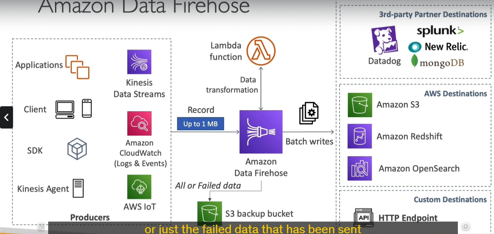

### **Chi Tiết về Amazon Data Firehose**

---

Amazon Data Firehose là một dịch vụ trong hệ sinh thái AWS giúp thu thập, xử lý và truyền dữ liệu streaming từ các nguồn khác nhau đến các điểm đến một cách tự động và gần như thời gian thực. Dưới đây là các chi tiết cụ thể:

---

### **1. Tổng Quan Về Firehose**

Amazon Data Firehose thực hiện nhiệm vụ **đón nhận dữ liệu từ nguồn (sources)**, **xử lý dữ liệu (nếu cần)** và **gửi đến các điểm đến (destinations)**. Điểm nổi bật là Firehose giúp bạn thực hiện quá trình này **một cách hoàn toàn tự động** mà không cần phải quản lý cơ sở hạ tầng.

---

### **2. Kiến Trúc Hoạt Động**

#### **2.1. Các Nguồn Dữ Liệu (Sources)**

- **Nguồn dữ liệu phổ biến**:
  - **Kinesis Agent**: Tự động thu thập log từ server.
  - **Ứng dụng khách hàng**:
    - Dùng **AWS SDK** hoặc **API** để gửi dữ liệu trực tiếp đến Firehose.
  - **Các dịch vụ AWS**:
    - **Kinesis Data Streams**: Firehose có thể **kéo** dữ liệu từ các luồng dữ liệu Kinesis.
    - **CloudWatch Logs và Events**: Firehose tích hợp sẵn để nhận log từ CloudWatch.
    - **AWS IoT**: Thu thập dữ liệu từ thiết bị IoT.

#### **2.2. Quá Trình Xử Lý Dữ Liệu (Processing)**

- **Chuyển đổi dữ liệu tùy chọn**:

  - Sử dụng **AWS Lambda** để chuyển đổi hoặc nén dữ liệu.
  - Ví dụ:
    - Đổi định dạng **CSV → JSON**.
    - Xóa các trường không cần thiết.

- **Nén dữ liệu**:

  - Firehose hỗ trợ các phương pháp nén như **gzip**, **Snappy**, hoặc **bzip2**.

- **Bộ đệm dữ liệu (Buffer)**:
  - **Buffer Size** (Kích thước bộ đệm): 1 MB đến 128 MB.
  - **Buffer Interval** (Thời gian đệm): 60 giây đến 900 giây.
  - Khi bộ đệm đầy hoặc hết thời gian đệm, dữ liệu sẽ được ghi batch đến điểm đến.

#### **2.3. Các Điểm Đến Dữ Liệu (Destinations)**

- **AWS Services**:
  - **Amazon S3**: Lưu trữ dữ liệu dài hạn hoặc backup.
  - **Amazon Redshift**: Tích hợp với Redshift để thực hiện phân tích dữ liệu.
  - **Amazon OpenSearch**: Lưu trữ và phân tích log hoặc dữ liệu phi cấu trúc.
- **Third-party Destinations**:
  - Tích hợp sẵn với các dịch vụ như **Datadog**, **Splunk**, **New Relic**, **MongoDB**.
- **HTTP Endpoint**:

  - Cho phép tùy chỉnh điểm đến qua giao thức HTTP.

- **Backup dữ liệu**:
  - Ghi toàn bộ hoặc chỉ dữ liệu lỗi vào **Amazon S3**.

---

### **3. Tính Năng Chính**

#### **3.1. Quản Lý Hoàn Toàn (Fully Managed)**

- Không cần quản lý cơ sở hạ tầng.
- Tự động mở rộng (Auto-scaling) dựa trên tải công việc.

#### **3.2. Thời Gian Gần Thực (Near Real-Time)**

- Firehose sử dụng bộ đệm (buffer) để gom dữ liệu.
- Độ trễ điển hình: Từ 60 giây đến vài phút (dựa trên cài đặt buffer).

#### **3.3. Xử Lý Dữ Liệu Đa Dạng**

- **Định dạng dữ liệu đầu vào**: CSV, JSON, Parquet, Avro, text, binary.
- **Tùy chọn chuyển đổi định dạng**:
  - Chuyển đổi dữ liệu thành **Parquet** hoặc **ORC**.
- **Tùy chọn nén dữ liệu**:
  - gzip, Snappy, bzip2.

#### **3.4. Tích Hợp Sẵn Với AWS Lambda**

- Chạy Lambda để xử lý dữ liệu (tùy chọn).
- Ví dụ:
  - Loại bỏ các trường không cần thiết.
  - Chuyển đổi định dạng hoặc chuẩn hóa dữ liệu.

#### **3.5. Bảo Mật**

- Mã hóa dữ liệu trong quá trình truyền (HTTPS).
- Mã hóa dữ liệu khi lưu trữ bằng AWS KMS.

---

### **4. So Sánh Amazon Data Firehose và Kinesis Data Streams**

| **Thuộc Tính**       | **Kinesis Data Streams**   | **Amazon Data Firehose**            |
| -------------------- | -------------------------- | ----------------------------------- |
| **Loại dịch vụ**     | Thu thập dữ liệu streaming | Tải dữ liệu streaming tới điểm đến  |
| **Độ trễ**           | Thời gian thực (Real-time) | Gần thời gian thực (Near real-time) |
| **Xử lý dữ liệu**    | Phải tự viết mã            | Tích hợp Lambda, chuyển đổi dữ liệu |
| **Quản lý**          | Tự quản lý shard           | Hoàn toàn tự động                   |
| **Điểm đến dữ liệu** | Dữ liệu thô                | S3, Redshift, OpenSearch, Splunk... |
| **Khả năng replay**  | Có                         | Không                               |

---

### **5. Ứng Dụng Thực Tiễn**

#### **5.1. Phân Tích Logs**

- **Nguồn**: CloudWatch Logs.
- **Xử lý**: Nén dữ liệu log, chuyển đổi định dạng.
- **Điểm đến**: Amazon S3 để lưu trữ dài hạn, hoặc Splunk để phân tích.

#### **5.2. IoT và Thiết Bị Kết Nối**

- **Nguồn**: Thiết bị IoT.
- **Điểm đến**: Amazon Redshift để phân tích thời gian thực.

#### **5.3. Tích Hợp Dữ Liệu Thứ Ba**

- **Nguồn**: Các ứng dụng sản xuất dữ liệu.
- **Điểm đến**: Splunk, New Relic hoặc Datadog.

#### **5.4. Dữ Liệu Đa Định Dạng**

- **Xử lý**: Chuyển đổi dữ liệu từ JSON sang Parquet.
- **Điểm đến**: Amazon S3 hoặc Redshift để lưu trữ và phân tích.

---

### **6. Điểm Quan Trọng Cần Nhớ**

- **Gần thời gian thực (Near Real-Time)**: Firehose không phải dịch vụ thời gian thực do sử dụng buffer.
- **Tự động mở rộng**: Không cần cấu hình shard như Kinesis Data Streams.
- **Tích hợp linh hoạt**: Hỗ trợ nhiều điểm đến, bao gồm cả dịch vụ AWS và bên thứ ba.
- **Không lưu trữ lâu dài**: Firehose không có khả năng lưu trữ và replay dữ liệu như Kinesis Data Streams.

---

Amazon Data Firehose giờ đổi tên thành delivery stream \
Kích thước Buffer (Buffer Size):

Đây là kích thước tối thiểu mà dữ liệu trong buffer cần đạt được trước khi Firehose tự động flush (đẩy dữ liệu đi).
Bạn có thể cấu hình kích thước buffer, thường là trong khoảng từ 1 MB đến 128 MB (đối với S3).
Ví dụ: Nếu buffer size được đặt là 5 MB, dữ liệu sẽ chỉ được gửi tới đích khi buffer chứa ít nhất 5 MB dữ liệu.
Thời gian Buffer (Buffer Interval):

Đây là khoảng thời gian tối đa mà dữ liệu có thể lưu trong buffer trước khi bị flush, bất kể kích thước buffer đã đạt hay chưa.
Thời gian buffer thường được đặt từ 60 giây đến 900 giây (15 phút).
Ví dụ: Nếu buffer interval là 120 giây, dữ liệu sẽ được đẩy tới đích sau 120 giây ngay cả khi buffer size chưa đạt.
