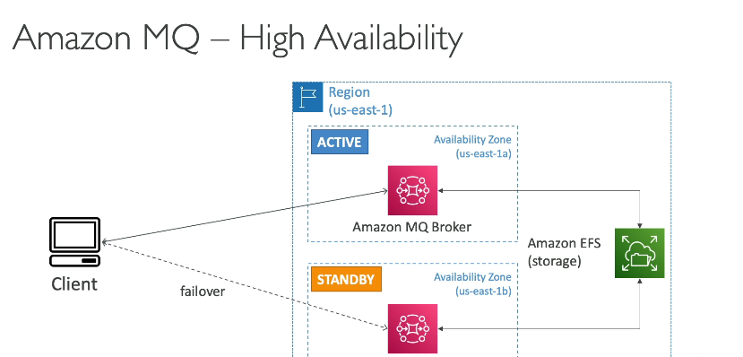

### Chi tiết về **Amazon MQ**

---

#### **Tổng quan**

- **Amazon MQ** là một dịch vụ quản lý message broker (trình quản lý thông điệp) hỗ trợ các giao thức mã nguồn mở phổ biến như **MQTT**, **AMQP**, **STOMP**, **OpenWire**, và **WSS**.
- Dịch vụ này đặc biệt hữu ích khi bạn di chuyển các ứng dụng truyền thống từ **on-premises** (tại chỗ) lên cloud mà không muốn sửa đổi ứng dụng để tích hợp với các giao thức hoặc API riêng của AWS như SQS và SNS.

#### **Công nghệ hỗ trợ**

- Amazon MQ hỗ trợ hai công nghệ chính:
  1. **RabbitMQ**: Một message broker phổ biến với hiệu suất cao.
  2. **ActiveMQ**: Một giải pháp lâu đời hỗ trợ nhiều giao thức mã nguồn mở.

---

#### **So sánh với SQS và SNS**

- **SQS và SNS** là các dịch vụ **cloud-native** của AWS, sử dụng giao thức riêng và có khả năng mở rộng vô hạn (infinite scaling).
- **Amazon MQ** không thể mở rộng linh hoạt như SQS hoặc SNS vì nó hoạt động trên các server vật lý. Do đó, quy mô của nó phụ thuộc vào tài nguyên tính toán và lưu trữ.
- **Tính năng kết hợp**:
  - Amazon MQ cung cấp cả **queue feature** (giống SQS) và **topic feature** (giống SNS) trong một broker duy nhất.

---

#### **Khả năng sẵn sàng cao (High Availability - HA)**

1. **Multi-AZ Setup**:
   - Amazon MQ có thể được triển khai trong nhiều **Availability Zones (AZ)** để đảm bảo tính sẵn sàng cao.
   - Một AZ hoạt động như **active** (đang hoạt động), và AZ còn lại là **standby** (chờ sẵn).
2. **Amazon EFS (Elastic File System)**:

   - Amazon EFS được sử dụng làm backend storage để đảm bảo dữ liệu được đồng bộ giữa các AZ.
   - Khi **failover** (chuyển đổi dự phòng) xảy ra:
     - Broker standby được kích hoạt.
     - Nó kết nối với cùng một hệ thống lưu trữ (EFS) như broker active.
     - Dữ liệu sẽ được giữ nguyên, đảm bảo tính toàn vẹn và liên tục của thông điệp.

3. **Quy trình failover**:
   - Nếu broker active gặp sự cố, broker standby sẽ tự động trở thành active.
   - Các client kết nối tới broker sẽ được tự động chuyển sang broker mới mà không làm mất dữ liệu.

---

#### **Ưu điểm**

- **Không cần tái cấu trúc ứng dụng**: Phù hợp với các ứng dụng sử dụng giao thức mã nguồn mở truyền thống.
- **Tích hợp dễ dàng**: Chạy các công nghệ phổ biến như RabbitMQ và ActiveMQ dưới dạng dịch vụ được quản lý.
- **Tính năng kết hợp**: Cung cấp cả khả năng hàng đợi (queue) và chủ đề (topic) trong một hệ thống duy nhất.
- **Multi-AZ và EFS**: Đảm bảo độ tin cậy và an toàn dữ liệu.

#### **Hạn chế**

- **Khả năng mở rộng hạn chế**: Không mở rộng nhanh chóng hoặc vô hạn như SQS/SNS.
- **Phụ thuộc vào server**: Có thể gặp vấn đề liên quan đến phần cứng hoặc tài nguyên tính toán.
- **Chi phí cao hơn**: Vì sử dụng tài nguyên cố định, chi phí có thể cao hơn nếu không tối ưu hóa.

---

### **Tóm tắt cho kỳ thi**

- **Amazon MQ = Managed RabbitMQ + ActiveMQ**.
- **Dành cho giao thức mã nguồn mở**: MQTT, AMQP, STOMP, OpenWire, WSS.
- **Không mở rộng vô hạn**: Không như SQS/SNS.
- **Multi-AZ với EFS**: Dữ liệu đồng bộ và failover an toàn.
- **Kết hợp queue và topic**: Đơn giản hóa ứng dụng.
