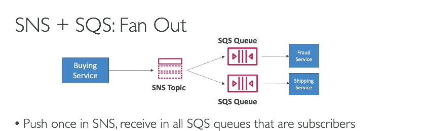
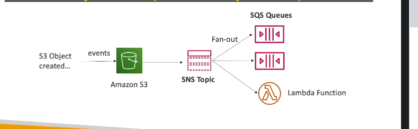
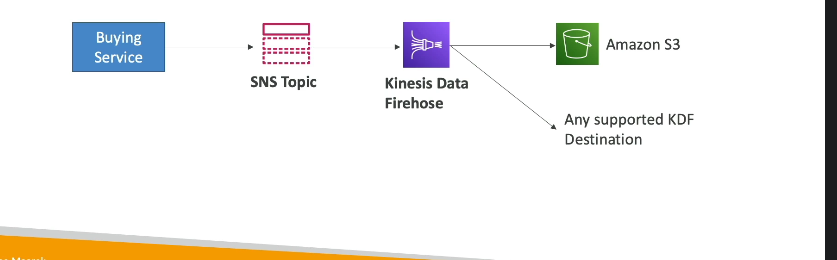
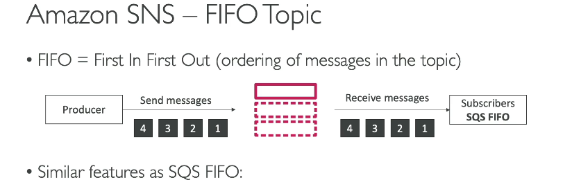
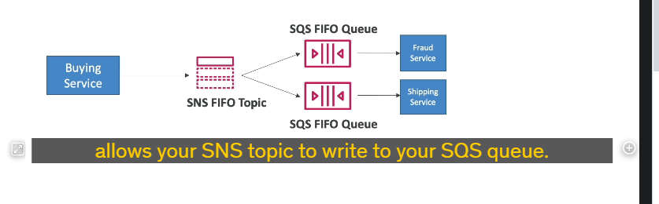
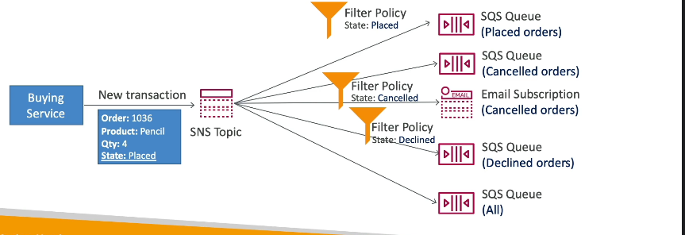

### **Chi tiết kiến thức: SNS + SQS Fan-Out Pattern**

---

#### **Tổng quan về SNS + SQS Fan-Out Pattern**

1. **Mục tiêu**: Gửi một tin nhắn từ **SNS topic** đến **nhiều SQS queues** một cách đáng tin cậy và linh hoạt.
2. **Lợi ích**:
   - **Giảm tải tích hợp thủ công**: Không cần gửi từng tin nhắn riêng lẻ đến từng SQS queue.
   - **Đảm bảo độ tin cậy**: SQS cung cấp khả năng lưu trữ tin nhắn, xử lý chậm trễ, và tự động thử lại khi thất bại.
   - **Khả năng mở rộng**: Thêm nhiều SQS queues làm subscriber dễ dàng.

---

#### **Cách thức hoạt động**

1. **Push** một tin nhắn đến SNS topic.
2. Tất cả **SQS queues** đã đăng ký với SNS topic sẽ nhận tin nhắn.
3. Đảm bảo rằng **SQS queue access policy** cho phép SNS topic gửi tin nhắn.

---

#### **Ứng dụng thực tế**

1. **Fan-out sự kiện S3**:
   

   - Một sự kiện trong S3 (ví dụ: file mới tạo) chỉ có thể kích hoạt một S3 event rule.
   - Sử dụng SNS để gửi sự kiện S3 đến nhiều SQS queues hoặc các dịch vụ khác (email, Lambda, v.v.).

2. **Fan-out với Kinesis Data Firehose (KDF)**:
   

   - SNS có thể gửi dữ liệu đến KDF, sau đó KDF chuyển dữ liệu vào **S3**, **Redshift**, hoặc các điểm đến khác.

3. **SNS FIFO**:
   
   
   - limit giống sqs fifo
   - Đảm bảo **thứ tự tin nhắn** và **tránh trùng lặp**:
     - Tin nhắn từ SNS FIFO topic sẽ được fan-out đến **SQS FIFO queues**.
     - Hỗ trợ **Message Group ID** và **Deduplication ID** để kiểm soát.

---

#### **Message Filtering trong SNS**

1. **Mục tiêu**: Giảm lượng tin nhắn không cần thiết đi vào từng SQS queue/subscriber.
2. **Cách thiết lập**:
   - Đặt **filter policy** bằng JSON cho từng subscription.
   - **Mặc định**: Mọi tin nhắn đều được nhận nếu không có filter policy.
3. **Ví dụ**:
   - SNS topic nhận các tin nhắn về đơn hàng.
   - **Filter policy cho SQS queue A**: Chỉ nhận đơn hàng có trạng thái "Placed".
   - **Filter policy cho SQS queue B**: Chỉ nhận đơn hàng "Canceled".
   - Có thể kết hợp với email subscription cho các trạng thái cụ thể.

---

#### **Tóm tắt lợi ích chính của SNS + SQS Fan-Out Pattern**

1. **Đảm bảo độ tin cậy và linh hoạt** khi gửi tin nhắn đến nhiều điểm nhận.
2. **Tăng khả năng mở rộng**: Thêm dễ dàng các subscriber mới.
3. **Message Filtering**: Tối ưu hóa luồng dữ liệu theo nhu cầu.
4. **FIFO hỗ trợ**: Đảm bảo thứ tự và loại bỏ trùng lặp tin nhắn.
5. **Đa dạng tích hợp**: Hỗ trợ từ SQS, Lambda, KDF đến email và HTTP endpoints.

---

### **Tóm tắt**

SNS + SQS Fan-Out Pattern giúp xử lý tin nhắn đa đích đáng tin cậy, mở rộng linh hoạt, và quản lý dễ dàng. Sử dụng tốt khi:

- Cần gửi tin nhắn đến nhiều SQS queues hoặc dịch vụ.
- Muốn đảm bảo độ tin cậy và không mất dữ liệu.
- Tối ưu hóa xử lý tin nhắn với **Message Filtering** hoặc **FIFO patterns**.
