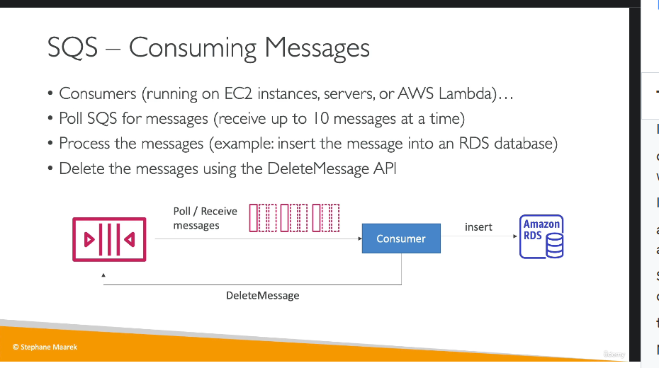

#### **1. Tổng quan về SQS**

- **Amazon SQS (Simple Queue Service)**:  
  
  - Là dịch vụ quản lý hàng đợi, giúp **decouple** giữa producer và consumer.
  - Tích hợp tốt để xử lý dữ liệu bất đồng bộ.

#### **2. Thành phần chính của SQS**

1. **Producer**:  
   

   - Là nguồn gửi thông điệp vào hàng đợi.
   - Có thể có một hoặc nhiều producer.
   - Sử dụng API `SendMessage` để gửi thông điệp.
   - Ví dụ: Gửi thông điệp chứa thông tin đặt hàng hoặc video cần xử lý.

2. **Queue**:

   - Chứa các thông điệp mà producer gửi vào.
   - Các đặc điểm của queue:
     - **Thời gian lưu trữ (Retention period)**:
       - Mặc định là **4 ngày**, tối đa **14 ngày**.
       - Thông điệp cần được xử lý và xóa trong thời gian này, nếu không sẽ bị mất.
     - **Kích thước thông điệp**: Tối đa **256 KB**.
     - **Throughput không giới hạn**: Không giới hạn số lượng thông điệp hay tốc độ gửi nhận.
     - **Độ trễ thấp**: Thời gian xử lý <10ms.
     - **Giao nhận thông điệp**:
       - **At least once delivery**: Có thể có thông điệp trùng lặp.
       - **Best effort ordering**: Thứ tự thông điệp không được đảm bảo.

3. **Consumer**:  
   
   - Là ứng dụng nhận và xử lý thông điệp từ queue.
   - **Cách thức hoạt động**:

     - Consumer **poll** (hỏi) queue để nhận thông điệp (tối đa 10 thông điệp/lần).
     - Sau khi xử lý thông điệp (ví dụ: lưu dữ liệu vào database), consumer gọi API `DeleteMessage` để xóa thông điệp khỏi queue.
     - Xóa thông điệp giúp đảm bảo không có consumer khác xử lý lại cùng một thông điệp.

   - Consumer có thể chạy trên:
     - **EC2 instances** (máy chủ ảo AWS).
     - **On-premises servers** (máy chủ tại chỗ).
     - **AWS Lambda** (serverless).

#### **3. Use Case cho SQS**

- **Xử lý đặt hàng**:
  - Producer gửi thông điệp chứa thông tin như order ID, customer ID, địa chỉ vào queue.
  - Consumer nhận thông điệp, lưu vào database (ví dụ: Amazon RDS), rồi xóa thông điệp khỏi queue.

#### **4. Lợi ích của SQS**

- **Decouple ứng dụng**: Giúp các thành phần độc lập, giảm phụ thuộc lẫn nhau.
- **Khả năng mở rộng**: Tự động scale để xử lý lưu lượng lớn.
- **Độ tin cậy**: Dữ liệu trong queue được lưu trữ bền vững cho đến khi consumer xóa.

---

### **Tóm Tắt Cô Đọng**

1. **Thành phần SQS**:

   - **Producer** gửi thông điệp vào queue.
   - **Queue** lưu thông điệp (thời gian lưu trữ tối đa 14 ngày, kích thước <256KB).
   - **Consumer** nhận, xử lý, và xóa thông điệp.

2. **Tính năng nổi bật**:

   - Throughput không giới hạn, độ trễ thấp (<10ms).
   - Giao nhận thông điệp "At least once", có thể trùng lặp hoặc sai thứ tự.

3. **Ứng dụng**:

   - Phù hợp cho xử lý bất đồng bộ, ví dụ như đặt hàng, xử lý video, gửi thông báo.

4. **Ưu điểm**: Decouple ứng dụng, hỗ trợ scale tự động, đáng tin cậy.

---

#### **1. Mở rộng quy mô (Scaling)**

- **Nhiều Consumers**:  
  

  - Có thể triển khai nhiều consumer để xử lý thông điệp đồng thời, tăng throughput.
  - Các consumer sẽ gọi hàm **poll** để nhận thông điệp khác nhau.
  - Nếu một consumer xử lý thông điệp chậm, thông điệp sẽ được các consumer khác nhận, đảm bảo **at least once delivery**.

- **Horizontal-Scaling**:
  
  - Khi lưu lượng thông điệp tăng, thêm consumer thông qua **Auto Scaling Group (ASG)**.
  - ASG sử dụng **Queue Length (ApproximateNumberOfMessages)** trong CloudWatch làm metric để tăng/giảm số lượng EC2 instances.
  - Ví dụ: Khi có surge (đột biến) trong đơn hàng, ASG sẽ tạo thêm EC2 instances để xử lý thông điệp nhanh hơn.

---

#### **2. Use Case thực tế: Xử lý video**

- **Vấn đề**:

  - Nếu xử lý video trực tiếp trong front-end, website sẽ chậm do tải lớn từ việc xử lý video.

- **Giải pháp sử dụng SQS**:
  
  1. **Front-end**:
     - Gửi yêu cầu xử lý video vào SQS queue.
     - Sử dụng EC2 instances tối ưu cho front-end (ví dụ: hiệu năng tốt, chi phí thấp).
  2. **Back-end**:
     - Consumer trong ASG sẽ nhận thông điệp từ SQS, xử lý video, và lưu vào S3 bucket.
     - Sử dụng EC2 instances có GPU để tối ưu hóa xử lý video.
  - **Kết quả**:
    - Front-end và back-end hoạt động độc lập, scale riêng biệt, đảm bảo hiệu năng.
    - Queue với throughput không giới hạn đảm bảo tính ổn định khi lưu lượng tăng cao.

---

#### **3. Bảo mật trong SQS**

- **Encryption (Mã hóa)**:
  - **In-flight encryption**: Mã hóa dữ liệu trong quá trình truyền với HTTPS.
  - **At-rest encryption**: Sử dụng AWS KMS keys để mã hóa dữ liệu lưu trữ.
  - **Client-side encryption**:
    - Tùy chọn mã hóa/giải mã trên client, không được hỗ trợ trực tiếp bởi SQS.
- **Access Control**:
  - **IAM Policies**: Quản lý quyền truy cập API của SQS.
  - **SQS Access Policies**:
    - Tương tự S3 bucket policies.
    - Hữu ích trong trường hợp **cross-account access** hoặc tích hợp với dịch vụ khác (ví dụ: SNS, S3).

---

### **Tóm Tắt Cô Đọng**

1. **Mở rộng quy mô**:

   - SQS hỗ trợ nhiều consumer hoạt động song song, giúp xử lý thông điệp nhanh chóng.
   - Sử dụng ASG kết hợp CloudWatch để tự động scale theo lưu lượng.

2. **Use Case chính**:

   - Tách biệt front-end và back-end trong ứng dụng xử lý video.
   - Front-end xử lý yêu cầu, back-end nhận thông điệp từ SQS để xử lý video, đảm bảo hiệu năng và tối ưu hóa tài nguyên.

3. **Bảo mật**:

   - Mã hóa in-flight và at-rest.
   - Access control qua IAM và SQS policies, hỗ trợ cross-account và tích hợp dịch vụ khác.

4. **Lợi ích SQS**:
   - Giảm phụ thuộc giữa các thành phần ứng dụng (decouple).
   - Đảm bảo tính ổn định và khả năng mở rộng trong mọi trường hợp lưu lượng lớn.
