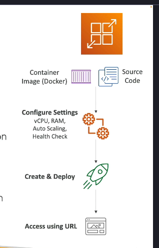

Dưới đây là chi tiết kiến thức về dịch vụ **AWS App Runner**, dựa trên nội dung bạn cung cấp:

---

### **AWS App Runner là gì?**

**AWS App Runner** là một dịch vụ **fully managed** (được quản lý hoàn toàn) giúp triển khai nhanh chóng các ứng dụng web và API với khả năng mở rộng quy mô tự động. Nó cho phép bất kỳ ai triển khai ứng dụng lên AWS mà không cần kiến thức chuyên sâu về hạ tầng hoặc container.

---

### **Cách hoạt động của AWS App Runner**

1. **Nguồn ứng dụng**:
   - Bạn có thể bắt đầu từ mã nguồn của mình hoặc từ một Docker container image.
2. **Cấu hình thiết lập**:
   - Định cấu hình các thông số như:
     - Số lượng vCPU (VCUs).
     - Bộ nhớ cần thiết cho container.
     - Cài đặt tự động mở rộng (autoscaling).
     - Các kiểm tra sức khỏe (health checks).
3. **Triển khai tự động**:
   - Sau khi cấu hình, App Runner tự động xây dựng và triển khai ứng dụng hoặc API của bạn.
   - Một URL sẽ được cung cấp ngay lập tức để bạn truy cập ứng dụng hoặc API mà không cần hiểu biết về cơ sở hạ tầng phía dưới.

---

### **Tính năng nổi bật của AWS App Runner**

- **Tự động mở rộng (Auto Scaling)**:
  - Tăng hoặc giảm tài nguyên tùy theo lưu lượng truy cập.
- **Tính sẵn sàng cao (High Availability)**:
  - Đảm bảo ứng dụng của bạn luôn hoạt động ổn định.
- **Cân bằng tải (Load Balancing)**:
  - Phân phối lưu lượng truy cập đồng đều giữa các container.
- **Mã hóa (Encryption)**:
  - Bảo mật dữ liệu ứng dụng của bạn.
- **Kết nối với VPC (Virtual Private Cloud)**:
  - Cho phép ứng dụng truy cập các dịch vụ như:
    - Cơ sở dữ liệu (databases).
    - Bộ nhớ đệm (cache).
    - Hàng đợi tin nhắn (message queue services).

---

### **Ưu điểm chính**

- **Dễ sử dụng**:
  - Không cần kiến thức về hạ tầng hay container.
- **Nhanh chóng**:
  - Triển khai sản phẩm nhanh từ giai đoạn phát triển đến sản xuất.
- **Tích hợp thực tiễn tốt nhất (Best Practices)**:
  - Tự động áp dụng các thực tiễn tốt nhất trong triển khai ứng dụng.
- **Đa dạng trường hợp sử dụng (Use Cases)**:
  - Triển khai ứng dụng web.
  - API hoặc microservices.
  - Ứng dụng triển khai nhanh trong môi trường sản xuất.

---

### **Khi nào nên sử dụng AWS App Runner?**

- Khi bạn cần triển khai ứng dụng web hoặc API nhanh chóng.
- Khi không muốn hoặc không cần quản lý hạ tầng phức tạp.
- Khi cần tích hợp dễ dàng với các dịch vụ AWS khác, như cơ sở dữ liệu hoặc dịch vụ nhắn tin.

---

### **Kết luận**

AWS App Runner là một công cụ mạnh mẽ nhưng đơn giản, phù hợp với các trường hợp triển khai ứng dụng web và API nhanh chóng, hiệu quả và bảo mật. Nó loại bỏ sự phức tạp của việc quản lý hạ tầng, cho phép bạn tập trung vào phát triển sản phẩm.

---
