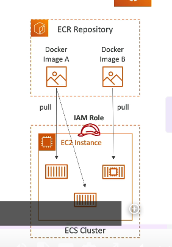

### **Giới Thiệu Amazon ECR**

Amazon ECR là viết tắt của **Elastic Container Registry**, được sử dụng để **lưu trữ và quản lý các Docker images** trên AWS. Dưới đây là các điểm chính:

---

#### **1. Tổng Quan về ECR**

- **Hai loại repository trong ECR**:
  - **Private repository**: Lưu trữ Docker images riêng tư, chỉ dành cho tài khoản của bạn (hoặc các tài khoản khác được bạn cấp quyền).
  - **Public repository**: Công khai và xuất bản các Docker images lên **Amazon ECR Public Gallery**.

---

#### **2. Tích Hợp Với Amazon ECS**

- **ECR tích hợp hoàn toàn với ECS**:
  - ECS cluster và các EC2 instance có thể **kéo (pull)** Docker images từ ECR để triển khai container.
- **Quy trình làm việc**:
  1. ECR lưu trữ các Docker images, được lưu trữ ở hậu trường bởi Amazon S3.
  2. ECS cluster (hoặc EC2 instance) cần một **IAM role** để có quyền kéo các Docker images từ ECR.
  3. Sau khi hình ảnh được kéo về, container sẽ được khởi chạy trên EC2 instance.

---

#### **3. Bảo Mật và Quản Lý**

- **Bảo mật**:
  - Mọi quyền truy cập vào ECR đều được bảo vệ bằng **IAM policies**.
  - Nếu gặp lỗi quyền truy cập, kiểm tra lại **IAM policies** đã được gán.
- **Tính năng bổ sung**:
  - **Image vulnerability scanning**: Quét lỗ hổng bảo mật của hình ảnh.
  - **Versioning**: Hỗ trợ quản lý phiên bản.
  - **Image tags**: Gắn nhãn cho hình ảnh.
  - **Image lifecycle**: Quản lý vòng đời hình ảnh, tự động xóa hình ảnh không cần thiết.

---

#### **4. Ứng Dụng**

- Khi bạn cần **lưu trữ Docker images** trên AWS, hãy nghĩ ngay đến **Amazon ECR**.
- Đây là một dịch vụ mạnh mẽ, linh hoạt, và phù hợp với hệ thống triển khai container trên ECS.

---

### **Lưu Ý Cho Kỳ Thi AWS**

- Amazon ECR là lựa chọn tốt nhất để lưu trữ Docker images trên AWS.
- Kết hợp ECR với ECS giúp tối ưu hóa triển khai container và quản lý bảo mật.

---
