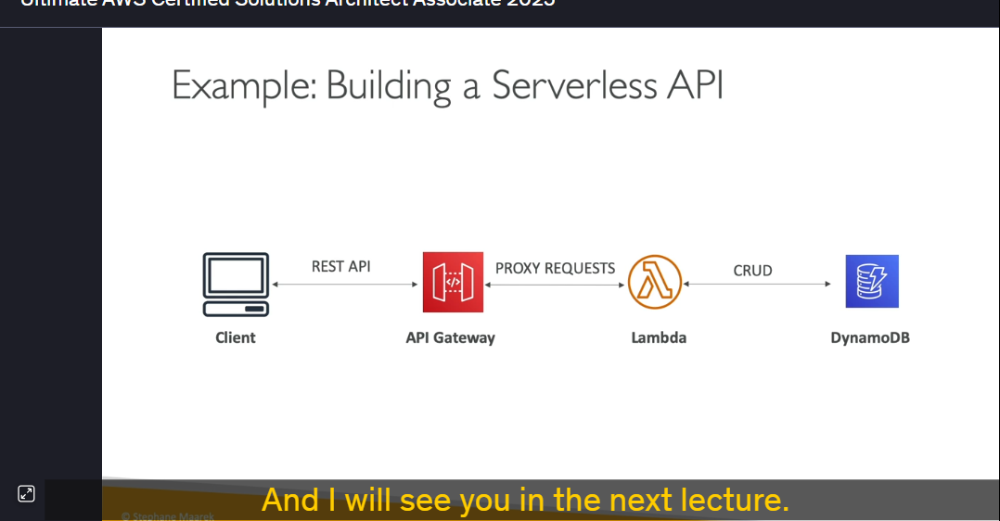

### **Tổng quan về API Gateway trong AWS**

Các hàm Lambda có thể sử dụng DynamoDB làm cơ sở dữ liệu cho API của chúng ta, và chúng ta có thể thực hiện các thao tác CRUD (Create, Read, Update, Delete) trên các bảng. Tuy nhiên, để khách hàng có thể gọi các hàm Lambda này, chúng ta cần một cách để kích hoạt chúng.

Có nhiều cách để thực hiện điều này:

1. **Khách hàng trực tiếp gọi hàm Lambda**: Điều này yêu cầu khách hàng phải có quyền IAM.
2. **Sử dụng Application Load Balancer (ALB)**: ALB sẽ đứng giữa khách hàng và hàm Lambda, cung cấp một endpoint HTTP để gọi hàm Lambda.
3. **Sử dụng API Gateway**: Đây là dịch vụ serverless của AWS cho phép tạo các REST API công khai và có thể truy cập được bởi khách hàng. API Gateway sẽ chuyển tiếp yêu cầu từ khách hàng đến hàm Lambda.

### **Lợi ích của API Gateway**

API Gateway không chỉ cung cấp một endpoint HTTP đơn giản mà còn mang lại nhiều tính năng hữu ích như:

- **Xác thực và ủy quyền**: Hỗ trợ nhiều cách xác thực như IAM, Amazon Cognito, và custom authorizer (sử dụng Lambda).
- **Quản lý phiên bản API**: Cho phép bạn quản lý các phiên bản API mà không làm ảnh hưởng đến khách hàng.
- **Hỗ trợ nhiều môi trường**: Có thể triển khai API trên các môi trường khác nhau như dev, test, và prod.
- **Tạo API keys và điều tiết yêu cầu**: Giới hạn số lượng yêu cầu từ khách hàng để tránh quá tải.
- **Hỗ trợ WebSocket**: Cho phép thực hiện streaming thời gian thực.
- **Chuyển đổi và xác thực yêu cầu/ phản hồi**: Đảm bảo các yêu cầu và phản hồi được định dạng đúng.
- **Tạo SDK và cache phản hồi**: Giúp tăng hiệu suất và dễ dàng tích hợp với các ứng dụng khác.

### **Cách API Gateway tích hợp với các dịch vụ khác**

1. **Lambda Function**: Đây là cách phổ biến nhất để tạo một REST API serverless. API Gateway sẽ gọi hàm Lambda để xử lý yêu cầu.
2. **HTTP Endpoint**: API Gateway có thể tích hợp với bất kỳ HTTP endpoint nào, bao gồm cả các API trên premises hoặc ứng dụng trên cloud.
3. **AWS Services**: API Gateway có thể tích hợp trực tiếp với các dịch vụ AWS như Step Functions, SQS, Kinesis Data Streams, v.v. Điều này cho phép bạn tạo các API công khai mà không cần cung cấp quyền truy cập AWS trực tiếp cho khách hàng.

### **Các loại triển khai API Gateway**

1. **Edge-Optimized**: Được tối ưu hóa cho khách hàng toàn cầu. Yêu cầu được định tuyến qua các vị trí Edge của CloudFront để giảm độ trễ.
2. **Regional**: Dành cho khách hàng trong cùng một khu vực. Không sử dụng CloudFront Edge locations.
3. **Private API Gateway**: Chỉ có thể truy cập từ bên trong VPC của bạn, sử dụng interface VPC endpoints.

### **Bảo mật trên API Gateway**

- **IAM Roles**: Sử dụng cho các ứng dụng nội bộ, ví dụ như các ứng dụng chạy trên EC2.
- **Amazon Cognito**: Dành cho các ứng dụng di động hoặc web, cung cấp xác thực người dùng.
- **Custom Authorizer**: Sử dụng Lambda function để triển khai logic xác thực tùy chỉnh.
- **HTTPS Security**: Sử dụng AWS Certificate Manager (ACM) để cung cấp chứng chỉ SSL cho API Gateway.

### **Kết luận**

API Gateway là một công cụ mạnh mẽ để tạo và quản lý các API serverless. Nó cung cấp nhiều tính năng hữu ích như xác thực, quản lý phiên bản, và tích hợp với các dịch vụ AWS khác. Bằng cách sử dụng API Gateway, bạn có thể tạo ra các ứng dụng serverless hoàn chỉnh mà không cần quản lý cơ sở hạ tầng.

---
