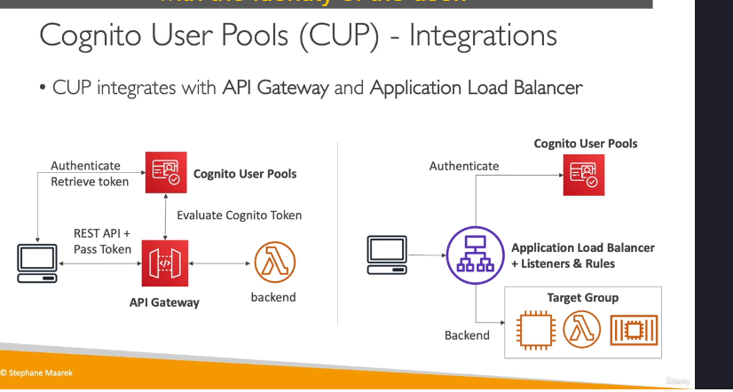
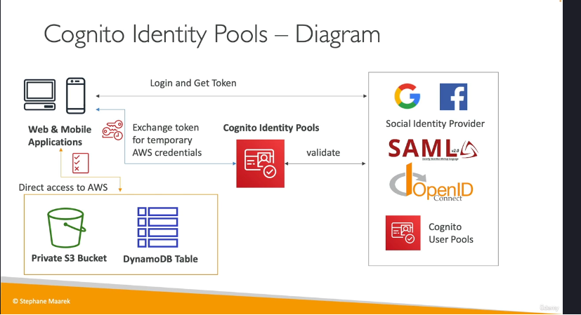

Amazon Cognito là một dịch vụ của AWS giúp quản lý danh tính người dùng cho các ứng dụng web và di động. Mục tiêu chính của Cognito là cung cấp danh tính cho người dùng bên ngoài tài khoản AWS của bạn, cho phép họ tương tác với ứng dụng của bạn một cách an toàn. Dưới đây là chi tiết về các khía cạnh chính của Amazon Cognito:

### 1. **Cognito User Pools (CUP)**

- **Định nghĩa**: Cognito User Pools là một cơ sở dữ liệu người dùng dạng serverless dành cho các ứng dụng web và di động. Nó cung cấp chức năng đăng nhập (sign-in) cho người dùng.
- **Tính năng**:
  - Đăng nhập đơn giản với username/email và mật khẩu.
  - Tính năng đặt lại mật khẩu.
  - Xác thực email và số điện thoại.
  - Hỗ trợ xác thực đa yếu tố (MFA).
  - Tích hợp với các nhà cung cấp danh tính bên thứ ba như Facebook, Google, v.v.
- **Tích hợp**:
  - **API Gateway**: Người dùng đăng nhập vào Cognito User Pool, nhận token, và chuyển token này đến API Gateway. API Gateway xác thực token và chuyển đổi nó thành danh tính người dùng, sau đó truyền danh tính này đến Lambda function để xử lý.
  - **Application Load Balancer (ALB)**: Tương tự, người dùng đăng nhập vào Cognito User Pool, sau đó chuyển token đến ALB. ALB xác thực token và chuyển tiếp yêu cầu đến backend kèm theo thông tin danh tính người dùng.

### 2. **Cognito Identity Pools (CIP) (Federated Identities)**

- **Định nghĩa**: Cognito Identity Pools cung cấp danh tính cho người dùng, nhưng thay vì truy cập ứng dụng thông qua API Gateway hoặc ALB, người dùng sẽ truy cập trực tiếp vào các tài nguyên AWS bằng cách sử dụng các credential tạm thời của AWS.
- **Tính năng**:
  - Người dùng có thể đăng nhập thông qua Cognito User Pools hoặc các nhà cung cấp danh tính bên thứ ba (như Facebook, Google, SAML, OpenID Connect).
  - Sau khi đăng nhập, người dùng nhận được token và chuyển token này đến Cognito Identity Pools để đổi lấy các credential tạm thời của AWS.
  - Các credential này được gắn với các IAM policy cụ thể, cho phép người dùng truy cập các dịch vụ AWS như S3, DynamoDB, v.v.
- **Tích hợp**:
  - **Row-Level Security trong DynamoDB**: Bằng cách sử dụng Cognito Identity Pools, bạn có thể thiết lập các điều kiện trong IAM policy để giới hạn quyền truy cập của người dùng vào các hàng cụ thể trong DynamoDB. Ví dụ, người dùng chỉ có thể truy cập các mục có khóa phân vùng (partition key) trùng với ID của họ trong Cognito.

### 3. **Sự khác biệt giữa IAM và Cognito**

- **IAM**: Quản lý người dùng và quyền truy cập trong phạm vi tài khoản AWS của bạn.
- **Cognito**: Dành cho người dùng bên ngoài tài khoản AWS, thường là người dùng cuối của ứng dụng web hoặc di động. Cognito cung cấp các tính năng như đăng nhập, xác thực, và quản lý danh tính cho hàng trăm hoặc hàng nghìn người dùng.

### 4. **Tổng kết**

- **Cognito User Pools**: Quản lý danh tính người dùng và cung cấp chức năng đăng nhập, tích hợp với API Gateway và ALB.
- **Cognito Identity Pools**: Cung cấp credential tạm thời để người dùng truy cập trực tiếp vào các dịch vụ AWS, hỗ trợ các trường hợp sử dụng như row-level security trong DynamoDB.
- **Tích hợp**: Cognito User Pools và Identity Pools có thể làm việc cùng nhau để cung cấp một giải pháp quản lý danh tính toàn diện cho ứng dụng của bạn.

Amazon Cognito là một dịch vụ mạnh mẽ và linh hoạt, giúp bạn dễ dàng quản lý người dùng và bảo mật ứng dụng của mình mà không cần phải tự xây dựng cơ sở hạ tầng xác thực phức tạp.
