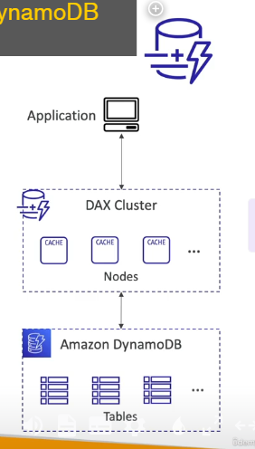
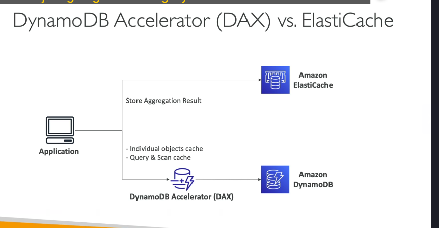
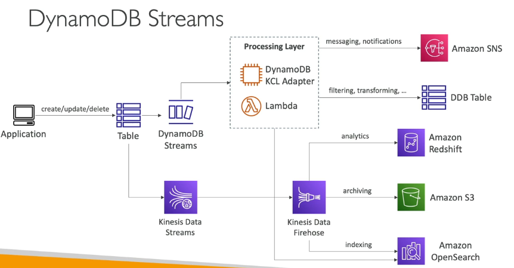
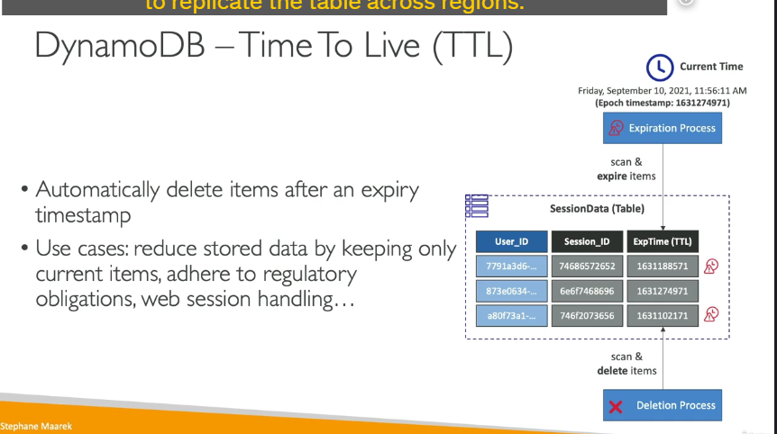
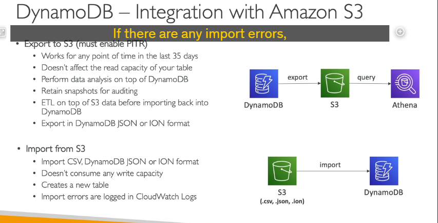

### **1. DynamoDB Accelerator (DAX)**

DAX là một lớp bộ nhớ đệm (cache) trong bộ nhớ được thiết kế riêng cho DynamoDB. Nó giúp cải thiện hiệu suất đọc bằng cách giảm độ trễ và giảm tải cho các bảng DynamoDB. Dưới đây là các điểm chính về DAX:

- **Mục đích**: DAX được sử dụng khi bạn có nhiều yêu cầu đọc (read-heavy workload) trên bảng DynamoDB, giúp giảm tình trạng tắc nghẽn bằng cách lưu trữ dữ liệu trong bộ nhớ đệm.
- **Độ trễ cực thấp**: DAX cung cấp độ trễ chỉ trong micro giây cho dữ liệu được lưu trong cache.
- **Tương thích với DynamoDB API**: Bạn không cần thay đổi logic ứng dụng của mình vì DAX tương thích hoàn toàn với các API hiện có của DynamoDB.
- **Cách hoạt động**:
  - Bạn tạo một cụm DAX gồm các nút cache.
  - Ứng dụng của bạn kết nối với cụm DAX thay vì kết nối trực tiếp với DynamoDB.
  - Cụm DAX sẽ tự động kết nối với bảng DynamoDB của bạn và xử lý các yêu cầu đọc.
- **Thời gian sống của cache (TTL)**: Mặc định là 5 phút, nhưng bạn có thể điều chỉnh thời gian này.
- **So sánh với ElastiCache**:
  

  - DAX được thiết kế riêng cho DynamoDB và phù hợp để cache các đối tượng riêng lẻ hoặc kết quả truy vấn.
  - ElastiCache phù hợp hơn cho việc lưu trữ kết quả tính toán phức tạp hoặc dữ liệu tổng hợp (aggregation).

---

### **2. DynamoDB Streams**

DynamoDB Streams là một tính năng cho phép bạn theo dõi mọi thay đổi (tạo, cập nhật, xóa) trên bảng DynamoDB theo thời gian thực. Dưới đây là các điểm chính về DynamoDB Streams:

- **Mục đích**: Phản ứng với các thay đổi trên bảng DynamoDB trong thời gian thực.
- **Các trường hợp sử dụng phổ biến**:
  - Gửi email chào mừng khi có người dùng mới đăng ký.
  - Phân tích sử dụng theo thời gian thực.
  - Sao chép dữ liệu sang các bảng phụ (derivative tables).
  - Triển khai sao chép liên vùng (cross-region replication).
  - Kích hoạt AWS Lambda khi có thay đổi trên bảng DynamoDB.
- **Hai loại xử lý luồng**:
  1. **DynamoDB Streams**:
     - Thời gian lưu trữ dữ liệu: 24 giờ.
     - Số lượng consumer (người tiêu dùng) bị giới hạn.
     - Thường được sử dụng với AWS Lambda để kích hoạt các hàm.
  2. **Kinesis Data Streams**:
     - Thời gian lưu trữ dữ liệu lên đến 1 năm.
     - Hỗ trợ số lượng consumer lớn hơn.
     - Cung cấp nhiều cách xử lý dữ liệu hơn, chẳng hạn như Kinesis Data Analytics, Kinesis Data Firehose, Glue Streaming ETLs, v.v.

---

### **Kiến trúc xử lý luồng (Stream Processing Architecture)**

Dưới đây là một ví dụ về kiến trúc xử lý luồng với DynamoDB Streams và Kinesis Data Streams:

1. **DynamoDB Streams**:

   - Ứng dụng thực hiện các thao tác tạo, cập nhật, xóa trên bảng DynamoDB.
   - Các thay đổi được ghi lại trong DynamoDB Streams.
   - Bạn có thể sử dụng AWS Lambda để xử lý các sự kiện từ DynamoDB Streams.
   - Hoặc sử dụng DynamoDB KCL Adapter để xử lý dữ liệu trên EC2 hoặc Lambda.

2. **Kinesis Data Streams**:
   - Các thay đổi từ DynamoDB được gửi trực tiếp đến Kinesis Data Streams.
   - Từ Kinesis, bạn có thể sử dụng Kinesis Data Firehose để gửi dữ liệu đến:
     - **Amazon Redshift** để phân tích.
     - **Amazon S3** để lưu trữ.
     - **Amazon OpenSearch** để tìm kiếm và lập chỉ mục.

---

### **Kết luận**

- **DAX** là giải pháp tối ưu để cải thiện hiệu suất đọc cho DynamoDB với độ trễ cực thấp.
- **DynamoDB Streams** và **Kinesis Data Streams** là các công cụ mạnh mẽ để xử lý dữ liệu theo thời gian thực từ DynamoDB, phù hợp cho các trường hợp như phân tích, sao chép dữ liệu, hoặc kích hoạt các quy trình tự động.

---

### **1. Bảng Toàn Cầu (Global Tables)**

- **Định nghĩa:** Bảng toàn cầu cho phép sao chép dữ liệu giữa nhiều khu vực AWS (Regions) để giảm độ trễ và tăng độ tin cậy cho ứng dụng.
- **Đặc điểm:**
  - **Replication Hai Chiều (Two-Way Replication):** Dữ liệu được đồng bộ từ bất kỳ khu vực nào và thay đổi được phản ánh trong mọi khu vực khác.
  - **Active-Active Replication:** Ứng dụng có thể vừa đọc vừa ghi dữ liệu ở bất kỳ khu vực nào.
- **Trường hợp sử dụng:**
  - Ứng dụng toàn cầu cần giảm độ trễ truy cập dữ liệu.
  - Đảm bảo dữ liệu sẵn sàng cao (High Availability) và khả năng chống chịu thảm họa.
- **Yêu cầu:**
  - **Bật DynamoDB Streams:** Streams ghi nhận mọi thay đổi trên bảng và làm cơ sở để sao chép dữ liệu giữa các khu vực.

---

### **2. Thời Gian Sống (Time to Live - TTL)**

- **Định nghĩa:** TTL cho phép tự động xóa các mục trong bảng sau khi một mốc thời gian hết hạn.
- **Cách hoạt động:**
  - Bạn thêm một thuộc tính (ví dụ: `ExpTime`) chứa dấu thời gian Epoch (Unix timestamp).
  - Khi thời gian hiện tại vượt quá giá trị này, mục dữ liệu sẽ hết hạn.
  - DynamoDB sẽ tự động đánh dấu mục cần xóa và xóa hoàn toàn sau đó.
- **Trường hợp sử dụng:**
  - **Lưu trữ dữ liệu ngắn hạn:** Chỉ giữ lại những mục dữ liệu mới nhất.
  - **Tuân thủ quy định pháp lý:** Ví dụ, xóa dữ liệu sau 2 năm.
  - **Quản lý phiên làm việc (Session Handling):**
    - Khi người dùng đăng nhập vào trang web, thông tin phiên (session) sẽ được lưu trong DynamoDB trong khoảng 2 giờ.
    - Nếu phiên không được gia hạn, dữ liệu sẽ tự động bị xóa.

---

### **3. Sao Lưu và Khôi Phục (Backup & Recovery)**

#### **3.1. Sao lưu liên tục (Continuous Backup) với Phục hồi Theo Điểm Thời Gian (Point-in-Time Recovery - PITR)**

- **Thời gian lưu trữ:** Tối đa 35 ngày.
- **Cách hoạt động:**
  - Khi bật PITR, DynamoDB ghi nhận mọi thay đổi trên bảng.
  - Có thể khôi phục dữ liệu về bất kỳ thời điểm nào trong khoảng 35 ngày.
- **Quá trình khôi phục:**
  - Tạo một bảng mới với dữ liệu đã được khôi phục.

#### **3.2. Sao lưu theo nhu cầu (On-Demand Backup)**

- **Thời gian lưu trữ:** Lưu trữ vô hạn cho đến khi người dùng xóa.
- **Cách hoạt động:**
  - Người dùng có thể sao lưu bất kỳ lúc nào theo nhu cầu.
  - Không ảnh hưởng đến hiệu suất hoặc độ trễ của bảng.
- **Quản lý nâng cao:**
  - Sử dụng **AWS Backup Service** để thiết lập chính sách vòng đời cho sao lưu và sao chép sao lưu giữa các khu vực.

---

### **4. Tích Hợp DynamoDB với Amazon S3**

#### **4.1. Xuất Dữ Liệu (Export)**

- **Yêu cầu:**
  - Cần bật **Point-in-Time Recovery (PITR)** trước khi xuất bảng DynamoDB.
- **Cách hoạt động:**
  - Có thể xuất dữ liệu trong khoảng thời gian 35 ngày qua.
  - Dữ liệu xuất ra ở định dạng **DynamoDB JSON** hoặc **ION format**.
- **Trường hợp sử dụng:**
  - **Phân tích dữ liệu:** Kết hợp với Amazon Athena để truy vấn dữ liệu.
  - **Lưu trữ lâu dài:** Lưu giữ ảnh chụp dữ liệu để kiểm toán.
  - **Biến đổi dữ liệu:** Thực hiện ETL trước khi nhập lại vào bảng DynamoDB mới.

#### **4.2. Nhập Dữ Liệu (Import)**

- **Định dạng nhập:** **CSV, JSON, ION**.
- **Cách hoạt động:**
  - Dữ liệu từ S3 có thể được nhập trở lại DynamoDB mà không tiêu tốn khả năng ghi (write capacity).
  - Quá trình nhập sẽ tạo ra một bảng mới.
- **Xử lý lỗi:** Mọi lỗi trong quá trình nhập sẽ được ghi lại trong **CloudWatch Logs**.

---

### **5. Tổng Kết**

DynamoDB là một dịch vụ cơ sở dữ liệu NoSQL mạnh mẽ với nhiều tính năng như:

- **Global Tables** cho ứng dụng toàn cầu.
- **TTL** giúp quản lý dữ liệu ngắn hạn và tuân thủ quy định pháp lý.
- **Backup & Recovery** linh hoạt với PITR và On-Demand Backup.
- **Tích hợp với S3** giúp mở rộng khả năng phân tích và quản lý dữ liệu.
