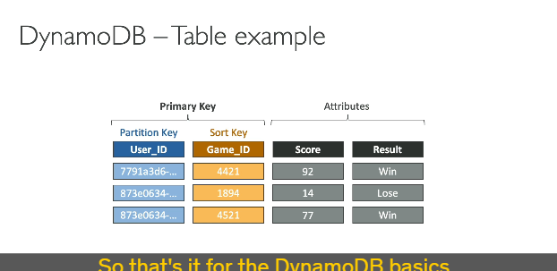

### DynamoDB: Tổng Quan Dễ Hiểu

---

### **1. DynamoDB là gì?**

- **DynamoDB** là cơ sở dữ liệu **NoSQL** do AWS phát triển và cung cấp.
- **Đặc điểm chính:**
  - **Fully managed**: AWS quản lý toàn bộ cơ sở hạ tầng, không cần bảo trì hay vá lỗi.
  - **High availability**: Dữ liệu được sao chép trên nhiều **Availability Zones** (AZs).
  - **Cloud native**: Được thiết kế riêng cho môi trường AWS.
  - **Scalable**: Có thể mở rộng để xử lý **hàng triệu yêu cầu mỗi giây**, **hàng nghìn tỷ dòng dữ liệu**, và **hàng trăm terabyte dữ liệu**.

---

### **2. Lợi ích chính:**

1. **Hiệu năng cao:**
   - Độ trễ **một chữ số mili giây**.
2. **Bảo mật tích hợp:**
   - Tích hợp với **IAM** để quản lý quyền truy cập.
3. **Tự động mở rộng (Auto-scaling):**
   - Linh hoạt điều chỉnh tài nguyên để xử lý khối lượng công việc.
4. **Không yêu cầu quản lý cơ sở dữ liệu:**
   - Chỉ cần tạo **table** và sử dụng.
5. **Chi phí thấp:**
   - Có thể chọn chế độ tính phí theo nhu cầu.

---

### **3. Cấu trúc cơ bản của DynamoDB:**

- **Table**: Không cần tạo database, chỉ cần tạo các **table**.
- **Primary Key**: Mỗi table cần một khóa chính, gồm:
  - **Partition Key**: Bắt buộc.
  - **Sort Key**: Tuỳ chọn (nếu cần phân nhóm dữ liệu).
- **Item**: Các dòng dữ liệu, không giới hạn số lượng.
- **Attributes**: Cột trong table, có thể thay đổi và không bắt buộc.

---

### **4. So sánh DynamoDB với RDS/Aurora:**

| **Tiêu chí**       | **DynamoDB**                     | **RDS/Aurora**                      |
| ------------------ | -------------------------------- | ----------------------------------- |
| Loại cơ sở dữ liệu | NoSQL                            | SQL (Relational)                    |
| Quy mô dữ liệu     | Trillions of rows, 100s of TBs   | Hạn chế hơn                         |
| Schema             | Linh hoạt, dễ thay đổi           | Phải thiết kế trước và khó thay đổi |
| Hiệu năng          | Single-digit millisecond latency | Phụ thuộc vào cấu hình              |
| Quản lý            | Không cần bảo trì                | Cần quản lý backup, vá lỗi          |

---

### **5. Các chế độ hoạt động của DynamoDB:**

#### **Provisioned Mode**:

- **Cách hoạt động:**
  - Bạn xác định trước dung lượng đọc/ghi (RCU/WCU).
  - Tự động mở rộng với Auto-scaling nếu được cấu hình.
- **Ưu điểm:**
  - Tiết kiệm chi phí cho khối lượng công việc ổn định.
- **Hạn chế:**
  - Không phù hợp với công việc có biến động bất ngờ hoặc tăng đột biến nhanh.

#### **On-Demand Mode**:

- **Cách hoạt động:**
  - DynamoDB tự động mở rộng mà không cần lập kế hoạch trước.
  - Bạn trả phí dựa trên **số lượng đọc/ghi thực tế**.
- **Ưu điểm:**
  - Phù hợp với khối lượng công việc không đoán trước hoặc có biến động đột ngột.
- **Hạn chế:**
  - Chi phí cao hơn Provisioned Mode trong một số trường hợp.

| **Chế độ**      | **Khi nào nên dùng?**                                  |
| --------------- | ------------------------------------------------------ |
| **Provisioned** | Khối lượng công việc ổn định, có thể dự đoán.          |
| **On-Demand**   | Khối lượng công việc không ổn định hoặc tăng đột biến. |

---

### **6. Dữ liệu và kiểu dữ liệu trong DynamoDB:**

- **Dữ liệu:**
  - **Item size**: Tối đa 400KB (không phù hợp lưu trữ tệp lớn).
- **Kiểu dữ liệu hỗ trợ:**
  - **Scalar**: String, Number, Boolean, Binary, Null.
  - **Collection**: List, Map, Set.

---

### **7. Khi nào chọn DynamoDB?**

- Khi ứng dụng cần:
  - Khả năng **mở rộng lớn** và hiệu năng cao.
  - **Schema linh hoạt** (thay đổi cấu trúc dữ liệu dễ dàng).
  - Đọc/Ghi ở quy mô hàng triệu giao dịch mỗi giây.
  - Xử lý khối lượng công việc không đoán trước.

---
