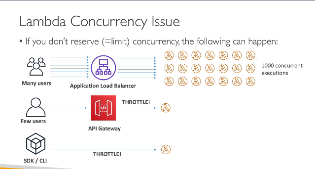
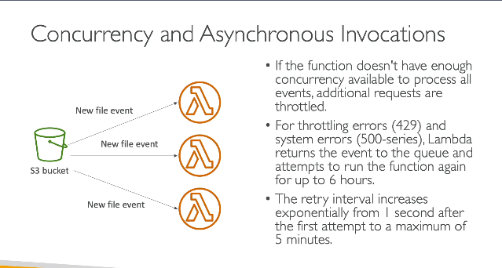
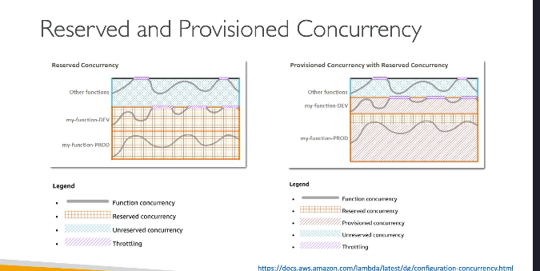

### Giới hạn về concurrency và giới hạn tốc độ của Lambda:

- **Thực thi concurrency:** Khi chúng ta gọi hàm Lambda nhiều lần, chúng ta sẽ có nhiều lần thực thi concurrency của các hàm Lambda. Lambda có thể mở rộng rất nhanh chóng và dễ dàng. Nếu chúng ta gọi hàm Lambda ở quy mô thấp, có thể có hai lần thực thi concurrency. Nhưng nếu có nhiều sự kiện xảy ra, có thể có tới 1000 lần thực thi concurrency của các hàm Lambda.

- **Giới hạn concurrency:** 
  Chúng ta có thể giới hạn số lượng thực thi concurrency của một hàm Lambda bằng cách đặt "reserved concurrency" ở mức hàm. Ví dụ, chúng ta có thể đặt giới hạn là 50 lần thực thi concurrency. Mỗi lần gọi vượt quá giới hạn concurrency sẽ kích hoạt một lỗi giới hạn tốc độ (throttle).

- **Lỗi throttle:** Nếu là gọi đồng bộ(sync), lỗi throttle sẽ trả về mã lỗi 429. Nếu là gọi không đồng bộ(async), nó sẽ tự động thử lại và chuyển đến hàng đợi DLQ.

- **Tăng giới hạn:** Nếu cần hơn 1000 lần thực thi concurrency, bạn có thể mở một yêu cầu hỗ trợ để tăng giới hạn.

- **Ảnh hưởng của giới hạn concurrency:** Giới hạn concurrency áp dụng cho tất cả các hàm trong tài khoản của bạn. Nếu một hàm vượt quá giới hạn, các hàm khác có thể bị giới hạn tốc độ.

### Thực thi không đồng bộ và hàng đợi sự kiện:

- **Thực thi không đồng bộ:**
  
  Ví dụ, khi tải lên các file vào S3, tạo ra sự kiện mới sẽ gọi hàm Lambda. Nếu có nhiều file được tải lên cùng lúc, sẽ có nhiều lần thực thi concurrency của Lambda. Nếu hàm không có đủ khả năng concurrency, các yêu cầu bổ sung sẽ bị giới hạn tốc độ.

- **Hàng đợi sự kiện:** Trong chế độ không đồng bộ, Lambda sẽ trả lại sự kiện vào hàng đợi sự kiện và thử lại trong tối đa 6 giờ. Thời gian thử lại sẽ tăng dần từ 1 giây đến tối đa 5 phút.

### Cold starts và provisioned concurrency:

- **Cold start:** Khi tạo một instance mới của hàm Lambda, mã phải được tải và khởi tạo. Nếu quá trình khởi tạo lớn, yêu cầu đầu tiên sẽ có độ trễ cao hơn và có thể ảnh hưởng đến người dùng.

- **Provisioned concurrency:** Để tránh cold start, bạn có thể sử dụng provisioned concurrency để phân bổ khả năng concurrency trước khi hàm được gọi. Điều này giúp giảm độ trễ cho tất cả các lần gọi.

- **Cải tiến cold start:** AWS đã cải tiến để giảm thiểu cold start trong VPC từ tháng 10 và 11 năm 2019.
