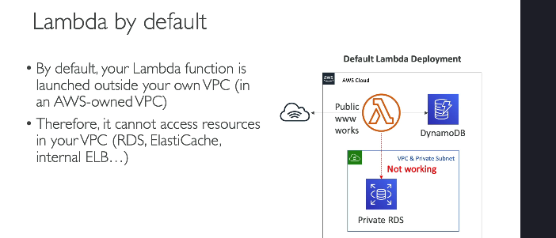
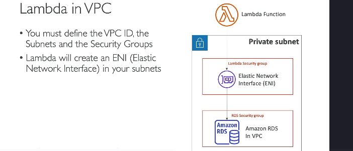
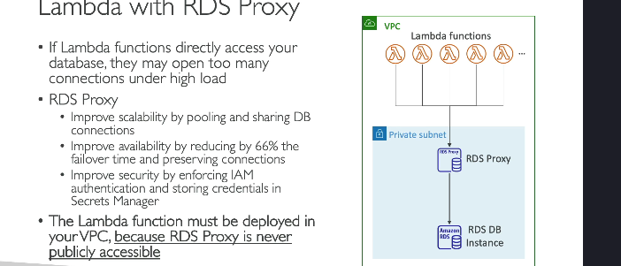

### Các kiến thức cơ bản về mạng cho AWS Lambda (Dành cho người mới bắt đầu)

---

AWS Lambda cho phép bạn chạy mã mà không cần quản lý server. Tuy nhiên, để Lambda có thể truy cập vào các tài nguyên riêng tư (như cơ sở dữ liệu), bạn cần hiểu rõ cách thiết lập mạng.

---

### **Mạng mặc định của Lambda**

- Khi bạn chạy một hàm Lambda, mặc định nó sẽ **không chạy trong VPC của bạn**. Thay vào đó, nó được chạy trong một VPC do AWS quản lý.
- Hệ quả:
  - Lambda **không thể truy cập** vào các tài nguyên **riêng tư trong VPC của bạn**, như:
    - **Cơ sở dữ liệu RDS riêng tư**.
    - **ElastiCache**.
    - **Internal Load Balancer** (cân bằng tải nội bộ).
  - Lambda **có thể truy cập** vào các tài nguyên **công khai** trên AWS, như:
    - **DynamoDB** (vì DynamoDB là một dịch vụ công khai của AWS).
    - Các **API công khai trên internet**.

---

### **Chạy Lambda trong VPC của bạn**

- Nếu Lambda cần truy cập các tài nguyên riêng tư trong VPC (như cơ sở dữ liệu RDS), bạn phải cấu hình để chạy Lambda **bên trong VPC** của bạn.
- Cách thực hiện:

  1. **Chỉ định VPC ID** (VPC mà Lambda sẽ chạy trong đó).
  2. Chọn **các subnet** trong VPC (những khu vực mạng nhỏ hơn).
  3. Gắn **Security Group** cho Lambda (để kiểm soát quyền truy cập mạng).
  4. Kết nối Lambda với **Elastic Network Interface (ENI)** trong subnet đã chọn.

- Kết quả:
  - Lambda có thể truy cập vào tài nguyên riêng tư, ví dụ:
    - **RDS Database**.
    - **ElastiCache**.
  - Kết nối hoàn toàn riêng tư, không qua internet.

---

### **Sử dụng Lambda với RDS Proxy**

Một vấn đề phổ biến khi Lambda kết nối trực tiếp với cơ sở dữ liệu RDS là:

- Lambda tạo rất nhiều **kết nối trực tiếp đến RDS** khi có nhiều hàm Lambda chạy đồng thời.
- Điều này có thể gây ra:
  - **Quá tải kết nối** trên RDS.
  - **Timeout** (hết thời gian chờ).
  - Hiệu suất giảm khi tải cao.

**Giải pháp:**  
Sử dụng **RDS Proxy** làm trung gian giữa Lambda và RDS:

1. **RDS Proxy** sẽ quản lý và tái sử dụng các kết nối với RDS, giúp giảm tải cho cơ sở dữ liệu.
2. Các Lambda kết nối với **RDS Proxy** thay vì kết nối trực tiếp đến RDS.

---

### **Lợi ích của RDS Proxy**

1. **Tăng khả năng mở rộng (Scalability):**
   - RDS Proxy quản lý và chia sẻ các kết nối, giảm thiểu số lượng kết nối trực tiếp từ Lambda đến RDS.
2. **Cải thiện thời gian failover:**
   - Trong trường hợp RDS bị lỗi, thời gian chuyển đổi (failover) sẽ giảm **66%**, giúp duy trì kết nối ổn định.
3. **Bảo mật tốt hơn:**
   - RDS Proxy hỗ trợ **IAM Authentication**, cho phép bạn dùng các tài khoản bảo mật IAM để quản lý quyền truy cập.
   - Thông tin đăng nhập có thể được lưu trữ an toàn trong **Secrets Manager**.

---

### **Yêu cầu khi dùng Lambda với RDS Proxy**

- Lambda cần được chạy **bên trong VPC**, vì:
  - RDS Proxy **không bao giờ công khai** (không thể truy cập từ mạng bên ngoài).
  - Nếu Lambda chạy bên ngoài VPC, nó sẽ **không có kết nối mạng** với RDS Proxy.

---

### **Tóm lại:**

- **Mặc định:** Lambda không có quyền truy cập tài nguyên trong VPC của bạn.
- **Khi cần truy cập tài nguyên riêng tư:** Bạn cần cấu hình Lambda chạy trong VPC.
- **RDS Proxy:** Một giải pháp tối ưu khi Lambda kết nối với RDS để cải thiện hiệu suất và bảo mật.
