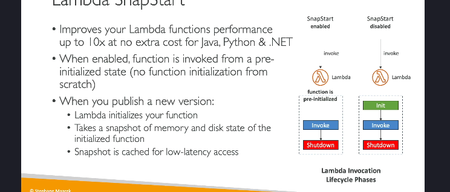

Lambda SnapStart là một tính năng giúp cải thiện hiệu suất của hàm AWS Lambda lên tới 10 lần mà **không tốn thêm chi phí**. Tính năng này hiện hỗ trợ các ngôn ngữ **Java**, **Python**, và **.NET**.

### 1. **Vấn đề khi không dùng SnapStart**

Khi SnapStart bị tắt, các hàm Lambda sẽ trải qua 3 giai đoạn vòng đời:

- **Initialize**: Đây là giai đoạn khởi tạo, nơi toàn bộ môi trường của hàm được thiết lập.
- **Invoke**: Giai đoạn thực thi logic của hàm.
- **Shutdown**: Giai đoạn kết thúc, giải phóng tài nguyên.

Trong số đó, **giai đoạn khởi tạo (Initialize)** thường chiếm nhiều thời gian nhất, đặc biệt đối với các hàm viết bằng Java, vì cần phải tải môi trường và các dependency.

---

### 2. **SnapStart hoạt động như thế nào?**

Khi sử dụng SnapStart, AWS Lambda sẽ thực hiện một số tối ưu hóa như sau:

- **Khởi tạo trước (Preinitialization)**: Hàm Lambda sẽ được khởi tạo trước khi bạn thực sự sử dụng nó.
- **Tạo snapshot**: Khi bạn **publish một phiên bản mới** của hàm Lambda, AWS sẽ tự động:
  - Khởi tạo hàm.
  - Tạo một **snapshot** của trạng thái bộ nhớ và đĩa tại thời điểm đó.
- **Sử dụng snapshot**: Khi hàm Lambda được gọi, AWS sẽ sử dụng snapshot đã tạo để bỏ qua giai đoạn khởi tạo và chuyển trực tiếp đến giai đoạn **Invoke**.

---

### 3. **Lợi ích của SnapStart**

- **Hiệu suất cao hơn**: Thời gian khởi động (cold start) giảm đáng kể, cải thiện tốc độ thực thi lên tới **10 lần**.
- **Không tốn thêm chi phí**: Bạn không phải trả thêm tiền để sử dụng tính năng này.
- **Hỗ trợ đa ngôn ngữ**: Java, Python, .NET.

---

### 4. **Quy trình triển khai SnapStart**

- Khi bạn publish một phiên bản mới của hàm Lambda:
  - AWS tự động khởi tạo hàm.
  - Snapshot được tạo ra từ trạng thái bộ nhớ và đĩa của hàm.
- Trong lần gọi tiếp theo, thay vì khởi tạo từ đầu, AWS chỉ cần khôi phục snapshot.

---

### 5. **Khi nào nên sử dụng SnapStart?**

SnapStart phù hợp khi:

- Hàm Lambda có thời gian khởi tạo lâu (đặc biệt với Java).
- Yêu cầu hiệu suất cao với độ trễ thấp.

---

**Kết luận**: Lambda SnapStart là một công cụ mạnh mẽ giúp tăng tốc độ hàm Lambda mà không yêu cầu người dùng can thiệp quá nhiều, đảm bảo hiệu suất cao mà vẫn tiết kiệm chi phí.
