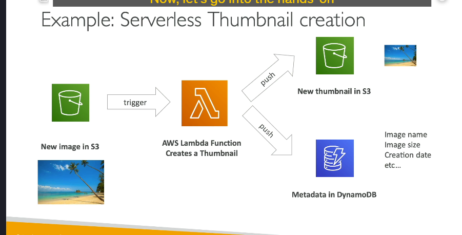
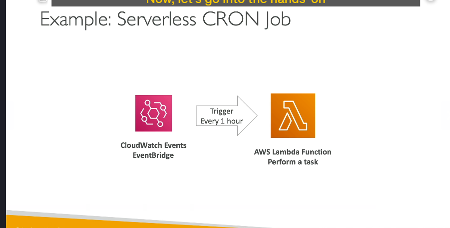

### **AWS Lambda là gì và tại sao nó hữu ích cho chúng ta?**

AWS Lambda là dịch vụ **serverless** của Amazon, cho phép bạn chạy các đoạn mã mà không cần quản lý cơ sở hạ tầng máy chủ. Mô hình này giúp các nhà phát triển chỉ cần **triển khai mã nguồn**, còn lại AWS sẽ lo liệu các công việc liên quan đến máy chủ như cung cấp tài nguyên, bảo trì và mở rộng.

---

### **So sánh AWS Lambda và Amazon EC2**

1. **Amazon EC2**:

   - EC2 yêu cầu bạn phải **cung cấp các máy chủ ảo** (virtual machines).
   - Máy chủ phải **chạy liên tục**, cho dù có sử dụng hay không.
   - Để mở rộng, bạn cần sử dụng **Auto Scaling groups** để tự động thêm hoặc xóa các máy chủ.
   - **Quản lý máy chủ** là công việc của bạn, dù bạn có thể tối ưu hóa việc bật/tắt chúng.

2. **AWS Lambda**:
   - Lambda là **serverless**, nghĩa là bạn không cần quản lý máy chủ.
   - Bạn chỉ **cung cấp mã** và Lambda sẽ **chạy theo yêu cầu**.
   - Lambda **hạn chế thời gian thực thi** (tối đa 15 phút cho mỗi lần gọi).
   - Mức phí chỉ tính khi Lambda thực thi, và bạn chỉ trả tiền khi có yêu cầu.

---

### **Lợi ích của AWS Lambda**

1. **Đơn giản và tiết kiệm chi phí**:

   - **Thanh toán theo số lượng yêu cầu và thời gian chạy**: Bạn chỉ trả tiền cho thời gian thực thi và số lượng yêu cầu Lambda nhận được.
   - Lambda có **một tầng miễn phí rất rộng**, bao gồm 1 triệu yêu cầu và 400,000 giây-GB tính toán.

2. **Khả năng mở rộng tự động**:

   - Lambda tự động mở rộng khi cần thiết, nếu có nhiều yêu cầu và số lượng phiên bản Lambda tăng lên, AWS sẽ tự động cung cấp thêm tài nguyên.

3. **Dễ dàng tích hợp với các dịch vụ AWS**:

   - **API Gateway** để tạo và gọi REST API.
   - **Kinesis** để xử lý và chuyển đổi dữ liệu theo thời gian thực.
   - **DynamoDB** có thể kích hoạt Lambda khi có thay đổi trong cơ sở dữ liệu.
   - **S3**: Lambda có thể kích hoạt khi có tệp tin mới được tải lên S3.
   - **CloudWatch Logs** và **EventBridge**: Dễ dàng giám sát và phản ứng với sự kiện trong hệ thống.
   - **SNS**, **SQS**: Để phản ứng với thông báo và xử lý tin nhắn.
   - **Cognito**: Kích hoạt Lambda khi người dùng đăng nhập.

4. **Hỗ trợ nhiều ngôn ngữ lập trình**:
   - Lambda hỗ trợ **Node.js**, **Python**, **Java**, **C# (.NET Core)**, **Ruby**, **PowerShell** và nhiều ngôn ngữ khác thông qua **Custom Runtime API**.
   - **Hỗ trợ Docker containers**: Lambda có thể chạy các Docker images, tuy nhiên trong kỳ thi, việc sử dụng **ECS hoặc Fargate** để chạy Docker containers vẫn là sự lựa chọn tối ưu hơn.

---

### **Những điều cần lưu ý về AWS Lambda**

1. **Hạn chế thời gian**:

   - Mỗi Lambda function chỉ có thể chạy trong **tối đa 15 phút**.

2. **Tính năng mở rộng**:

   - Lambda sẽ tự động **mở rộng số lượng instance** khi có nhiều yêu cầu đồng thời (concurrency).

3. **Quản lý tài nguyên**:

   - Bạn có thể **cung cấp tối đa 10 GB RAM** cho mỗi Lambda function, điều này sẽ cải thiện hiệu suất CPU và mạng.

4. **Tích hợp với các dịch vụ khác**:
   - Lambda có thể tích hợp với hầu hết các dịch vụ của AWS, giúp bạn dễ dàng tạo ra các ứng dụng phản ứng với sự kiện.

---

### **Ví dụ Serverless với AWS Lambda**

Trong ví dụ này, giả sử bạn có một **S3 bucket** nơi các hình ảnh được tải lên và bạn muốn **tạo thumbnails tự động** ngay khi có hình ảnh mới được tải lên.

---

### **Tổng Quan Kiến Trúc**

1. **Tải ảnh lên S3**:

   - Người dùng tải lên một hình ảnh mới vào S3 bucket của bạn.
   - Điều này kích hoạt một **S3 event notification**.

2. **Lambda Function**:

   - Sự kiện này kích hoạt một **Lambda function** trong AWS.
   - Lambda function này sẽ chứa mã lệnh để **tạo thumbnail** cho hình ảnh được tải lên.

3. **Tạo Thumbnail**:

   - Lambda function xử lý hình ảnh và tạo ra một phiên bản nhỏ hơn (thumbnail).
   - Hình ảnh thumbnail có thể được tải lên **S3 bucket khác** hoặc trong cùng một bucket, nhưng vào **thư mục hoặc tên khác** để dễ dàng nhận diện.

4. **Lưu Metadata vào DynamoDB**:

   - Lambda function có thể lưu thêm thông tin về hình ảnh (ví dụ: tên, kích thước, ngày tạo) vào một bảng **DynamoDB** để lưu trữ dữ liệu.

5. **Tự động hóa và Kiến trúc phản ứng**:
   - Nhờ vào Lambda, toàn bộ quy trình được tự động hóa. Mỗi khi một hình ảnh mới được tải lên, hệ thống sẽ tự động tạo thumbnail và lưu metadata mà không cần can thiệp thủ công.

---

### **Serverless CRON Jobs với Lambda**

Một ví dụ khác rất phổ biến cho Lambda là **serverless CRON job**. Các CRON job thường được dùng để lên lịch thực hiện các tác vụ tại những thời điểm cố định (ví dụ: mỗi 5 phút hoặc mỗi thứ Hai lúc 10:00 AM).

#### **Ví Dụ về Serverless CRON Job**:

- Truyền thống, CRON jobs sẽ được quản lý trên các **EC2 instance**, có nghĩa là máy chủ phải chạy liên tục, ngay cả khi CRON job không thực hiện công việc gì, dẫn đến lãng phí tài nguyên.
- Với Lambda, bạn có thể thiết lập một **CloudWatch Event rule** (hoặc **EventBridge rule**) để kích hoạt Lambda function vào những khoảng thời gian cố định (ví dụ: mỗi giờ) để thực hiện tác vụ.
- Cả **CloudWatch Events** và **Lambda** đều là serverless, có nghĩa là bạn không cần quản lý máy chủ và chỉ trả tiền cho thời gian thực thi khi tác vụ được chạy.

---

### **Giá Cả của Lambda**

- **Requests**:

  - **1 triệu yêu cầu đầu tiên mỗi tháng** là miễn phí.
  - Sau đó, bạn sẽ phải trả **$0.20 cho mỗi 1 triệu yêu cầu**.

- **Thời gian Tính Toán**:
  - Lambda tính phí dựa trên **thời gian** mã của bạn chạy, được đo bằng **gigabyte-seconds** (GB-seconds).
  - Bạn sẽ nhận **400,000 GB-seconds miễn phí** mỗi tháng.
    - Ví dụ: Nếu Lambda function của bạn chạy trong **1 giây** với **1 GB RAM**, nó sẽ tiêu tốn **1 GB-second**.
    - Nếu function của bạn có **128 MB RAM**, nó sẽ tiêu tốn **ít gấp 8 lần** so với 1 GB RAM cho cùng thời gian thực thi (do bộ nhớ thấp hơn).
  - Sau khi hết miễn phí, bạn sẽ phải trả **$1 cho mỗi 600,000 GB-seconds**.

---

### **Tại sao Lambda Tiết Kiệm Chi Phí**

Lambda rất **rẻ** so với việc chạy các EC2 instances vì:

- **Bạn chỉ trả tiền cho thời gian mã của bạn chạy**.
- Bạn không cần phải cung cấp hay duy trì cơ sở hạ tầng.
- Mô hình tính phí dựa trên **yêu cầu** và **thời gian chạy** giúp Lambda trở thành lựa chọn tiết kiệm cho nhiều tác vụ.

---

### **Kết Luận**

AWS Lambda cung cấp một giải pháp đơn giản, tiết kiệm chi phí và có thể mở rộng cho việc xây dựng các ứng dụng serverless, có thể phản hồi các sự kiện, chẳng hạn như tải lên tệp tin hoặc các tác vụ theo lịch trình. Với Lambda, bạn có thể tránh phải quản lý máy chủ và chỉ trả tiền cho thời gian thực thi mã của bạn, giúp nó trở thành một lựa chọn phổ biến cho các kiến trúc đám mây hiện đại.
