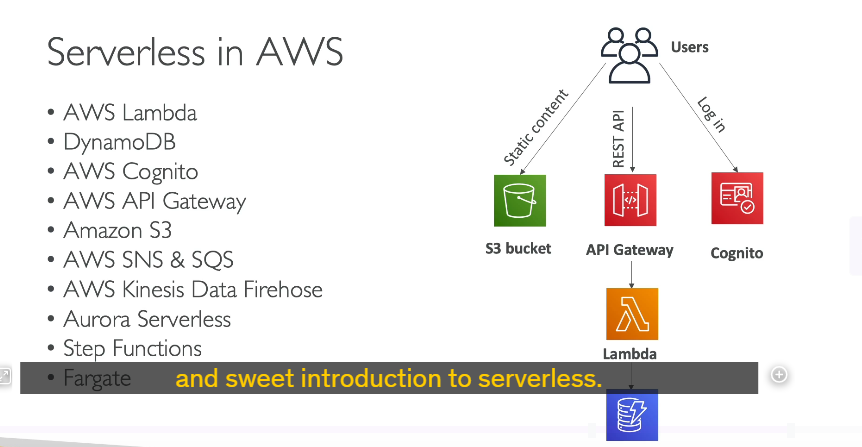

### **Giới thiệu về Serverless trên AWS**

Serverless là một mô hình cho phép nhà phát triển tập trung vào việc viết và triển khai mã mà không cần phải quản lý cơ sở hạ tầng máy chủ. Mặc dù máy chủ vẫn tồn tại, nhưng chúng hoàn toàn được AWS quản lý, bao gồm việc cấp phát, mở rộng và bảo trì.

---

### **Serverless là gì?**

1. **Định nghĩa ban đầu**:

   - Ban đầu gắn liền với mô hình **Function as a Service (FaaS)**.
   - Được tiên phong bởi **AWS Lambda**, nơi nhà phát triển triển khai hàm (function) mà không cần quản lý máy chủ.

2. **Phạm vi mở rộng**:
   - Hiện nay, serverless bao gồm các dịch vụ được quản lý như: **cơ sở dữ liệu, tin nhắn, lưu trữ**, và nhiều hơn nữa.
   - Serverless không có nghĩa là không có máy chủ, mà là **bạn không phải nhìn thấy hoặc quản lý chúng**.

---

### **Serverless hoạt động như thế nào trên AWS?**

1. **Kiến trúc tham khảo**:

   - Người dùng truy cập **nội dung tĩnh** từ **Amazon S3** (hoặc kết hợp với **CloudFront** để tăng tốc phân phối).
   - **AWS Cognito** quản lý danh tính người dùng để đăng nhập.
   - **API Gateway** xử lý các yêu cầu REST API từ người dùng và chuyển tiếp đến **AWS Lambda**.
   - Lambda thực thi logic và truy xuất dữ liệu từ **Amazon DynamoDB**.

2. **Các dịch vụ liên quan đến Serverless**:
   - **AWS Lambda**: Chạy mã không cần quản lý máy chủ.
   - **Amazon S3**: Lưu trữ nội dung tĩnh và phương tiện.
   - **Amazon DynamoDB**: Cơ sở dữ liệu NoSQL serverless.
   - **API Gateway**: Quản lý API RESTful serverless.
   - **SNS và SQS**: Dịch vụ nhắn tin tự động mở rộng.
   - **Kinesis Data Firehose**: Xử lý dữ liệu streaming không cần quản lý máy chủ.
   - **Aurora Serverless**: Cơ sở dữ liệu Aurora tự động mở rộng.
   - **Step Functions**: Điều phối luồng công việc serverless.
   - **Fargate**: Chạy container mà không cần quản lý cơ sở hạ tầng ECS.

---

### **Lợi ích của Serverless**

1. **Không quản lý máy chủ**: Không cần lo lắng về việc cài đặt, bảo trì hoặc mở rộng máy chủ.
2. **Thanh toán theo sử dụng**: Chỉ trả tiền cho tài nguyên bạn sử dụng (không cần trả tiền cho tài nguyên không dùng đến).
3. **Tự động mở rộng**: Tự động xử lý lưu lượng tăng giảm mà không cần can thiệp thủ công.

---
