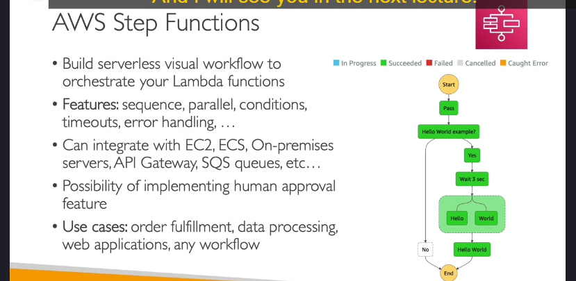

### **Chi Tiết về AWS Step Functions**

AWS Step Functions là dịch vụ dùng để xây dựng các **workflow không máy chủ (serverless)** với giao diện trực quan, giúp **điều phối (orchestrate)** các dịch vụ trong AWS.

---

### **1. Tổng Quan**

- **Mục đích:** Tạo, quản lý và vận hành các workflow phức tạp trong AWS.
- **Chủ yếu dùng cho Lambda Functions:** Nhưng không chỉ giới hạn ở Lambda.
- **Cách hoạt động:**
  - Người dùng thiết kế một biểu đồ workflow dưới dạng đồ thị.
  - Mỗi bước trong workflow có thể xử lý thành công, thất bại hoặc điều kiện logic khác nhau.

---

### **2. Các Tính Năng Chính**

- **Sắp xếp thứ tự (Sequencing):** Xác định thứ tự thực thi các bước.
- **Thực thi song song (Parallel Functions):** Chạy nhiều tác vụ đồng thời.
- **Điều kiện (Conditions):** Đưa ra quyết định dựa trên kết quả của từng bước.
- **Timeouts:** Xác định thời gian tối đa cho một bước trong workflow.
- **Xử lý lỗi (Error Handling):** Quản lý lỗi với logic retry hoặc fallback.

---

### **3. Tích Hợp với Các Dịch Vụ AWS**

Step Functions có thể tích hợp với nhiều dịch vụ AWS như:

- **Lambda Functions:** Xử lý logic không máy chủ.
- **EC2 Instances:** Điều phối các tác vụ chạy trên EC2.
- **ECS Tasks:** Xử lý công việc container hóa.
- **On-Premises Servers:** Điều phối các tác vụ máy chủ nội bộ.
- **API Gateway:** Xử lý yêu cầu API.
- **SQS Queues:** Quản lý hàng đợi thông điệp.
- **SNS Topics:** Gửi thông báo.
- **Glue, DynamoDB, Athena:** Tích hợp cho phân tích và lưu trữ dữ liệu.

---

### **4. Chức Năng Phê Duyệt Thủ Công (Human Approval)**

- **Mô tả:** Một workflow có thể yêu cầu con người tham gia phê duyệt ở một bước nào đó.
- **Ví dụ:**
  - Nếu kết quả của bước kiểm tra dữ liệu cần sự xem xét của con người:
    - Nếu được phê duyệt ("Yes"), workflow tiếp tục.
    - Nếu từ chối ("No"), workflow sẽ kết thúc hoặc thất bại.

---

### **5. Các Trường Hợp Sử Dụng**

Step Functions có nhiều ứng dụng thực tế, bao gồm:

- **Xử lý đơn hàng (Order Fulfillment):** Tự động hóa quy trình đặt hàng và xử lý giao dịch.
- **Xử lý dữ liệu (Data Processing):** Thực hiện các bước phân tích và biến đổi dữ liệu theo trình tự.
- **Ứng dụng web (Web Applications):** Điều phối logic backend của ứng dụng web.
- **Xử lý workflow phức tạp:** Bất kỳ quy trình nào cần sự trực quan và logic nhiều bước.

---

### **Lợi Ích**

- **Giao diện đồ họa:** Dễ hình dung và quản lý workflow phức tạp.
- **Khả năng mở rộng:** Dễ dàng tích hợp nhiều dịch vụ AWS khác nhau.
- **Không máy chủ:** Giảm chi phí quản lý hạ tầng.
- **Quản lý lỗi tốt:** Cho phép xây dựng logic retry khi lỗi xảy ra.

---

### **Kết Luận**

AWS Step Functions là công cụ mạnh mẽ cho các doanh nghiệp cần điều phối và quản lý quy trình làm việc phức tạp. Việc tích hợp với nhiều dịch vụ AWS khác giúp tối ưu hóa hoạt động và tăng hiệu suất làm việc.
