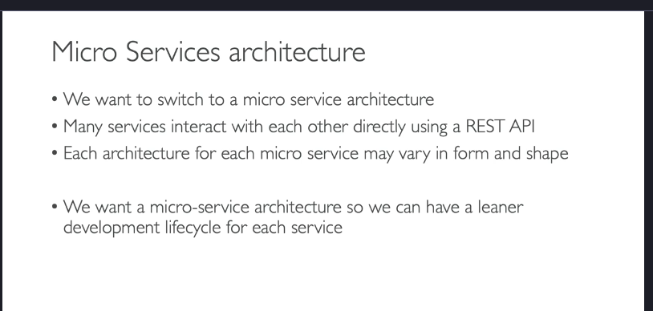
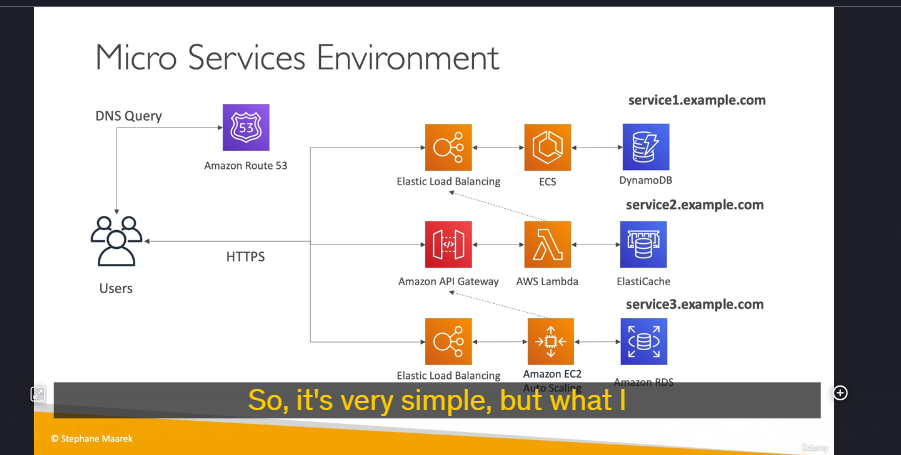

### **Chi Tiết Kiến Thức Về Microservices Architecture**

thảo luận về **kiến trúc microservices**, một cách tiếp cận phổ biến để xây dựng các hệ thống phân tán. Dưới đây là các điểm chính và chi tiết kỹ thuật:

---

### **1. Tổng Quan Về Microservices**

- **Định nghĩa**: Microservices là một kiến trúc phần mềm trong đó ứng dụng được chia thành các dịch vụ nhỏ, độc lập, mỗi dịch vụ thực hiện một chức năng cụ thể.
- **Giao tiếp giữa các dịch vụ**: Các microservices thường giao tiếp với nhau thông qua **REST API** hoặc các cơ chế khác như message queues (SQS, SNS).
- **Lợi ích**:
  - **Phát triển độc lập**: Mỗi dịch vụ có thể được phát triển, triển khai và scale độc lập.
  - **Tối ưu công nghệ**: Mỗi dịch vụ có thể sử dụng công nghệ phù hợp nhất cho nhiệm vụ của nó.
  - **Dễ bảo trì và mở rộng**: Thay đổi trong một dịch vụ không ảnh hưởng đến các dịch vụ khác.

---

### **2. Ví Dụ Về Kiến Trúc Microservices**

#### **a. Microservice 1: Sử dụng ECS và DynamoDB**

- **Công nghệ**:
  - **Elastic Load Balancer (ELB)**: Phân phối lưu lượng truy cập đến các container.
  - **Amazon ECS (Elastic Container Service)**: Quản lý các Docker container chạy microservice.
  - **DynamoDB**: Lưu trữ dữ liệu cho microservice.
- **Giao tiếp**: Người dùng tương tác với microservice qua HTTPS thông qua ELB.
- **DNS**: Sử dụng **Route 53** để cung cấp DNS name (ví dụ: `service1.example.com`).

#### **b. Microservice 2: Sử dụng Serverless và ElastiCache**

- **Công nghệ**:
  - **AWS Lambda**: Xử lý logic nghiệp vụ.
  - **Amazon ElastiCache**: Cung cấp bộ nhớ đệm (cache) để tăng hiệu suất.
- **Giao tiếp**: Lambda có thể gọi REST API của Microservice 1 thông qua ELB để lấy dữ liệu cần thiết.

#### **c. Microservice 3: Sử dụng EC2 Auto Scaling và RDS**

- **Công nghệ**:
  - **Amazon EC2 Auto Scaling**: Tự động scale các máy ảo dựa trên nhu cầu.
  - **Amazon RDS**: Cơ sở dữ liệu quan hệ để lưu trữ dữ liệu.
- **Giao tiếp**: EC2 instance có thể gọi Microservice 2 trước khi đưa ra quyết định.

---

### **3. Các Mẫu Giao Tiếp Trong Microservices**

#### **a. Giao Tiếp Đồng Bộ (Synchronous)**

- **Cơ chế**: Các dịch vụ giao tiếp trực tiếp với nhau thông qua REST API hoặc HTTPS.
- **Ví dụ**:
  - API Gateway gọi Lambda.
  - Lambda gọi ELB của một microservice khác.
- **Ưu điểm**: Đơn giản, dễ triển khai.
- **Nhược điểm**: Tăng độ trễ nếu có nhiều dịch vụ gọi lẫn nhau.

#### **b. Giao Tiếp Bất Đồng Bộ (Asynchronous)**

- **Cơ chế**: Các dịch vụ giao tiếp thông qua message queues (SQS, SNS) hoặc event-driven architecture.
- **Ví dụ**:
  - Một dịch vụ đẩy message vào SQS, dịch vụ khác xử lý message khi có thể.
  - S3 kích hoạt Lambda khi có file mới được upload.
- **Ưu điểm**: Giảm độ trễ, tăng khả năng chịu lỗi.
- **Nhược điểm**: Phức tạp hơn trong thiết kế và debug.

---

### **4. Thách Thức Khi Sử Dụng Microservices**

- **Chi phí phát triển**: Mỗi microservice cần có cơ sở hạ tầng riêng, dẫn đến chi phí phát triển và quản lý tăng.
- **Tối ưu hóa tài nguyên**: Khó khăn trong việc tối ưu hóa mật độ server và sử dụng tài nguyên.
- **Quản lý phiên bản**: Cần quản lý nhiều phiên bản của các dịch vụ cùng lúc.
- **Phức tạp tích hợp**: Client cần tích hợp với nhiều dịch vụ khác nhau, dẫn đến phức tạp trong việc phát triển và bảo trì.

---

### **5. Giải Pháp Sử Dụng Serverless**

- **API Gateway + Lambda**: Giúp tự động scale và giảm chi phí quản lý server.
- **Tạo SDK tự động**: Sử dụng Swagger để tạo client SDK từ API Gateway, giúp tích hợp dễ dàng hơn.
- **Dễ dàng sao chép môi trường**: API Gateway cho phép sao chép và triển khai các API một cách nhanh chóng.

---

### **6. Tổng Kết**

- **Microservices** là một kiến trúc linh hoạt, cho phép phát triển và scale các dịch vụ độc lập.
- **Giao tiếp đồng bộ** (REST API) và **bất đồng bộ** (SQS, SNS) là hai mẫu phổ biến.
- **Thách thức** bao gồm chi phí phát triển, quản lý phiên bản và tích hợp phức tạp.
- **Serverless** (API Gateway, Lambda) có thể giúp giải quyết một số thách thức này.

---
