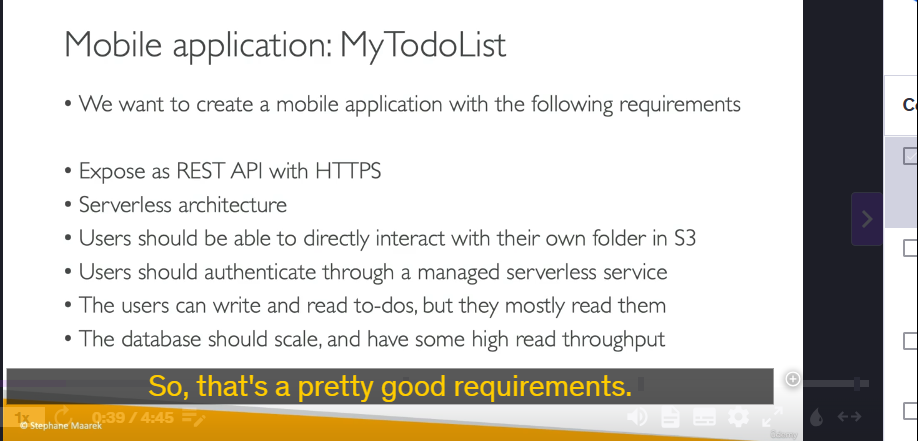

### **Chi Tiết Kiến Thức Về Serverless Architectures và Ứng Dụng MyTodoList**

Trong bài học này, chúng ta đã thảo luận về cách xây dựng một ứng dụng di động có tên **MyTodoList** sử dụng kiến trúc **serverless**. Dưới đây là các điểm chính và chi tiết kỹ thuật:

---

### **1. Yêu Cầu Của Ứng Dụng**

- **REST API với HTTPS endpoints**: Ứng dụng cần cung cấp một API REST để tương tác với dữ liệu.
- **Kiến trúc serverless**: Không cần quản lý máy chủ, tự động scale và chỉ trả tiền cho tài nguyên sử dụng.
- **Tương tác trực tiếp với S3**: Người dùng có thể quản lý dữ liệu của họ trong một thư mục riêng trên Amazon S3.
- **Xác thực người dùng**: Sử dụng dịch vụ xác thực serverless (managed service).
- **Tối ưu hiệu suất**: Ứng dụng có nhiều thao tác đọc (read) hơn ghi (write), do đó cần một cơ sở dữ liệu có khả năng scale và throughput cao.

---

### **2. Kiến Trúc Serverless Đề Xuất**

Để đáp ứng các yêu cầu trên, kiến trúc được đề xuất bao gồm các thành phần chính sau:

#### **a. Amazon API Gateway**

- **Vai trò**: Cung cấp các HTTPS endpoints để tương tác với ứng dụng.
- **Tích hợp với Lambda**: API Gateway sẽ kích hoạt các hàm Lambda để xử lý yêu cầu từ client.
- **Lợi ích**: Tự động scale, không cần quản lý máy chủ, và hỗ trợ HTTPS.

#### **b. AWS Lambda**

- **Vai trò**: Xử lý logic nghiệp vụ (ví dụ: thêm, xóa, sửa to-do).
- **Tích hợp với DynamoDB**: Lambda đọc và ghi dữ liệu vào DynamoDB.
- **Lợi ích**: Serverless, tự động scale, và chỉ trả tiền cho thời gian thực thi.

#### **c. Amazon DynamoDB**

- **Vai trò**: Lưu trữ dữ liệu to-do của người dùng.
- **Lợi ích**: Cơ sở dữ liệu NoSQL serverless, tự động scale, và hỗ trợ throughput cao.
- **Tối ưu hiệu suất**: Sử dụng **DynamoDB Accelerator (DAX)** để cache các truy vấn đọc, giảm tải cho DynamoDB và cải thiện hiệu suất.

#### **d. Amazon Cognito**

- **Vai trò**: Quản lý xác thực người dùng.
- **Cơ chế hoạt động**:
  - Người dùng đăng nhập qua Cognito.
  - Cognito cung cấp **temporary credentials** (chứng chỉ tạm thời) để người dùng truy cập vào S3 hoặc các dịch vụ khác.
- **Lợi ích**: Bảo mật, không cần lưu trữ thông tin đăng nhập trên client.

#### **e. Amazon S3**

- **Vai trò**: Lưu trữ dữ liệu file của người dùng (ví dụ: hình ảnh, file đính kèm).
- **Cơ chế truy cập**: Người dùng nhận temporary credentials từ Cognito để truy cập vào thư mục riêng của họ trên S3.
- **Lợi ích**: Dễ dàng quản lý và scale.

---

### **3. Tối Ưu Hiệu Suất và Chi Phí**

- **DynamoDB Accelerator (DAX)**:
  - **Vai trò**: Cache các truy vấn đọc, giảm tải cho DynamoDB.
  - **Lợi ích**: Cải thiện hiệu suất và giảm chi phí (do giảm số lượng RCUs cần thiết).
- **Caching tại API Gateway**:
  - **Vai trò**: Cache các phản hồi API nếu dữ liệu ít thay đổi.
  - **Lợi ích**: Giảm thời gian phản hồi và tải cho Lambda.

---

### **4. Lợi Ích Của Kiến Trúc Serverless**

- **Không cần quản lý máy chủ**: AWS quản lý tất cả tài nguyên.
- **Tự động scale**: Ứng dụng tự động scale dựa trên nhu cầu.
- **Chi phí thấp**: Chỉ trả tiền cho tài nguyên sử dụng.
- **Bảo mật**: Sử dụng Cognito để quản lý xác thực và temporary credentials.

---

### **5. Lưu Ý Quan Trọng**

- **Không lưu trữ AWS credentials trên client**: Luôn sử dụng temporary credentials từ Cognito để đảm bảo bảo mật.
- **Sử dụng DAX và caching**: Để tối ưu hiệu suất và chi phí khi có nhiều thao tác đọc.

---

### **6. Tổng Kết**

Kiến trúc serverless cho ứng dụng **MyTodoList** bao gồm:

- **API Gateway** để cung cấp REST API.
- **Lambda** để xử lý logic.
- **DynamoDB** để lưu trữ dữ liệu.
- **Cognito** để quản lý xác thực.
- **S3** để lưu trữ file.
- **DAX** và **caching** để tối ưu hiệu suất.

Đây là một kiến trúc phổ biến và hiệu quả cho các ứng dụng serverless, giúp giảm thiểu chi phí và công sức quản lý.

---
