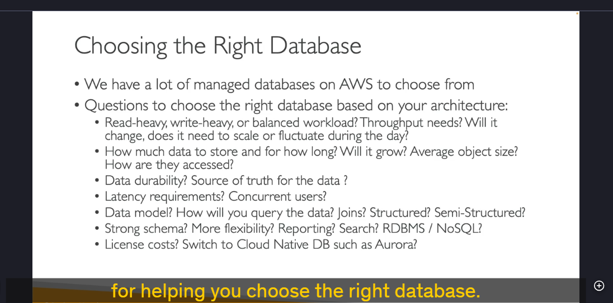
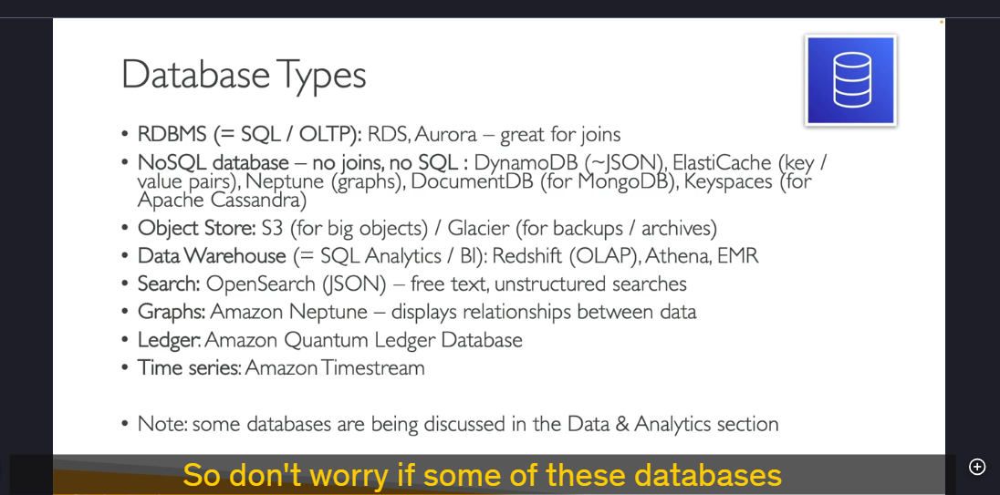

### **Chi tiết kiến thức về Cơ sở dữ liệu (Databases)**

Trong phần này, chúng ta sẽ tìm hiểu về các loại cơ sở dữ liệu khác nhau trên AWS và cách lựa chọn cơ sở dữ liệu phù hợp cho từng workload cụ thể. Dưới đây là các khía cạnh quan trọng cần xem xét khi chọn cơ sở dữ liệu:

---

### **1. Các yếu tố cần xem xét khi chọn cơ sở dữ liệu**

- **Workload (Khối lượng công việc):**
  - **Write-heavy (Ghi nhiều):** Cần cơ sở dữ liệu tối ưu cho việc ghi dữ liệu.
  - **Read-heavy (Đọc nhiều):** Cần cơ sở dữ liệu tối ưu cho việc đọc dữ liệu.
  - **Balanced workload (Cân bằng):** Cần cơ sở dữ liệu xử lý cả đọc và ghi một cách cân bằng.
- **Dữ liệu:**

  - **Kích thước dữ liệu:** Dữ liệu lớn hay nhỏ? Dữ liệu có tăng trưởng theo thời gian không?
  - **Độ bền dữ liệu (Data Durability):** Dữ liệu có cần được lưu trữ an toàn và không bị mất mát không?
  - **Nguồn dữ liệu (Source of Truth):** Dữ liệu được lấy từ đâu và có cần đồng bộ hóa không?

- **Hiệu suất:**

  - **Độ trễ (Latency):** Có yêu cầu về độ trễ thấp không?
  - **Người dùng đồng thời (Concurrent Users):** Có bao nhiêu người dùng truy cập đồng thời?

- **Mô hình dữ liệu:**

  - **Cấu trúc dữ liệu (Structured, Semi-structured, Unstructured):** Dữ liệu có cấu trúc chặt chẽ hay linh hoạt?
  - **Cách truy vấn (Query):** Có cần thực hiện các phép JOIN, truy vấn phức tạp không?

- **Tính năng bổ sung:**
  - **Báo cáo (Reporting):** Có cần tích hợp báo cáo trên cơ sở dữ liệu không?
  - **Tìm kiếm (Search):** Có cần tìm kiếm văn bản tự do (full-text search) không?
  - **Chi phí (Cost):** Có yêu cầu về chi phí thấp hoặc không có phí bản quyền không?

---

### **2. Các loại cơ sở dữ liệu trên AWS**

#### **2.1. Cơ sở dữ liệu quan hệ (RDBMS - Relational Database Management System)**

- **Đặc điểm:**
  - Sử dụng SQL (Structured Query Language).
  - Phù hợp cho các ứng dụng OLTP (Online Transaction Processing).
  - Hỗ trợ JOIN và các truy vấn phức tạp.
- **Dịch vụ AWS:**
  - **Amazon RDS (Relational Database Service):** Hỗ trợ nhiều engine như MySQL, PostgreSQL, Oracle, SQL Server, MariaDB.
  - **Amazon Aurora:** Cơ sở dữ liệu tương thích MySQL và PostgreSQL, hiệu suất cao, tự động mở rộng.

#### **2.2. Cơ sở dữ liệu NoSQL**

- **Đặc điểm:**
  - Linh hoạt hơn so với RDBMS.
  - Không hỗ trợ JOIN hoặc SQL (trừ một số ngoại lệ).
  - Phù hợp cho dữ liệu phi cấu trúc hoặc bán cấu trúc.
- **Dịch vụ AWS:**
  - **Amazon DynamoDB:** Cơ sở dữ liệu NoSQL key-value, hiệu suất cao, tự động mở rộng.
  - **Amazon ElastiCache:** Dịch vụ bộ nhớ đệm (cache) dựa trên Redis hoặc Memcached.
  - **Amazon Neptune:** Cơ sở dữ liệu đồ thị (Graph Database) để quản lý các mối quan hệ phức tạp.
  - **Amazon DocumentDB:** Cơ sở dữ liệu tương thích MongoDB, lưu trữ dữ liệu dạng JSON.
  - **Amazon Keyspaces:** Cơ sở dữ liệu tương thích Apache Cassandra, phù hợp cho dữ liệu phân tán.

#### **2.3. Lưu trữ đối tượng (Object Store)**

- **Đặc điểm:**
  - Phù hợp cho lưu trữ các đối tượng lớn như hình ảnh, video, file backup.
- **Dịch vụ AWS:**
  - **Amazon S3 (Simple Storage Service):** Lưu trữ đối tượng với độ bền cao.
  - **Amazon Glacier:** Lưu trữ dữ liệu lưu trữ (archival) với chi phí thấp.

#### **2.4. Kho dữ liệu (Data Warehousing)**

- **Đặc điểm:**
  - Phù hợp cho phân tích dữ liệu (OLAP - Online Analytical Processing) và BI (Business Intelligence).
- **Dịch vụ AWS:**
  - **Amazon Redshift:** Kho dữ liệu quan hệ, hỗ trợ truy vấn SQL phức tạp.
  - **Amazon Athena:** Dịch vụ truy vấn dữ liệu trực tiếp trên S3 bằng SQL.
  - **Amazon EMR (Elastic MapReduce):** Dịch vụ xử lý dữ liệu lớn (Big Data) sử dụng Hadoop, Spark.

#### **2.5. Cơ sở dữ liệu tìm kiếm (Search Databases)**

- **Đặc điểm:**
  - Hỗ trợ tìm kiếm văn bản tự do (full-text search) và tìm kiếm phi cấu trúc.
- **Dịch vụ AWS:**
  - **Amazon OpenSearch Service (trước đây là Elasticsearch):** Hỗ trợ tìm kiếm và phân tích dữ liệu.

#### **2.6. Cơ sở dữ liệu đồ thị (Graph Databases)**

- **Đặc điểm:**
  - Phù hợp cho các ứng dụng cần quản lý mối quan hệ phức tạp giữa các dữ liệu.
- **Dịch vụ AWS:**
  - **Amazon Neptune:** Cơ sở dữ liệu đồ thị hỗ trợ cả RDF và Property Graph.

#### **2.7. Cơ sở dữ liệu sổ cái (Ledger Databases)**

- **Đặc điểm:**
  - Phù hợp cho các ứng dụng cần lưu trữ lịch sử giao dịch một cách minh bạch và không thể thay đổi.
- **Dịch vụ AWS:**
  - **Amazon QLDB (Quantum Ledger Database):** Cơ sở dữ liệu sổ cái phi tập trung.

#### **2.8. Cơ sở dữ liệu chuỗi thời gian (Time Series Databases)**

- **Đặc điểm:**
  - Phù hợp cho các ứng dụng cần lưu trữ và phân tích dữ liệu theo thời gian.
- **Dịch vụ AWS:**
  - **Amazon Timestream:** Cơ sở dữ liệu chuỗi thời gian hiệu suất cao.

---

### **3. Tổng kết**

- **RDBMS (SQL):** Phù hợp cho các ứng dụng cần truy vấn phức tạp và JOIN (RDS, Aurora).
- **NoSQL:** Linh hoạt, phù hợp cho dữ liệu phi cấu trúc (DynamoDB, DocumentDB).
- **Object Store:** Lưu trữ đối tượng lớn (S3, Glacier).
- **Data Warehousing:** Phân tích dữ liệu và BI (Redshift, Athena).
- **Search Databases:** Tìm kiếm văn bản tự do (OpenSearch).
- **Graph Databases:** Quản lý mối quan hệ phức tạp (Neptune).
- **Ledger Databases:** Lưu trữ lịch sử giao dịch (QLDB).
- **Time Series Databases:** Phân tích dữ liệu theo thời gian (Timestream).

---

### **4. Lưu ý**

- Các câu hỏi trong bài kiểm tra sẽ yêu cầu bạn chọn cơ sở dữ liệu phù hợp dựa trên các yêu cầu cụ thể của workload.
- Không cần nhớ tất cả các chi tiết ngay lập tức, nhưng cần hiểu rõ các đặc điểm và trường hợp sử dụng của từng loại cơ sở dữ liệu.
