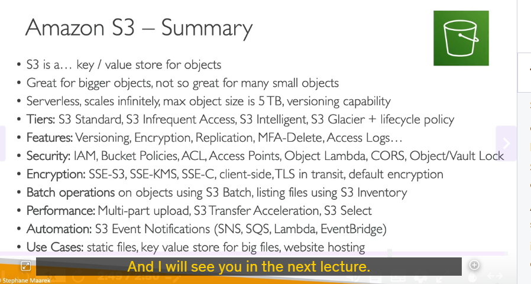
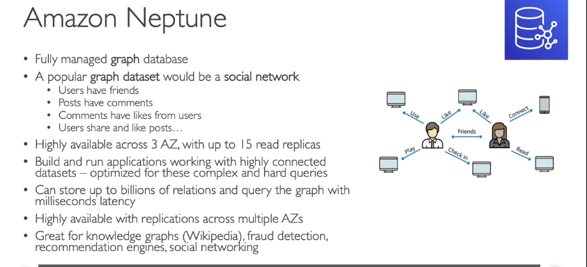
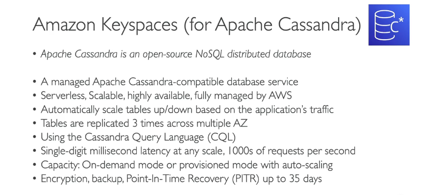
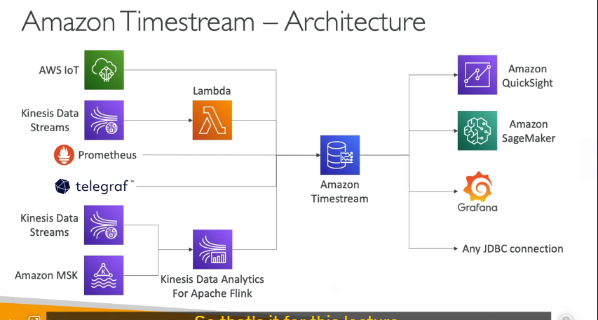

### **Tổng hợp về Amazon Aurora**

Amazon Aurora là một dịch vụ cơ sở dữ liệu quan hệ (RDBMS) được quản lý hoàn toàn bởi AWS, tương thích với hai engine cơ sở dữ liệu phổ biến là **PostgreSQL** và **MySQL**. Aurora được thiết kế để cung cấp hiệu suất cao, khả năng mở rộng và tính sẵn sàng cao hơn so với các cơ sở dữ liệu truyền thống.

---

### **1. Kiến trúc của Amazon Aurora**

- **Tách biệt lưu trữ và tính toán (Storage và Compute):**
  - **Lưu trữ (Storage):**
    - Dữ liệu được lưu trữ trên **6 bản sao (replicas)** tự động, phân tán trên **3 Availability Zones (AZs)**.
    - Quá trình **self-healing** tự động sửa chữa các vấn đề về lưu trữ.
    - **Tự động mở rộng (Auto-scaling):** Lưu trữ tăng tự động khi cần thiết, không cần can thiệp thủ công.
  - **Tính toán (Compute):**
    - Các instance cơ sở dữ liệu được tổ chức thành **cluster** và có thể triển khai trên nhiều AZs.
    - **Read replicas** có thể tự động mở rộng để xử lý tải đọc tăng cao.

---

### **2. Các tính năng chính**

- **Endpoints (Điểm kết nối):**
  - **Writer Endpoint:** Dùng để ghi dữ liệu vào instance chính (primary instance).
  - **Reader Endpoint:** Dùng để đọc dữ liệu từ các read replicas.
- **Bảo mật và giám sát:**
  - Cung cấp các tính năng bảo mật, giám sát và bảo trì tương tự như Amazon RDS.
- **Sao lưu và phục hồi (Backup và Restore):**
  - Hỗ trợ sao lưu tự động và phục hồi dữ liệu một cách linh hoạt.

---

### **3. Các tính năng nâng cao**

- **Aurora Serverless:**
  - Phù hợp cho các workload không ổn định hoặc không thể dự đoán trước.
  - Không cần lập kế hoạch dung lượng (capacity planning), Aurora tự động điều chỉnh tài nguyên.
- **Aurora Global Database:**
  - Cho phép tạo các **read replicas** trên nhiều khu vực (regions) khác nhau.
  - Sao chép dữ liệu giữa các regions với độ trễ dưới **1 giây**.
  - Trong trường hợp sự cố xảy ra ở region chính, có thể **promote** một region phụ thành region chính.
- **Aurora Machine Learning:**
  - Tích hợp với **Amazon SageMaker** và **Amazon Comprehend** để thực hiện các tác vụ machine learning trực tiếp trên dữ liệu Aurora.
- **Aurora Database Cloning:**
  - Cho phép tạo một **cluster mới** từ cluster hiện có một cách nhanh chóng, phù hợp cho môi trường testing hoặc staging.
  - Nhanh hơn so với việc tạo snapshot và restore.

---

### **4. Ưu điểm của Amazon Aurora**

- **Hiệu suất cao:** Tốc độ đọc/ghi nhanh hơn so với MySQL và PostgreSQL thông thường.
- **Tính sẵn sàng cao:** Dữ liệu được sao chép trên 6 bản sao và 3 AZs.
- **Tự động mở rộng:** Lưu trữ và read replicas tự động mở rộng khi cần.
- **Giảm bớt công việc quản lý:** AWS quản lý phần lớn các tác vụ bảo trì và nâng cấp.
- **Tích hợp nhiều tính năng nâng cao:** Aurora Serverless, Global Database, Machine Learning, v.v.

---

### **5. Use Cases (Trường hợp sử dụng)**

- **Ứng dụng doanh nghiệp:** Cần hiệu suất cao và tính sẵn sàng cao.
- **Workload không ổn định:** Sử dụng Aurora Serverless để tránh lãng phí tài nguyên.
- **Ứng dụng toàn cầu:** Sử dụng Aurora Global Database để sao chép dữ liệu giữa các regions.
- **Machine Learning:** Tích hợp Aurora với SageMaker để phân tích dữ liệu.
- **Môi trường testing/staging:** Sử dụng Aurora Database Cloning để tạo môi trường thử nghiệm nhanh chóng.

---

### **6. So sánh với Amazon RDS**

- **Giống nhau:**
  - Cả hai đều là dịch vụ cơ sở dữ liệu quan hệ được quản lý bởi AWS.
  - Hỗ trợ các engine như MySQL và PostgreSQL.
- **Khác nhau:**
  - **Aurora** có hiệu suất cao hơn, tính sẵn sàng cao hơn và nhiều tính năng nâng cao hơn so với **RDS**.
  - **Aurora** có kiến trúc lưu trữ và tính toán tách biệt, trong khi **RDS** sử dụng kiến trúc truyền thống.

---

### **7. Kết luận**

## Amazon Aurora là một lựa chọn tuyệt vời cho các ứng dụng cần hiệu suất cao, tính sẵn sàng cao và khả năng mở rộng linh hoạt. Với các tính năng như Aurora Serverless, Global Database và Machine Learning, Aurora mang lại nhiều lợi ích vượt trội so với các cơ sở dữ liệu truyền thống.

---

### **Tổng hợp về Amazon ElastiCache**

Amazon ElastiCache là một dịch vụ quản lý bộ nhớ đệm (cache) được cung cấp bởi AWS, hỗ trợ hai công nghệ phổ biến là **Redis** và **Memcached**. ElastiCache giúp cải thiện hiệu suất ứng dụng bằng cách lưu trữ dữ liệu trong bộ nhớ (in-memory), mang lại độ trễ cực thấp (dưới mili giây) cho các tác vụ đọc dữ liệu.

### **1. Tổng quan về ElastiCache**

- **Mục đích:** Cung cấp bộ nhớ đệm để tăng tốc độ truy cập dữ liệu.
- **Công nghệ hỗ trợ:**
  - **Redis:** Hỗ trợ clustering, Multi-AZ, read replicas, và nhiều tính năng nâng cao.
  - **Memcached:** Đơn giản, phù hợp cho các use case đòi hỏi hiệu suất cao và không cần tính năng phức tạp.

---

### **2. Tính năng chính**

- **Hiệu suất cao:**
  - Độ trễ dưới mili giây nhờ lưu trữ dữ liệu trong bộ nhớ.
- **Khả năng mở rộng:**
  - **Redis:** Hỗ trợ clustering, Multi-AZ, và read replicas để phân tán tải.
  - **Memcached:** Dễ dàng mở rộng bằng cách thêm các node.
- **Bảo mật:**
  - **IAM:** Quản lý quyền truy cập thông qua IAM.
  - **Security Groups:** Kiểm soát truy cập mạng.
  - **KMS:** Mã hóa dữ liệu khi lưu trữ (at-rest encryption).
  - **Redis Authentication:** Xác thực cho Redis.
- **Sao lưu và phục hồi:**
  - Hỗ trợ sao lưu (backups), snapshot, và phục hồi theo thời điểm cụ thể (point-in-time restore).
- **Bảo trì:**
  - Bảo trì tự động và có thể lên lịch (managed and scheduled maintenance).

---

### **3. Lưu ý quan trọng cho kỳ thi AWS**

- **Yêu cầu thay đổi mã ứng dụng:**
  - Để sử dụng ElastiCache, bạn cần **sửa đổi mã ứng dụng** để tích hợp với dịch vụ này.
  - Nếu câu hỏi trong kỳ thi yêu cầu một giải pháp caching **không cần thay đổi mã**, ElastiCache không phải là lựa chọn phù hợp.

---

### **4. Use Cases (Trường hợp sử dụng)**

- **Key/Value Store:**
  - Lưu trữ dữ liệu dạng key-value để truy cập nhanh chóng.
- **Caching database queries:**
  - Giảm tải cho cơ sở dữ liệu bằng cách lưu trữ kết quả truy vấn thường xuyên sử dụng.
- **Lưu trữ session data:**
  - Lưu trữ thông tin phiên (session) của người dùng trên website.
- **Giảm độ trễ:**
  - Cải thiện trải nghiệm người dùng bằng cách giảm độ trễ truy cập dữ liệu.

---

### **5. So sánh Redis và Memcached**

| **Tính năng**     | **Redis**                          | **Memcached**                                    |
| ----------------- | ---------------------------------- | ------------------------------------------------ |
| **Clustering**    | Hỗ trợ                             | Không hỗ trợ                                     |
| **Multi-AZ**      | Hỗ trợ                             | Không hỗ trợ                                     |
| **Read Replicas** | Hỗ trợ                             | Không hỗ trợ                                     |
| **Persistence**   | Hỗ trợ lưu trữ dữ liệu lâu dài     | Không hỗ trợ                                     |
| **Data Types**    | Hỗ trợ nhiều kiểu dữ liệu phức tạp | Chỉ hỗ trợ key-value đơn giản                    |
| **Use Case**      | Phù hợp cho các ứng dụng phức tạp  | Phù hợp cho các ứng dụng đơn giản, hiệu suất cao |

---

### **6. Kết luận**

Amazon ElastiCache là một dịch vụ mạnh mẽ để cải thiện hiệu suất ứng dụng thông qua việc lưu trữ dữ liệu trong bộ nhớ. Tuy nhiên, việc sử dụng ElastiCache yêu cầu thay đổi mã ứng dụng, vì vậy hãy cân nhắc kỹ khi lựa chọn giải pháp caching phù hợp. Các use case phổ biến bao gồm caching database queries, lưu trữ session data và giảm độ trễ truy cập dữ liệu.

Hy vọng phần tổng hợp này sẽ giúp bạn nắm vững kiến thức về Amazon ElastiCache! 🚀

---

### **Tổng hợp về Amazon DynamoDB**

Amazon DynamoDB là một dịch vụ cơ sở dữ liệu NoSQL được quản lý hoàn toàn bởi AWS, cung cấp hiệu suất cao với độ trễ ở mức mili giây. DynamoDB là một lựa chọn phổ biến cho các ứng dụng cần khả năng mở rộng linh hoạt, tính sẵn sàng cao và không cần quản lý cơ sở hạ tầng.

---

### **1. Tổng quan về DynamoDB**

- **Loại cơ sở dữ liệu:** NoSQL (Key-Value và Document Store).
- **Tính năng chính:**
  - **Serverless:** Không cần quản lý máy chủ, tự động mở rộng.
  - **Hiệu suất cao:** Độ trễ mili giây cho cả đọc và ghi.
  - **Tính sẵn sàng cao:** Dữ liệu được sao chép trên nhiều Availability Zones (AZs).

---

### **2. Các chế độ Capacity (Dung lượng)**

- **Provisioned Capacity:**
  - Bạn cung cấp trước dung lượng đọc/ghi (Read/Write Capacity Units - RCU/WCU).
  - Hỗ trợ **Auto Scaling** để tự động điều chỉnh dung lượng dựa trên workload.
  - Phù hợp cho workload ổn định hoặc thay đổi dần theo thời gian.
- **On-Demand Capacity:**
  - Không cần cung cấp trước dung lượng, tự động mở rộng theo nhu cầu.
  - Phù hợp cho workload không thể dự đoán hoặc có đột biến lớn.

---

### **3. Tính năng nổi bật**

- **DAX (DynamoDB Accelerator):**
  - Bộ nhớ đệm (cache) tương thích với DynamoDB, giảm độ trễ đọc xuống micro giây.
  - Không cần thay đổi mã ứng dụng để sử dụng DAX.
- **Global Tables:**
  - Hỗ trợ **active-active replication** giữa các regions.
  - Cho phép đọc/ghi từ bất kỳ region nào, phù hợp cho ứng dụng toàn cầu.
- **DynamoDB Streams:**
  - Ghi lại mọi thay đổi (insert, update, delete) trong bảng DynamoDB.
  - Tích hợp với **AWS Lambda** để xử lý sự kiện theo thời gian thực.
- **Kinesis Data Streams:**
  - Thay thế hoặc bổ sung cho DynamoDB Streams, hỗ trợ lưu trữ dữ liệu lên đến 1 năm.
  - Tích hợp với **Kinesis Data Firehose** để xử lý và lưu trữ dữ liệu.

---

### **4. Sao lưu và phục hồi**

- **Point-in-Time Recovery (PITR):**
  - Cho phép khôi phục bảng DynamoDB đến bất kỳ thời điểm nào trong vòng **35 ngày**.
- **On-Demand Backups:**
  - Sao lưu theo yêu cầu, hỗ trợ lưu trữ dài hạn.
- **Export to S3:**
  - Xuất dữ liệu từ DynamoDB sang **Amazon S3** mà không tiêu tốn RCU.
- **Import from S3:**
  - Nhập dữ liệu từ S3 vào DynamoDB mà không tiêu tốn WCU.

---

### **5. Bảo mật**

- **IAM:** Quản lý quyền truy cập thông qua IAM.
- **Encryption:** Mã hóa dữ liệu khi lưu trữ (at-rest encryption) bằng **AWS KMS**.
- **VPC Endpoints:** Cho phép truy cập DynamoDB từ VPC một cách an toàn.

---

### **6. Use Cases (Trường hợp sử dụng)**

- **Serverless Application Development:**
  - Phù hợp cho các ứng dụng serverless với items dữ liệu nhỏ (hàng trăm KB).
- **Distributed Serverless Cache:**
  - Thay thế ElasticCache làm key-value store.
- **Session Storage:**
  - Lưu trữ session data với tính năng **TTL (Time-to-Live)** để tự động xóa dữ liệu hết hạn.
- **Rapidly Evolving Schema:**
  - Phù hợp cho các ứng dụng cần linh hoạt về schema (không cần định nghĩa schema trước).

---

### **7. Lưu ý quan trọng cho kỳ thi AWS**

- **DynamoDB là lựa chọn tốt khi:**
  - Cần độ trễ thấp (mili giây hoặc micro giây với DAX).
  - Cần khả năng mở rộng tự động (On-Demand Capacity).
  - Cần linh hoạt về schema (NoSQL).
  - Cần tích hợp với các dịch vụ AWS khác như Lambda, Kinesis, S3.
- **DynamoDB không phải lựa chọn tốt khi:**
  - Cần thực hiện các truy vấn phức tạp (JOIN, SQL).
  - Dữ liệu có kích thước lớn (hàng MB hoặc GB).

---

### **8. So sánh DynamoDB với RDBMS**

| **Tính năng**          | **DynamoDB**                          | **RDBMS (ví dụ: RDS)**         |
| ---------------------- | ------------------------------------- | ------------------------------ |
| **Loại cơ sở dữ liệu** | NoSQL (Key-Value, Document)           | SQL (Quan hệ)                  |
| **Schema**             | Linh hoạt, không cần định nghĩa trước | Cố định, cần định nghĩa trước  |
| **Hiệu suất**          | Độ trễ mili giây, tự động mở rộng     | Phụ thuộc vào cấu hình         |
| **Quản lý**            | Serverless, không cần quản lý         | Cần quản lý máy chủ            |
| **Use Case**           | Ứng dụng serverless, caching          | Ứng dụng cần truy vấn phức tạp |

---

### **9. Kết luận**

Amazon DynamoDB là một dịch vụ cơ sở dữ liệu NoSQL mạnh mẽ, phù hợp cho các ứng dụng cần hiệu suất cao, khả năng mở rộng linh hoạt và tích hợp với hệ sinh thái AWS. Với các tính năng như DAX, Global Tables, và DynamoDB Streams, DynamoDB là lựa chọn hàng đầu cho nhiều use case khác nhau.

## Hy vọng phần tổng hợp này sẽ giúp bạn nắm vững kiến thức về Amazon DynamoDB! 🚀

### Tổng quan về Amazon S3 từ góc độ cơ sở dữ liệu

Amazon S3 (Simple Storage Service) là một dịch vụ lưu trữ đối tượng (object storage) của AWS, được thiết kế để lưu trữ và truy xuất dữ liệu với khả năng mở rộng vô hạn. Dưới đây là các điểm chính về Amazon S3:

#### 1. **Kiến trúc lưu trữ**

- **Key-Value Store**: S3 là một kho lưu trữ dữ liệu dạng key-value, nơi mỗi đối tượng được lưu trữ với một key duy nhất.
- **Lưu trữ đối tượng lớn**: S3 phù hợp để lưu trữ các đối tượng lớn (lên đến 5TB mỗi đối tượng), nhưng không phù hợp cho việc lưu trữ nhiều đối tượng nhỏ.
- **Serverless**: S3 là dịch vụ serverless, không yêu cầu quản lý cơ sở hạ tầng.
- **Versioning**: S3 hỗ trợ versioning, cho phép bạn lưu trữ nhiều phiên bản của cùng một đối tượng.

#### 2. **Các lớp lưu trữ**

- **S3 Standard**: Dành cho dữ liệu thường xuyên truy cập.
- **S3 Infrequent Access (IA)**: Dành cho dữ liệu ít truy cập hơn nhưng vẫn cần truy xuất nhanh.
- **S3 Intelligent-Tiering**: Tự động di chuyển dữ liệu giữa các lớp dựa trên mô hình truy cập.
- **S3 Glacier và Glacier Deep Archive**: Dành cho dữ liệu lưu trữ dài hạn, ít truy cập.

#### 3. **Tính năng quan trọng**

- **Lifecycle Policies**: Tự động chuyển đổi giữa các lớp lưu trữ dựa trên thời gian.
- **Versioning**: Quản lý các phiên bản của đối tượng.
- **Encryption**: Hỗ trợ nhiều cơ chế mã hóa như SSE-S3, SSE-KMS, SSE-C, và mã hóa phía client.
- **Replication**: Sao chép dữ liệu giữa các bucket hoặc các region.
- **MFA Delete**: Yêu cầu xác thực đa yếu tố để xóa đối tượng.
- **Access Logs**: Ghi lại các yêu cầu truy cập vào bucket.

#### 4. **Bảo mật**

- **IAM Policies**: Quản lý quyền truy cập thông qua IAM.
- **Bucket Policies**: Định nghĩa các quyền truy cập ở cấp độ bucket.
- **ACL (Access Control Lists)**: Quản lý quyền truy cập ở cấp độ đối tượng.
- **Access Points**: Tạo các điểm truy cập riêng biệt cho các ứng dụng khác nhau.
- **Object Lock/Vault Lock**: Khóa đối tượng để ngăn chặn xóa hoặc sửa đổi.

#### 5. **Tính năng nâng cao**

- **S3 Object Lambda**: Cho phép biến đổi đối tượng trước khi trả về ứng dụng.
- **CORS (Cross-Origin Resource Sharing)**: Cho phép truy cập tài nguyên từ các domain khác nhau.
- **S3 Batch Operations**: Thực hiện các thao tác hàng loạt trên nhiều đối tượng.
- **S3 Inventory**: Tạo báo cáo về các đối tượng trong bucket.

#### 6. **Cải thiện hiệu suất**

- **Multi-Part Upload**: Tải lên các tệp lớn bằng cách chia nhỏ thành nhiều phần.
- **S3 Transfer Acceleration**: Tăng tốc độ truyền tải dữ liệu giữa các region.
- **S3 Select**: Truy vấn và lấy dữ liệu cụ thể từ các đối tượng mà không cần tải toàn bộ.

#### 7. **Tự động hóa**

- **S3 Event Notifications**: Kích hoạt các sự kiện khi có thay đổi trong bucket, tích hợp với SNS, SQS, Lambda, và EventBridge.

#### 8. **Use Cases**

- **Lưu trữ tệp tĩnh**: Phù hợp cho việc lưu trữ các tệp tĩnh như hình ảnh, video, và tài liệu.
- **Hosting website**: S3 có thể được sử dụng để host các website tĩnh.
- **Lưu trữ dữ liệu lớn**: Lý tưởng cho việc lưu trữ dữ liệu lớn như backup, log, và dữ liệu phân tích.

### Kết luận

Amazon S3 là một dịch vụ linh hoạt và mạnh mẽ, cung cấp nhiều tính năng và tùy chọn để quản lý dữ liệu một cách hiệu quả. Hiểu rõ các tính năng và cách sử dụng S3 sẽ giúp bạn tối ưu hóa việc lưu trữ và quản lý dữ liệu trên AWS.

---

### Tổng quan về Amazon DocumentDB

Amazon DocumentDB là một dịch vụ cơ sở dữ liệu NoSQL được quản lý hoàn toàn bởi AWS, được thiết kế để tương thích với MongoDB. Dưới đây là các điểm chính về Amazon DocumentDB:

#### 1. **Giới thiệu về DocumentDB**

- **NoSQL Database**: DocumentDB là một cơ sở dữ liệu NoSQL, phù hợp cho việc lưu trữ và truy vấn dữ liệu dạng JSON.
- **Tương thích với MongoDB**: DocumentDB tương thích với MongoDB, cho phép bạn sử dụng các công cụ và ứng dụng MongoDB hiện có.

#### 2. **Tính năng chính**

- **Fully Managed**: DocumentDB là một dịch vụ được quản lý hoàn toàn, giúp giảm bớt gánh nặng quản lý cơ sở hạ tầng.
- **High Availability**: Dữ liệu được sao chép tự động qua ba Availability Zones (AZs), đảm bảo tính sẵn sàng cao.
- **Automatic Storage Scaling**: Dung lượng lưu trữ của DocumentDB tự động tăng lên theo từng bước 10GB khi cần thiết.
- **Scalability**: DocumentDB được thiết kế để có thể mở rộng quy mô để xử lý các tải công việc với hàng triệu yêu cầu mỗi giây.

#### 3. **So sánh với Aurora**

- **Aurora**: Là một dịch vụ cơ sở dữ liệu quan hệ (RDS) tương thích với MySQL và PostgreSQL, được tối ưu hóa cho các tải công việc OLTP.
- **DocumentDB**: Là một dịch vụ cơ sở dữ liệu NoSQL tương thích với MongoDB, phù hợp cho việc lưu trữ và truy vấn dữ liệu dạng JSON.

#### 4. **Use Cases**

- **Lưu trữ và truy vấn dữ liệu JSON**: DocumentDB lý tưởng cho các ứng dụng cần lưu trữ và truy vấn dữ liệu dạng JSON.
- **Ứng dụng NoSQL**: Phù hợp cho các ứng dụng NoSQL cần tính sẵn sàng cao và khả năng mở rộng.

#### 5. **Điểm cần nhớ cho kỳ thi**

- **MongoDB và DocumentDB**: Khi gặp các câu hỏi liên quan đến MongoDB trong kỳ thi, hãy nghĩ đến DocumentDB.
- **NoSQL Databases**: Khi gặp các câu hỏi về cơ sở dữ liệu NoSQL, hãy nghĩ đến cả DocumentDB và DynamoDB.

### Kết luận

Amazon DocumentDB là một dịch vụ cơ sở dữ liệu NoSQL mạnh mẽ và linh hoạt, tương thích với MongoDB, giúp bạn dễ dàng lưu trữ và truy vấn dữ liệu dạng JSON. Hiểu rõ các tính năng và cách sử dụng DocumentDB sẽ giúp bạn tối ưu hóa việc quản lý dữ liệu NoSQL trên AWS.

---

### Tổng quan về Amazon Neptune

Amazon Neptune là một dịch vụ cơ sở dữ liệu đồ thị (graph database) được quản lý hoàn toàn bởi AWS, được thiết kế để xử lý các tập dữ liệu có tính kết nối cao. Dưới đây là các điểm chính về Amazon Neptune:

#### 1. **Giới thiệu về Neptune**

- **Graph Database**: Neptune là một cơ sở dữ liệu đồ thị, lý tưởng cho việc lưu trữ và truy vấn các tập dữ liệu có tính kết nối cao như mạng xã hội, hệ thống đề xuất, và phát hiện gian lận.
- **Fully Managed**: Neptune là một dịch vụ được quản lý hoàn toàn, giúp giảm bớt gánh nặng quản lý cơ sở hạ tầng.

#### 2. **Tính năng chính**

- **High Availability**: Neptune sao chép dữ liệu qua ba Availability Zones (AZs), đảm bảo tính sẵn sàng cao.
- **Scalability**: Hỗ trợ tới 15 read replicas để mở rộng quy mô đọc.
- **Performance**: Có thể lưu trữ hàng tỷ mối quan hệ và truy vấn với độ trễ chỉ vài mili giây.
- **Knowledge Graphs**: Phù hợp cho việc lưu trữ các đồ thị tri thức, ví dụ như cơ sở dữ liệu Wikipedia.

#### 3. **Use Cases**

- **Mạng xã hội**: Lưu trữ và truy vấn các mối quan hệ phức tạp giữa người dùng, bài đăng, bình luận, và lượt thích.
- **Hệ thống đề xuất**: Xây dựng các hệ thống đề xuất dựa trên các mối quan hệ phức tạp giữa người dùng và sản phẩm.
- **Phát hiện gian lận**: Phân tích các mối quan hệ phức tạp để phát hiện các hành vi gian lận.
- **Đồ thị tri thức**: Lưu trữ và truy vấn các đồ thị tri thức như cơ sở dữ liệu Wikipedia.

#### 4. **Neptune Streams**

- **Real-time Changes**: Neptune Streams cung cấp một chuỗi dữ liệu thay đổi theo thời gian thực cho mọi thay đổi xảy ra trong cơ sở dữ liệu đồ thị.
- **No Duplicates and Strict Ordering**: Đảm bảo không có dữ liệu trùng lặp và thứ tự nghiêm ngặt của các thay đổi.
- **HTTP REST API**: Dữ liệu stream có thể truy cập thông qua API REST, cho phép các ứng dụng đọc các thay đổi trong thời gian thực.

#### 5. **Use Cases for Neptune Streams**

- **Gửi thông báo**: Gửi thông báo khi có thay đổi trong dữ liệu đồ thị.
- **Đồng bộ hóa dữ liệu**: Duy trì đồng bộ hóa dữ liệu với các kho lưu trữ khác như Amazon S3, OpenSearch, ElastiCache.
- **Replication Across Regions**: Sao chép dữ liệu giữa các region bằng cách sử dụng các thay đổi trong stream.

### Kết luận

## Amazon Neptune là một dịch vụ cơ sở dữ liệu đồ thị mạnh mẽ và linh hoạt, lý tưởng cho các ứng dụng có tính kết nối cao. Hiểu rõ các tính năng và cách sử dụng Neptune sẽ giúp bạn tối ưu hóa việc quản lý và truy vấn dữ liệu đồ thị trên AWS.

---

### Tổng quan về Amazon Keyspaces (Apache Cassandra trên AWS)

Amazon Keyspaces là một dịch vụ cơ sở dữ liệu NoSQL được quản lý hoàn toàn bởi AWS, tương thích với Apache Cassandra. Dưới đây là các điểm chính về Amazon Keyspaces:

#### 1. **Giới thiệu về Amazon Keyspaces**

- **Managed Apache Cassandra**: Keyspaces là phiên bản được quản lý hoàn toàn của Apache Cassandra trên AWS.
- **NoSQL Distributed Database**: Cassandra là một cơ sở dữ liệu NoSQL phân tán, phù hợp cho các ứng dụng cần khả năng mở rộng và tính sẵn sàng cao.

#### 2. **Tính năng chính**

- **Serverless**: Keyspaces là một dịch vụ serverless, không yêu cầu quản lý cơ sở hạ tầng.
- **Scalability**: Tự động mở rộng quy mô bảng dữ liệu dựa trên lưu lượng ứng dụng.
- **High Availability**: Dữ liệu được sao chép ba lần qua nhiều Availability Zones (AZs), đảm bảo tính sẵn sàng cao.
- **Cassandra Query Language (CQL)**: Sử dụng CQL để thực hiện các truy vấn trên Keyspaces.
- **Low Latency**: Độ trễ chỉ vài mili giây ở bất kỳ quy mô nào, hỗ trợ hàng nghìn yêu cầu mỗi giây.

#### 3. **Chế độ dung lượng**

- **On-Demand Mode**: Thanh toán dựa trên lượng yêu cầu thực tế, không cần dự đoán trước dung lượng.
- **Provisioned Mode with Auto-Scaling**: Cung cấp dung lượng trước và tự động điều chỉnh dựa trên nhu cầu.

#### 4. **Bảo mật và sao lưu**

- **Encryption**: Hỗ trợ mã hóa dữ liệu ở trạng thái nghỉ và trong quá trình truyền tải.
- **Backup và Point-In-Time Recovery**: Hỗ trợ sao lưu và khôi phục dữ liệu đến bất kỳ thời điểm nào trong vòng 35 ngày.

#### 5. **Use Cases**

- **Lưu trữ thông tin thiết bị IoT**: Phù hợp cho việc lưu trữ và truy vấn dữ liệu từ các thiết bị IoT.
- **Dữ liệu chuỗi thời gian**: Lý tưởng cho việc lưu trữ và phân tích dữ liệu chuỗi thời gian.
- **Ứng dụng NoSQL**: Phù hợp cho các ứng dụng NoSQL cần khả năng mở rộng và tính sẵn sàng cao.

#### 6. **Điểm cần nhớ cho kỳ thi**

- **Apache Cassandra và Amazon Keyspaces**: Khi gặp các câu hỏi liên quan đến Apache Cassandra trong kỳ thi, hãy nghĩ đến Amazon Keyspaces.

### Kết luận

Amazon Keyspaces là một dịch vụ cơ sở dữ liệu NoSQL mạnh mẽ và linh hoạt, tương thích với Apache Cassandra, giúp bạn dễ dàng lưu trữ và truy vấn dữ liệu phân tán. Hiểu rõ các tính năng và cách sử dụng Keyspaces sẽ giúp bạn tối ưu hóa việc quản lý dữ liệu NoSQL trên AWS.

---

## oldb sẽ ngừng vào tháng 3/2025 nên thôi khỏi học

---

### Tổng quan về Amazon Timestream

Amazon Timestream là một dịch vụ cơ sở dữ liệu chuỗi thời gian (time series database) được quản lý hoàn toàn bởi AWS, được thiết kế để lưu trữ và phân tích dữ liệu chuỗi thời gian một cách hiệu quả. Dưới đây là các điểm chính về Amazon Timestream:

#### 1. **Giới thiệu về Timestream**

- **Time Series Database**: Timestream là một cơ sở dữ liệu chuỗi thời gian, lý tưởng cho việc lưu trữ và phân tích dữ liệu có yếu tố thời gian.
- **Fully Managed**: Timestream là một dịch vụ được quản lý hoàn toàn, giúp giảm bớt gánh nặng quản lý cơ sở hạ tầng.
- **Serverless**: Không yêu cầu quản lý cơ sở hạ tầng, tự động điều chỉnh dung lượng dựa trên nhu cầu.

#### 2. **Tính năng chính**

- **Scalability**: Có thể lưu trữ và phân tích hàng nghìn tỷ sự kiện mỗi ngày.
- **Performance**: Nhanh hơn và rẻ hơn so với việc sử dụng cơ sở dữ liệu quan hệ cho dữ liệu chuỗi thời gian.
- **SQL Compatibility**: Hỗ trợ đầy đủ SQL, cho phép thực hiện các truy vấn phức tạp.
- **Multi-Tier Storage**: Dữ liệu gần đây được lưu trữ trong bộ nhớ, trong khi dữ liệu lịch sử được lưu trữ trong một lớp lưu trữ tối ưu chi phí.
- **Time Series Analytics**: Cung cấp các hàm phân tích chuỗi thời gian để giúp bạn phân tích dữ liệu và tìm kiếm các mẫu trong thời gian gần thực.

#### 3. **Bảo mật**

- **Encryption**: Hỗ trợ mã hóa dữ liệu ở trạng thái nghỉ và trong quá trình truyền tải.

#### 4. **Use Cases**

- **Ứng dụng IoT**: Lưu trữ và phân tích dữ liệu từ các thiết bị IoT.
- **Ứng dụng vận hành**: Theo dõi và phân tích hiệu suất của các hệ thống vận hành.
- **Phân tích thời gian thực**: Phân tích dữ liệu chuỗi thời gian trong thời gian gần thực.

#### 5. **Kiến trúc tích hợp**

- **Data Ingestion**: Timestream có thể nhận dữ liệu từ các nguồn như AWS IoT, Kinesis Data Streams, Prometheus, Telegraf, và Amazon MSK.
- **Data Consumption**: Dữ liệu từ Timestream có thể được sử dụng để xây dựng bảng điều khiển với Amazon QuickSight, thực hiện machine learning với Amazon SageMaker, và tích hợp với các ứng dụng khác thông qua kết nối JDBC-java Database Connectivity.

### Kết luận

Amazon Timestream là một dịch vụ cơ sở dữ liệu chuỗi thời gian mạnh mẽ và linh hoạt, lý tưởng cho các ứng dụng cần lưu trữ và phân tích dữ liệu có yếu tố thời gian. Hiểu rõ các tính năng và cách sử dụng Timestream sẽ giúp bạn tối ưu hóa việc quản lý và phân tích dữ liệu chuỗi thời gian trên AWS.
