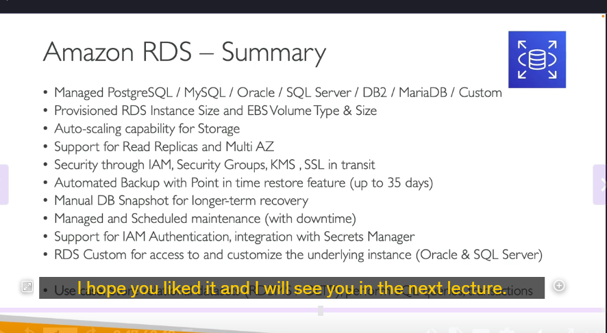
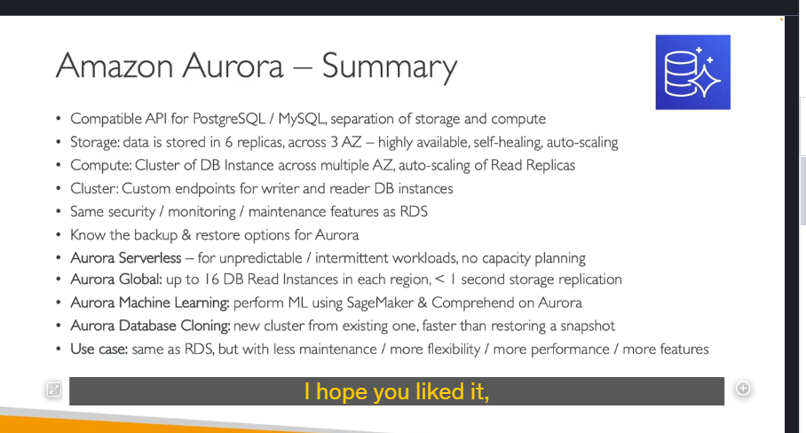
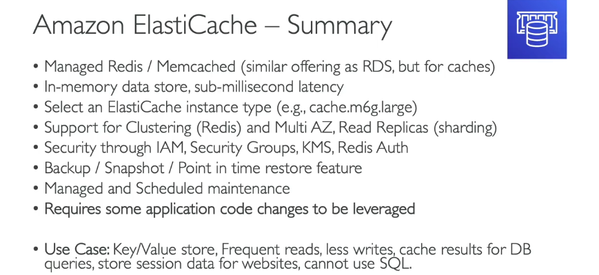

### **Tổng hợp về Amazon Aurora**

Amazon Aurora là một dịch vụ cơ sở dữ liệu quan hệ (RDBMS) được quản lý hoàn toàn bởi AWS, tương thích với hai engine cơ sở dữ liệu phổ biến là **PostgreSQL** và **MySQL**. Aurora được thiết kế để cung cấp hiệu suất cao, khả năng mở rộng và tính sẵn sàng cao hơn so với các cơ sở dữ liệu truyền thống.

---

### **1. Kiến trúc của Amazon Aurora**

- **Tách biệt lưu trữ và tính toán (Storage và Compute):**
  - **Lưu trữ (Storage):**
    - Dữ liệu được lưu trữ trên **6 bản sao (replicas)** tự động, phân tán trên **3 Availability Zones (AZs)**.
    - Quá trình **self-healing** tự động sửa chữa các vấn đề về lưu trữ.
    - **Tự động mở rộng (Auto-scaling):** Lưu trữ tăng tự động khi cần thiết, không cần can thiệp thủ công.
  - **Tính toán (Compute):**
    - Các instance cơ sở dữ liệu được tổ chức thành **cluster** và có thể triển khai trên nhiều AZs.
    - **Read replicas** có thể tự động mở rộng để xử lý tải đọc tăng cao.

---

### **2. Các tính năng chính**

- **Endpoints (Điểm kết nối):**
  - **Writer Endpoint:** Dùng để ghi dữ liệu vào instance chính (primary instance).
  - **Reader Endpoint:** Dùng để đọc dữ liệu từ các read replicas.
- **Bảo mật và giám sát:**
  - Cung cấp các tính năng bảo mật, giám sát và bảo trì tương tự như Amazon RDS.
- **Sao lưu và phục hồi (Backup và Restore):**
  - Hỗ trợ sao lưu tự động và phục hồi dữ liệu một cách linh hoạt.

---

### **3. Các tính năng nâng cao**

- **Aurora Serverless:**
  - Phù hợp cho các workload không ổn định hoặc không thể dự đoán trước.
  - Không cần lập kế hoạch dung lượng (capacity planning), Aurora tự động điều chỉnh tài nguyên.
- **Aurora Global Database:**
  - Cho phép tạo các **read replicas** trên nhiều khu vực (regions) khác nhau.
  - Sao chép dữ liệu giữa các regions với độ trễ dưới **1 giây**.
  - Trong trường hợp sự cố xảy ra ở region chính, có thể **promote** một region phụ thành region chính.
- **Aurora Machine Learning:**
  - Tích hợp với **Amazon SageMaker** và **Amazon Comprehend** để thực hiện các tác vụ machine learning trực tiếp trên dữ liệu Aurora.
- **Aurora Database Cloning:**
  - Cho phép tạo một **cluster mới** từ cluster hiện có một cách nhanh chóng, phù hợp cho môi trường testing hoặc staging.
  - Nhanh hơn so với việc tạo snapshot và restore.

---

### **4. Ưu điểm của Amazon Aurora**

- **Hiệu suất cao:** Tốc độ đọc/ghi nhanh hơn so với MySQL và PostgreSQL thông thường.
- **Tính sẵn sàng cao:** Dữ liệu được sao chép trên 6 bản sao và 3 AZs.
- **Tự động mở rộng:** Lưu trữ và read replicas tự động mở rộng khi cần.
- **Giảm bớt công việc quản lý:** AWS quản lý phần lớn các tác vụ bảo trì và nâng cấp.
- **Tích hợp nhiều tính năng nâng cao:** Aurora Serverless, Global Database, Machine Learning, v.v.

---

### **5. Use Cases (Trường hợp sử dụng)**

- **Ứng dụng doanh nghiệp:** Cần hiệu suất cao và tính sẵn sàng cao.
- **Workload không ổn định:** Sử dụng Aurora Serverless để tránh lãng phí tài nguyên.
- **Ứng dụng toàn cầu:** Sử dụng Aurora Global Database để sao chép dữ liệu giữa các regions.
- **Machine Learning:** Tích hợp Aurora với SageMaker để phân tích dữ liệu.
- **Môi trường testing/staging:** Sử dụng Aurora Database Cloning để tạo môi trường thử nghiệm nhanh chóng.

---

### **6. So sánh với Amazon RDS**

- **Giống nhau:**
  - Cả hai đều là dịch vụ cơ sở dữ liệu quan hệ được quản lý bởi AWS.
  - Hỗ trợ các engine như MySQL và PostgreSQL.
- **Khác nhau:**
  - **Aurora** có hiệu suất cao hơn, tính sẵn sàng cao hơn và nhiều tính năng nâng cao hơn so với **RDS**.
  - **Aurora** có kiến trúc lưu trữ và tính toán tách biệt, trong khi **RDS** sử dụng kiến trúc truyền thống.

---

### **7. Kết luận**

## Amazon Aurora là một lựa chọn tuyệt vời cho các ứng dụng cần hiệu suất cao, tính sẵn sàng cao và khả năng mở rộng linh hoạt. Với các tính năng như Aurora Serverless, Global Database và Machine Learning, Aurora mang lại nhiều lợi ích vượt trội so với các cơ sở dữ liệu truyền thống.

---

### **Tổng hợp về Amazon ElastiCache**

Amazon ElastiCache là một dịch vụ quản lý bộ nhớ đệm (cache) được cung cấp bởi AWS, hỗ trợ hai công nghệ phổ biến là **Redis** và **Memcached**. ElastiCache giúp cải thiện hiệu suất ứng dụng bằng cách lưu trữ dữ liệu trong bộ nhớ (in-memory), mang lại độ trễ cực thấp (dưới mili giây) cho các tác vụ đọc dữ liệu.

### **1. Tổng quan về ElastiCache**

- **Mục đích:** Cung cấp bộ nhớ đệm để tăng tốc độ truy cập dữ liệu.
- **Công nghệ hỗ trợ:**
  - **Redis:** Hỗ trợ clustering, Multi-AZ, read replicas, và nhiều tính năng nâng cao.
  - **Memcached:** Đơn giản, phù hợp cho các use case đòi hỏi hiệu suất cao và không cần tính năng phức tạp.

---

### **2. Tính năng chính**

- **Hiệu suất cao:**
  - Độ trễ dưới mili giây nhờ lưu trữ dữ liệu trong bộ nhớ.
- **Khả năng mở rộng:**
  - **Redis:** Hỗ trợ clustering, Multi-AZ, và read replicas để phân tán tải.
  - **Memcached:** Dễ dàng mở rộng bằng cách thêm các node.
- **Bảo mật:**
  - **IAM:** Quản lý quyền truy cập thông qua IAM.
  - **Security Groups:** Kiểm soát truy cập mạng.
  - **KMS:** Mã hóa dữ liệu khi lưu trữ (at-rest encryption).
  - **Redis Authentication:** Xác thực cho Redis.
- **Sao lưu và phục hồi:**
  - Hỗ trợ sao lưu (backups), snapshot, và phục hồi theo thời điểm cụ thể (point-in-time restore).
- **Bảo trì:**
  - Bảo trì tự động và có thể lên lịch (managed and scheduled maintenance).

---

### **3. Lưu ý quan trọng cho kỳ thi AWS**

- **Yêu cầu thay đổi mã ứng dụng:**
  - Để sử dụng ElastiCache, bạn cần **sửa đổi mã ứng dụng** để tích hợp với dịch vụ này.
  - Nếu câu hỏi trong kỳ thi yêu cầu một giải pháp caching **không cần thay đổi mã**, ElastiCache không phải là lựa chọn phù hợp.

---

### **4. Use Cases (Trường hợp sử dụng)**

- **Key/Value Store:**
  - Lưu trữ dữ liệu dạng key-value để truy cập nhanh chóng.
- **Caching database queries:**
  - Giảm tải cho cơ sở dữ liệu bằng cách lưu trữ kết quả truy vấn thường xuyên sử dụng.
- **Lưu trữ session data:**
  - Lưu trữ thông tin phiên (session) của người dùng trên website.
- **Giảm độ trễ:**
  - Cải thiện trải nghiệm người dùng bằng cách giảm độ trễ truy cập dữ liệu.

---

### **5. So sánh Redis và Memcached**

| **Tính năng**     | **Redis**                          | **Memcached**                                    |
| ----------------- | ---------------------------------- | ------------------------------------------------ |
| **Clustering**    | Hỗ trợ                             | Không hỗ trợ                                     |
| **Multi-AZ**      | Hỗ trợ                             | Không hỗ trợ                                     |
| **Read Replicas** | Hỗ trợ                             | Không hỗ trợ                                     |
| **Persistence**   | Hỗ trợ lưu trữ dữ liệu lâu dài     | Không hỗ trợ                                     |
| **Data Types**    | Hỗ trợ nhiều kiểu dữ liệu phức tạp | Chỉ hỗ trợ key-value đơn giản                    |
| **Use Case**      | Phù hợp cho các ứng dụng phức tạp  | Phù hợp cho các ứng dụng đơn giản, hiệu suất cao |

---

### **6. Kết luận**

Amazon ElastiCache là một dịch vụ mạnh mẽ để cải thiện hiệu suất ứng dụng thông qua việc lưu trữ dữ liệu trong bộ nhớ. Tuy nhiên, việc sử dụng ElastiCache yêu cầu thay đổi mã ứng dụng, vì vậy hãy cân nhắc kỹ khi lựa chọn giải pháp caching phù hợp. Các use case phổ biến bao gồm caching database queries, lưu trữ session data và giảm độ trễ truy cập dữ liệu.

Hy vọng phần tổng hợp này sẽ giúp bạn nắm vững kiến thức về Amazon ElastiCache! 🚀

---

### **Tổng hợp về Amazon DynamoDB**

Amazon DynamoDB là một dịch vụ cơ sở dữ liệu NoSQL được quản lý hoàn toàn bởi AWS, cung cấp hiệu suất cao với độ trễ ở mức mili giây. DynamoDB là một lựa chọn phổ biến cho các ứng dụng cần khả năng mở rộng linh hoạt, tính sẵn sàng cao và không cần quản lý cơ sở hạ tầng.

---

### **1. Tổng quan về DynamoDB**

- **Loại cơ sở dữ liệu:** NoSQL (Key-Value và Document Store).
- **Tính năng chính:**
  - **Serverless:** Không cần quản lý máy chủ, tự động mở rộng.
  - **Hiệu suất cao:** Độ trễ mili giây cho cả đọc và ghi.
  - **Tính sẵn sàng cao:** Dữ liệu được sao chép trên nhiều Availability Zones (AZs).

---

### **2. Các chế độ Capacity (Dung lượng)**

- **Provisioned Capacity:**
  - Bạn cung cấp trước dung lượng đọc/ghi (Read/Write Capacity Units - RCU/WCU).
  - Hỗ trợ **Auto Scaling** để tự động điều chỉnh dung lượng dựa trên workload.
  - Phù hợp cho workload ổn định hoặc thay đổi dần theo thời gian.
- **On-Demand Capacity:**
  - Không cần cung cấp trước dung lượng, tự động mở rộng theo nhu cầu.
  - Phù hợp cho workload không thể dự đoán hoặc có đột biến lớn.

---

### **3. Tính năng nổi bật**

- **DAX (DynamoDB Accelerator):**
  - Bộ nhớ đệm (cache) tương thích với DynamoDB, giảm độ trễ đọc xuống micro giây.
  - Không cần thay đổi mã ứng dụng để sử dụng DAX.
- **Global Tables:**
  - Hỗ trợ **active-active replication** giữa các regions.
  - Cho phép đọc/ghi từ bất kỳ region nào, phù hợp cho ứng dụng toàn cầu.
- **DynamoDB Streams:**
  - Ghi lại mọi thay đổi (insert, update, delete) trong bảng DynamoDB.
  - Tích hợp với **AWS Lambda** để xử lý sự kiện theo thời gian thực.
- **Kinesis Data Streams:**
  - Thay thế hoặc bổ sung cho DynamoDB Streams, hỗ trợ lưu trữ dữ liệu lên đến 1 năm.
  - Tích hợp với **Kinesis Data Firehose** để xử lý và lưu trữ dữ liệu.

---

### **4. Sao lưu và phục hồi**

- **Point-in-Time Recovery (PITR):**
  - Cho phép khôi phục bảng DynamoDB đến bất kỳ thời điểm nào trong vòng **35 ngày**.
- **On-Demand Backups:**
  - Sao lưu theo yêu cầu, hỗ trợ lưu trữ dài hạn.
- **Export to S3:**
  - Xuất dữ liệu từ DynamoDB sang **Amazon S3** mà không tiêu tốn RCU.
- **Import from S3:**
  - Nhập dữ liệu từ S3 vào DynamoDB mà không tiêu tốn WCU.

---

### **5. Bảo mật**

- **IAM:** Quản lý quyền truy cập thông qua IAM.
- **Encryption:** Mã hóa dữ liệu khi lưu trữ (at-rest encryption) bằng **AWS KMS**.
- **VPC Endpoints:** Cho phép truy cập DynamoDB từ VPC một cách an toàn.

---

### **6. Use Cases (Trường hợp sử dụng)**

- **Serverless Application Development:**
  - Phù hợp cho các ứng dụng serverless với items dữ liệu nhỏ (hàng trăm KB).
- **Distributed Serverless Cache:**
  - Thay thế ElasticCache làm key-value store.
- **Session Storage:**
  - Lưu trữ session data với tính năng **TTL (Time-to-Live)** để tự động xóa dữ liệu hết hạn.
- **Rapidly Evolving Schema:**
  - Phù hợp cho các ứng dụng cần linh hoạt về schema (không cần định nghĩa schema trước).

---

### **7. Lưu ý quan trọng cho kỳ thi AWS**

- **DynamoDB là lựa chọn tốt khi:**
  - Cần độ trễ thấp (mili giây hoặc micro giây với DAX).
  - Cần khả năng mở rộng tự động (On-Demand Capacity).
  - Cần linh hoạt về schema (NoSQL).
  - Cần tích hợp với các dịch vụ AWS khác như Lambda, Kinesis, S3.
- **DynamoDB không phải lựa chọn tốt khi:**
  - Cần thực hiện các truy vấn phức tạp (JOIN, SQL).
  - Dữ liệu có kích thước lớn (hàng MB hoặc GB).

---

### **8. So sánh DynamoDB với RDBMS**

| **Tính năng**          | **DynamoDB**                          | **RDBMS (ví dụ: RDS)**         |
| ---------------------- | ------------------------------------- | ------------------------------ |
| **Loại cơ sở dữ liệu** | NoSQL (Key-Value, Document)           | SQL (Quan hệ)                  |
| **Schema**             | Linh hoạt, không cần định nghĩa trước | Cố định, cần định nghĩa trước  |
| **Hiệu suất**          | Độ trễ mili giây, tự động mở rộng     | Phụ thuộc vào cấu hình         |
| **Quản lý**            | Serverless, không cần quản lý         | Cần quản lý máy chủ            |
| **Use Case**           | Ứng dụng serverless, caching          | Ứng dụng cần truy vấn phức tạp |

---

### **9. Kết luận**

Amazon DynamoDB là một dịch vụ cơ sở dữ liệu NoSQL mạnh mẽ, phù hợp cho các ứng dụng cần hiệu suất cao, khả năng mở rộng linh hoạt và tích hợp với hệ sinh thái AWS. Với các tính năng như DAX, Global Tables, và DynamoDB Streams, DynamoDB là lựa chọn hàng đầu cho nhiều use case khác nhau.

Hy vọng phần tổng hợp này sẽ giúp bạn nắm vững kiến thức về Amazon DynamoDB! 🚀
