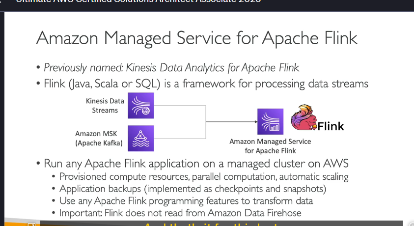

**Amazon Managed Service for Apache Flink** (trước đây gọi là **Kinesis Data Analytics for Apache Flink**) là một dịch vụ được quản lý bởi AWS, giúp bạn chạy các ứng dụng **Apache Flink** trên nền tảng đám mây của AWS mà không cần phải tự quản lý cơ sở hạ tầng.

### **Apache Flink là gì?**

- **Apache Flink** là một framework mã nguồn mở, được sử dụng để xử lý các luồng dữ liệu (**data streams**) trong thời gian thực.
- Nó hỗ trợ các ngôn ngữ lập trình như **Java**, **SQL**, và **Scala**.
- Flink được thiết kế để xử lý dữ liệu lớn với khả năng xử lý song song (parallel processing) và tự động mở rộng (auto-scaling).

---

### **Cách thức hoạt động của Amazon Managed Service for Apache Flink**

1. **Đọc dữ liệu từ các nguồn**:

   - Dịch vụ này có thể đọc dữ liệu từ **Kinesis Data Streams** (một dịch vụ xử lý luồng dữ liệu thời gian thực của AWS).
   - Nó cũng có thể đọc dữ liệu từ **Amazon MSK** (Managed Streaming for Apache Kafka), một dịch vụ được quản lý bởi AWS dành cho **Apache Kafka** (một nền tảng xử lý luồng dữ liệu phổ biến).

2. **Chạy ứng dụng Apache Flink**:

   - Bạn có thể chạy bất kỳ ứng dụng Apache Flink nào trên cụm (cluster) được quản lý bởi AWS.
   - AWS sẽ tự động cung cấp tài nguyên tính toán (compute resources), hỗ trợ tính toán song song (parallel computation) và tự động mở rộng (automatic scaling) dựa trên nhu cầu của bạn.

3. **Quản lý sao lưu và khôi phục**:

   - AWS sẽ tự động quản lý các bản sao lưu (backups) cho ứng dụng của bạn thông qua **checkpoints** và **snapshots**.
   - **Checkpoints** là các điểm kiểm tra để đảm bảo ứng dụng có thể khôi phục từ một trạng thái nhất định nếu có sự cố.
   - **Snapshots** là các bản chụp nhanh trạng thái của ứng dụng tại một thời điểm cụ thể.

4. **Biến đổi dữ liệu**:
   - Bạn có thể sử dụng bất kỳ tính năng lập trình nào được hỗ trợ bởi Apache Flink để biến đổi dữ liệu của mình.
   - Flink cung cấp sự linh hoạt cao trong việc thực hiện các phép biến đổi (transformations) trên luồng dữ liệu.

---

### **Lưu ý quan trọng**

- **Flink có thể đọc dữ liệu từ Kinesis Data Streams**, nhưng **không thể đọc trực tiếp từ Amazon Kinesis Data Firehose**. Đây là một điểm có thể xuất hiện trong các câu hỏi thi AWS.
- **Amazon Managed Service for Apache Flink** chỉ được sử dụng để xử lý các luồng dữ liệu (data streams), không phải cho các tác vụ xử lý dữ liệu theo lô (batch processing).

---

### **Tóm tắt**

- **Amazon Managed Service for Apache Flink** là một dịch vụ được quản lý bởi AWS, giúp bạn dễ dàng chạy các ứng dụng Apache Flink để xử lý luồng dữ liệu thời gian thực.
- Nó tích hợp với các dịch vụ như **Kinesis Data Streams** và **Amazon MSK**.
- AWS tự động quản lý cơ sở hạ tầng, sao lưu, và khả năng mở rộng, giúp bạn tập trung vào việc phát triển ứng dụng.
- Flink không thể đọc dữ liệu trực tiếp từ **Kinesis Data Firehose**, đây là một điểm cần lưu ý trong các kỳ thi AWS.

---
