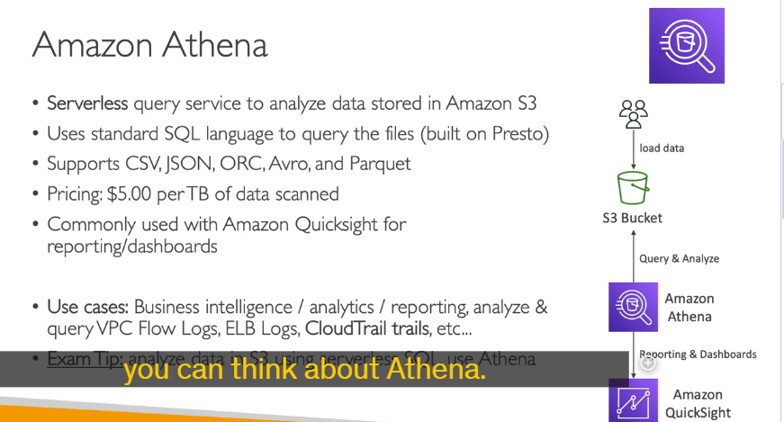

Amazon Athena là một dịch vụ truy vấn dữ liệu không cần máy chủ (serverless) của AWS, cho phép bạn phân tích dữ liệu trực tiếp từ Amazon S3 bằng cách sử dụng ngôn ngữ SQL tiêu chuẩn. Dưới đây là các chi tiết quan trọng về Amazon Athena:

### 1. **Cách thức hoạt động**

- **Serverless**: Athena không yêu cầu bạn phải quản lý hoặc cung cấp bất kỳ cơ sở hạ tầng nào. Bạn chỉ cần tải dữ liệu lên Amazon S3 và bắt đầu truy vấn.
- **Sử dụng SQL**: Athena sử dụng ngôn ngữ SQL để truy vấn dữ liệu. Điều này giúp người dùng quen thuộc với SQL dễ dàng sử dụng.
- **Dựa trên Presto**: Athena được xây dựng trên nền tảng Presto, một công cụ truy vấn SQL mã nguồn mở, cho phép truy vấn dữ liệu lớn một cách hiệu quả.

### 2. **Định dạng dữ liệu hỗ trợ**

Athena hỗ trợ nhiều định dạng dữ liệu khác nhau, bao gồm:

- **CSV**
- **JSON**
- **ORC**
- **Avro**
- **Parquet**

### 3. **Chi phí**

- **Thanh toán theo lượng dữ liệu quét**: Bạn chỉ phải trả tiền cho lượng dữ liệu mà Athena quét để thực hiện truy vấn. Chi phí được tính theo terabyte dữ liệu quét.
- **Không cần cung cấp cơ sở dữ liệu**: Vì Athena là serverless, bạn không cần phải quản lý hoặc cung cấp bất kỳ cơ sở dữ liệu nào.

### 4. **Cải thiện hiệu suất**

- **Sử dụng định dạng cột (Columnar Formats)**: Để giảm chi phí và cải thiện hiệu suất, bạn nên sử dụng các định dạng cột như **Parquet** hoặc **ORC**. Những định dạng này chỉ quét các cột cần thiết thay vì toàn bộ tệp.
- **Nén dữ liệu**: Nén dữ liệu giúp giảm kích thước tệp, từ đó giảm lượng dữ liệu cần quét và cải thiện hiệu suất.
- **Phân vùng dữ liệu (Partitioning)**: Bạn có thể phân vùng dữ liệu trong S3 bằng cách tổ chức dữ liệu theo các thư mục dựa trên các cột cụ thể (ví dụ: năm, tháng, ngày). Điều này giúp Athena chỉ quét các phần dữ liệu cần thiết, giảm thời gian và chi phí truy vấn.
- **Sử dụng tệp lớn**: Việc sử dụng các tệp lớn (ví dụ: 128MB trở lên) giúp giảm chi phí và cải thiện hiệu suất so với việc sử dụng nhiều tệp nhỏ.

### 5. **Tích hợp với các dịch vụ khác**

- **Amazon QuickSight**: Athena thường được sử dụng cùng với Amazon QuickSight để tạo báo cáo và bảng điều khiển (dashboards). QuickSight kết nối với Athena, và Athena kết nối với S3 để lấy dữ liệu.
- **AWS Glue**: Glue có thể được sử dụng để chuyển đổi dữ liệu từ các định dạng như CSV sang Parquet hoặc ORC thông qua các công việc ETL (Extract, Transform, Load).

### 6. **Truy vấn liên kết (Federated Query)**

- **Truy vấn dữ liệu từ nhiều nguồn**: Ngoài việc truy vấn dữ liệu từ S3, Athena còn có thể truy vấn dữ liệu từ các cơ sở dữ liệu quan hệ và phi quan hệ khác, cả trên AWS và on-premises.
- **Data Source Connector**: Athena sử dụng các kết nối dữ liệu (Data Source Connector) dưới dạng Lambda function để thực hiện các truy vấn liên kết. Các kết nối này có thể kết nối với các dịch vụ như CloudWatch Logs, DynamoDB, RDS, và nhiều dịch vụ khác.
- **Lưu kết quả truy vấn**: Kết quả của các truy vấn liên kết có thể được lưu trữ lại vào S3 để phân tích sau này.

### 7. **Các trường hợp sử dụng phổ biến**

- **Truy vấn ad hoc**: Thực hiện các truy vấn nhanh chóng mà không cần thiết lập cơ sở hạ tầng phức tạp.
- **Business Intelligence (BI)**: Phân tích dữ liệu để đưa ra các quyết định kinh doanh.
- **Báo cáo và phân tích**: Tạo các báo cáo và phân tích từ dữ liệu lưu trữ trong S3.
- **Phân tích log**: Phân tích các log từ các dịch vụ AWS như VPC Flow Logs, Load Balancer Logs, CloudTrail, v.v.

### 8. **Mẹo thi AWS**

- Khi cần phân tích dữ liệu trong S3 bằng một công cụ SQL không cần máy chủ, hãy nghĩ đến Athena.
- Để cải thiện hiệu suất và giảm chi phí, hãy sử dụng các định dạng cột như Parquet hoặc ORC, nén dữ liệu, và phân vùng dữ liệu.

### Kết luận

## Amazon Athena là một công cụ mạnh mẽ để phân tích dữ liệu trực tiếp từ S3 mà không cần di chuyển dữ liệu. Với khả năng truy vấn liên kết và tích hợp với các dịch vụ khác như QuickSight và Glue, Athena trở thành một phần quan trọng trong hệ sinh thái dữ liệu của AWS.

tạo bảng trong athena rồi query log hay object là nó theo kiểu bảng
