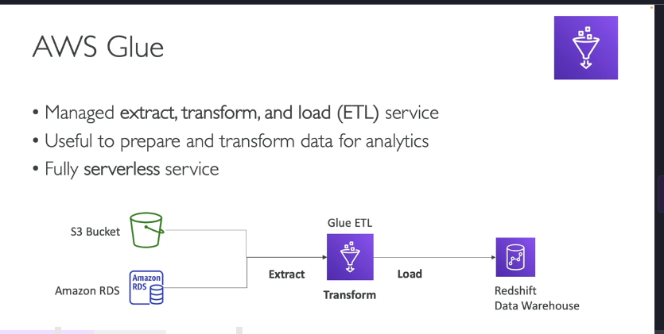
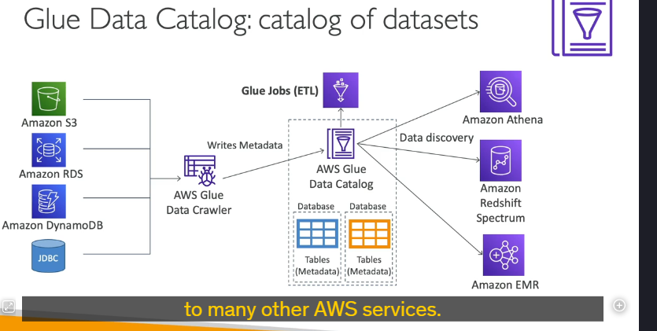
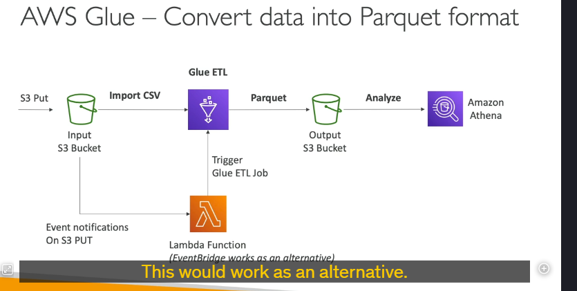

AWS Glue là một dịch vụ **Extract, Transform, Load (ETL)** được quản lý hoàn toàn (fully managed) và không cần máy chủ (serverless), giúp bạn chuẩn bị và biến đổi dữ liệu cho các tác vụ phân tích. Dưới đây là các chi tiết quan trọng về AWS Glue:

---

### 1. **Tổng quan về AWS Glue**

- **Mục đích**: Glue được sử dụng để trích xuất (extract), biến đổi (transform) và tải (load) dữ liệu từ các nguồn khác nhau vào các kho dữ liệu hoặc dịch vụ phân tích.
- **Tính năng chính**:
  - **Serverless**: Không cần quản lý cơ sở hạ tầng, tự động mở rộng (scalable).
  - **Hỗ trợ nhiều nguồn dữ liệu**: S3, RDS, DynamoDB, JDBC, và các cơ sở dữ liệu on-premises.
  - **Glue Data Catalog**: Lưu trữ metadata của các bảng và cột dữ liệu, giúp dễ dàng khám phá và truy vấn dữ liệu.

---

### 2. **Các trường hợp sử dụng phổ biến**

- **Chuyển đổi dữ liệu**: Chuyển đổi dữ liệu từ định dạng này sang định dạng khác (ví dụ: CSV sang Parquet).
- **Tích hợp dữ liệu**: Kết hợp dữ liệu từ nhiều nguồn khác nhau (ví dụ: S3 và RDS) và tải vào Redshift hoặc các kho dữ liệu khác.
- **Tự động hóa ETL**: Sử dụng Glue để tự động hóa các quy trình ETL thông qua các job và trigger.

---

### 3. **Các thành phần chính của AWS Glue**

#### **a. Glue-Data-Catalog**

- **Mục đích**: Lưu trữ metadata của các bảng và cột dữ liệu.
- **Cách thức hoạt động**:
  - **Glue Data Crawlers**: Quét các nguồn dữ liệu (S3, RDS, DynamoDB, JDBC) để thu thập metadata (tên bảng, tên cột, kiểu dữ liệu, v.v.).
  - Metadata được lưu trữ trong
    **Glue Data Catalog**, giúp các dịch vụ như Athena, Redshift Spectrum, và EMR dễ dàng khám phá và truy vấn dữ liệu.

#### **b. Glue ETL Jobs**

- **Mục đích**: Thực hiện các tác vụ ETL (Extract, Transform, Load).
- **Cách thức hoạt động**:
  - Bạn viết mã (code) để trlue Data Cataloích xuất, biến đổi và tải dữ liệu.
  - Glue tự động thực thi các job ETL và xử lý dữ liệu.
- **Ví dụ**:
  - Chuyển đổi dữ liệu từ CSV sang Parquet để tối ưu hóa hiệu suất khi sử dụng với Athena.
  - Tích hợp dữ liệu từ S3 và RDS vào Redshift.

#### **c. Glue Job Bookmarks**

- **Mục đích**: Theo dõi dữ liệu đã được xử lý để tránh xử lý trùng lặp (reprocessing) trong các lần chạy job tiếp theo.
- **Lợi ích**: Tiết kiệm thời gian và tài nguyên khi chạy các job ETL định kỳ.

---

### 4. **Các tính năng nâng cao của AWS Glue**

#### **a. Glue Elastic Views**

- **Mục đích**: Tạo các view (khung nhìn) ảo kết hợp dữ liệu từ nhiều nguồn khác nhau (ví dụ: RDS, Aurora, S3) bằng SQL.
- **Tính năng**:
  - Serverless: Không cần quản lý cơ sở hạ tầng.
  - Tự động cập nhật: Glue theo dõi các thay đổi trong dữ liệu nguồn và cập nhật view tự động.

#### **b. Glue DataBrew**

- **Mục đích**: Làm sạch và chuẩn hóa dữ liệu bằng các phép biến đổi được xây dựng sẵn (prebuilt transformations).
- **Lợi ích**: Giúp người dùng không cần viết mã (code) để xử lý dữ liệu.

#### **c. Glue Studio**

- **Mục đích**: Cung cấp giao diện đồ họa (GUI) để tạo, chạy và giám sát các job ETL trong Glue.
- **Lợi ích**: Dễ dàng sử dụng cho người dùng không có kinh nghiệm lập trình.

#### **d. Glue Streaming ETL**

- **Mục đích**: Xử lý dữ liệu theo thời gian thực (real-time) thay vì theo lô (batch).
- **Cách thức hoạt động**:
  - Sử dụng Apache Spark Structured Streaming để đọc dữ liệu từ các nguồn như Kinesis Data Streams, Kafka, hoặc MSK (Managed Streaming for Kafka).
  - Thực hiện các phép biến đổi và tải dữ liệu vào các đích (target) như S3, Redshift, hoặc các kho dữ liệu khác.

---

### 5. **Tích hợp với các dịch vụ AWS khác**

- **Amazon Athena**: Sử dụng Glue Data Catalog để khám phá và truy vấn dữ liệu.
- **Amazon Redshift Spectrum**: Truy vấn dữ liệu trực tiếp từ S3 bằng cách sử dụng metadata từ Glue Data Catalog.
- **Amazon EMR**: Sử dụng Glue Data Catalog để quản lý metadata khi xử lý dữ liệu lớn.

---

### 6. **Ví dụ sử dụng AWS Glue**

#### **a. Chuyển đổi dữ liệu từ CSV sang Parquet**

1. Dữ liệu được tải lên S3 dưới dạng CSV.
2. Glue ETL Job được kích hoạt (thông qua Lambda hoặc EventBridge) để chuyển đổi dữ liệu từ CSV sang Parquet.
3. Dữ liệu sau khi chuyển đổi được lưu vào một S3 bucket khác.
4. Athena sử dụng dữ liệu Parquet để thực hiện các truy vấn hiệu quả hơn.

#### **b. Tích hợp dữ liệu từ S3 và RDS vào Redshift**

1. Glue ETL Job trích xuất dữ liệu từ S3 và RDS.
2. Dữ liệu được biến đổi (ví dụ: lọc, thêm cột) trong Glue.
3. Dữ liệu được tải vào Redshift để phân tích.

---

### 7. **Ưu điểm của AWS Glue**

- **Serverless**: Không cần quản lý cơ sở hạ tầng, tự động mở rộng.
- **Tích hợp đa dạng**: Hỗ trợ nhiều nguồn dữ liệu và dịch vụ AWS.
- **Tự động hóa**: Glue Data Crawlers và Job Bookmarks giúp tự động hóa quy trình ETL.
- **Hiệu suất cao**: Glue Elastic Views và Streaming ETL giúp xử lý dữ liệu theo thời gian thực.

---

### 8. **Tổng kết**

AWS Glue là một công cụ mạnh mẽ để thực hiện các tác vụ ETL trên AWS. Với khả năng tích hợp linh hoạt, tự động hóa cao, và hỗ trợ nhiều tính năng nâng cao như Glue Data Catalog, Elastic Views, và Streaming ETL, Glue là lựa chọn hàng đầu cho các tác vụ chuẩn bị và biến đổi dữ liệu.

---

### 9. **Mẹo thi AWS**

- Khi gặp các câu hỏi liên quan đến ETL, chuyển đổi dữ liệu, hoặc tích hợp dữ liệu từ nhiều nguồn, hãy nghĩ đến AWS Glue.
- Hiểu rõ vai trò của **Glue Data Catalog** và cách nó tích hợp với các dịch vụ như Athena, Redshift Spectrum, và EMR.
- Nhận biết các tính năng nâng cao như **Glue Elastic Views**, **Glue DataBrew**, và **Glue Streaming ETL**.
