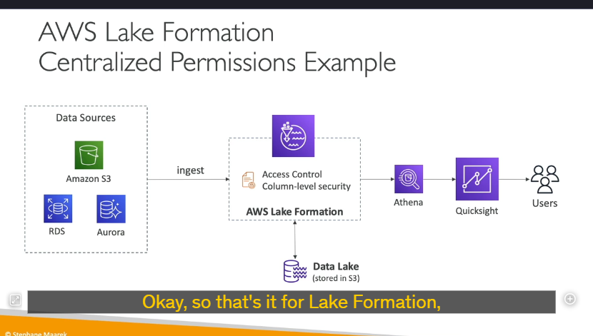

**AWS Lake Formation** giúp bạn tạo ra các **data lakes** (hồ dữ liệu).  
Nhưng **data lake** là gì?  
**Data lake** là một nơi tập trung để lưu trữ tất cả dữ liệu của bạn tại một chỗ, giúp bạn có thể thực hiện các phân tích trên đó.

**Lake Formation** là một dịch vụ được quản lý hoàn toàn, giúp việc thiết lập một data lake trở nên cực kỳ dễ dàng. Thông thường, việc này có thể mất hàng tháng, nhưng nhờ **Lake Formation**, bạn chỉ cần vài ngày để bắt đầu với một data lake.

**Lake Formation** sẽ giúp bạn khám phá, làm sạch, biến đổi và đưa dữ liệu vào data lake của mình. Nó tự động hóa nhiều bước thủ công phức tạp như thu thập, làm sạch, di chuyển, phân loại dữ liệu, và cả việc loại bỏ các dữ liệu trùng lặp (de-duplication) bằng cách sử dụng các phép biến đổi dựa trên **machine learning**.

Trong data lake này, bạn có thể kết hợp các nguồn dữ liệu có cấu trúc (structured) và không cấu trúc (unstructured). **Lake Formation** cung cấp sẵn các **blueprints** (khuôn mẫu), giúp bạn di chuyển dữ liệu từ một nơi đến data lake trung tâm này. Các blueprints này hỗ trợ các nguồn dữ liệu như **Amazon S3**, **Amazon RDS**, các cơ sở dữ liệu quan hệ (relational databases) bạn chạy trên máy chủ tại chỗ (on-premises), hoặc các cơ sở dữ liệu NoSQL, v.v.

Tại sao bạn nên thiết lập **Lake Formation**?  
Bạn có mọi thứ ở một nơi, nhưng quan trọng hơn, bạn có thể thiết lập **Fine-grained access controls** (kiểm soát truy cập chi tiết) cho các ứng dụng của mình ở cấp độ hàng (row) và cột (column). Điều này có nghĩa là bất kỳ ứng dụng nào kết nối với **AWS Lake Formation** sẽ có quyền truy cập chi tiết, và đây là một lợi thế lớn.

**Lake Formation** hoạt động như thế nào?  
Thực chất, nó là một lớp trên **AWS Glue**, nhưng bạn không cần tương tác trực tiếp với Glue. Như đã nói, **Lake Formation** cho phép bạn tạo một data lake được lưu trữ trong **Amazon S3**. Các nguồn dữ liệu có thể là **Amazon S3**, **RDS**, **Aurora**, cơ sở dữ liệu tại chỗ của bạn (on-premises database) như SQL hoặc NoSQL, v.v. Nhờ các blueprints có sẵn trong **Lake Formation**, bạn sẽ đưa dữ liệu vào data lake.

**Lake Formation** đi kèm với các công cụ như **Source Crawlers**, **ETL** (Extract, Transform, Load), công cụ chuẩn bị dữ liệu và công cụ phân loại dữ liệu. Tất cả những thứ này đến từ dịch vụ **Glue** bên dưới. Sau đó, bạn có các cài đặt bảo mật và kiểm soát truy cập để đảm bảo dữ liệu của bạn được bảo vệ trong data lake.

Các dịch vụ có thể tận dụng **Lake Formation** bao gồm **Athena**, **Redshift**, **EMR**, hoặc các công cụ phân tích khác như **Apache Spark framework**. Người dùng sẽ kết nối với các dịch vụ này, và các dịch vụ này sẽ kết nối với **Lake Formation** và data lake của bạn.

Tại sao chúng ta muốn sử dụng **Lake Formation**?  
Một khía cạnh quan trọng được nhắc đến trong các kỳ thi là **centralized permissions** (quyền tập trung). Ví dụ, công ty của bạn sử dụng **Athena** và **QuickSight** để phân tích dữ liệu, và người dùng chỉ được xem dữ liệu họ cần. Các nguồn dữ liệu của bạn bao gồm **Amazon S3**, **RDS**, **Aurora**, v.v. Bạn có thể thiết lập bảo mật trong **Athena**, **QuickSight**, ở cấp độ người dùng, hoặc thông qua các chính sách bucket của **S3**, người dùng trong **RDS** hoặc **Aurora**. Điều này dẫn đến việc quản lý bảo mật ở nhiều nơi và trở nên rối rắm.

**Lake Formation** giải quyết vấn đề này bằng cách cung cấp kiểm soát truy cập tập trung, với bảo mật ở cấp độ hàng và cột. Với **Lake Formation**, bạn đưa tất cả dữ liệu vào một bucket **S3** trung tâm, nhưng từ **Lake Formation**, bạn quản lý tất cả các quyền truy cập để đảm bảo rằng bất kỳ dịch vụ nào kết nối với **Lake Formation** chỉ có quyền xem những gì họ được phép. Cho dù bạn sử dụng **Athena**, **QuickSight**, hay bất kỳ công cụ nào khác, bạn chỉ cần quản lý bảo mật tại một nơi duy nhất – **Lake Formation**.

---

**Tóm tắt:**

- **AWS Lake Formation** là dịch vụ giúp tạo và quản lý **data lakes** (hồ dữ liệu) một cách dễ dàng và nhanh chóng.
- Nó tự động hóa các bước phức tạp như thu thập, làm sạch, di chuyển, và phân loại dữ liệu.
- **Lake Formation** hỗ trợ kết hợp dữ liệu có cấu trúc và không cấu trúc, đồng thời cung cấp các **blueprints** để di chuyển dữ liệu từ nhiều nguồn khác nhau.
- Một lợi ích lớn là **Fine-grained access controls**, cho phép kiểm soát truy cập chi tiết ở cấp độ hàng và cột.
- **Lake Formation** hoạt động trên nền tảng **AWS Glue** và tích hợp với các dịch vụ như **Athena**, **Redshift**, **EMR**, và các công cụ phân tích khác.
- Quản lý bảo mật tập trung là một ưu điểm nổi bật của **Lake Formation**, giúp đơn giản hóa việc kiểm soát quyền truy cập dữ liệu.
