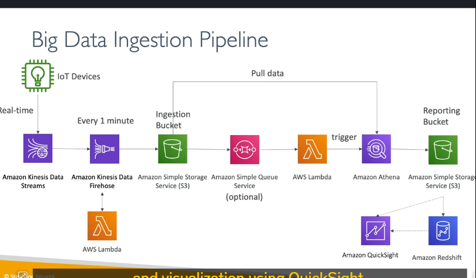
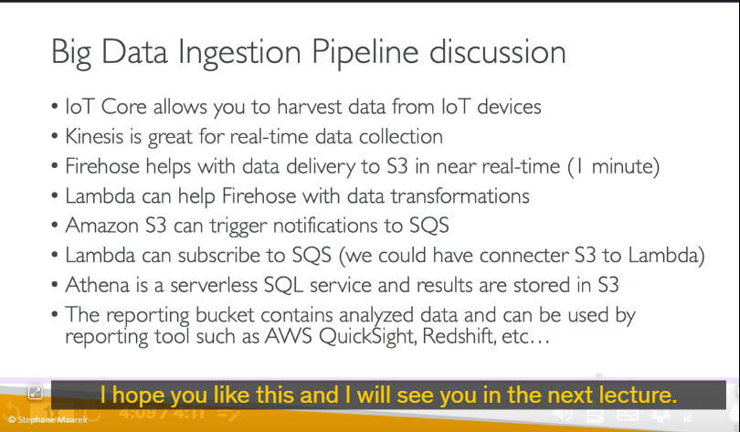

### **Giới thiệu về Big Data Ingestion Pipeline**

Mục tiêu của một **Big Data Ingestion Pipeline** là:

- Thu thập dữ liệu theo thời gian thực.
- Biến đổi dữ liệu.
- Truy vấn dữ liệu đã biến đổi bằng SQL.
- Lưu trữ kết quả truy vấn vào **Amazon S3**.
- Tải dữ liệu vào kho dữ liệu (**data warehouse**) để tạo báo cáo và dashboard.

Kiến trúc này hoàn toàn **serverless** (không cần quản lý máy chủ) và được quản lý bởi AWS.

---

### **Các bước trong Big Data Ingestion Pipeline**

#### **1. Thu thập dữ liệu từ IoT Devices**

- **IoT Devices** (thiết bị IoT) là nguồn sản xuất dữ liệu.
- **AWS IoT Core** là dịch vụ giúp quản lý các thiết bị IoT và thu thập dữ liệu từ chúng.
- Dữ liệu từ IoT Devices được gửi trực tiếp đến **Kinesis Data Streams** thông qua IoT Core.
  - **Kinesis Data Streams** là dịch vụ xử lý luồng dữ liệu thời gian thực của AWS.

#### **2. Chuyển dữ liệu vào Amazon S3**

- **Kinesis Data Streams** có thể kết nối với **Kinesis Data Firehose**.
  - **Kinesis Data Firehose** giúp chuyển dữ liệu vào **Amazon S3** với tần suất tối thiểu là **1 phút/lần**.
  - Dữ liệu được lưu trữ trong một **S3 bucket** (thùng chứa dữ liệu) gọi là **ingestion bucket**.

#### **3. Biến đổi dữ liệu**

- **Kinesis Data Firehose** có thể tích hợp với **AWS Lambda** để thực hiện các phép biến đổi dữ liệu nhanh chóng (ví dụ: làm sạch dữ liệu).
- Lambda function sẽ xử lý dữ liệu trước khi nó được lưu vào S3.

#### **4. Kích hoạt xử lý dữ liệu**

- Khi dữ liệu được lưu vào **ingestion bucket**, nó có thể kích hoạt các dịch vụ khác:
  - **Amazon SQS** (Simple Queue Service): Một hàng đợi (queue) có thể được kích hoạt để xử lý dữ liệu bất đồng bộ.
  - **AWS Lambda**: Lambda có thể được kích hoạt trực tiếp từ S3 hoặc thông qua SQS.

#### **5. Truy vấn dữ liệu bằng Amazon Athena**

- **AWS Lambda** có thể kích hoạt một truy vấn SQL trên **Amazon Athena**.
  - **Amazon Athena** là dịch vụ truy vấn dữ liệu serverless bằng SQL, hoạt động trực tiếp trên dữ liệu lưu trữ trong S3.
- Kết quả truy vấn từ Athena được lưu vào một **reporting bucket** (thùng chứa báo cáo) trong S3.

#### **6. Phân tích và trực quan hóa dữ liệu**

- Dữ liệu trong **reporting bucket** có thể được sử dụng để:
  - **Trực quan hóa**: Sử dụng **Amazon QuickSight** để tạo các báo cáo và dashboard trực quan.
  - **Phân tích nâng cao**: Tải dữ liệu vào **Amazon Redshift** (kho dữ liệu) để thực hiện các phân tích phức tạp hơn.
    - **Redshift** cũng có thể được sử dụng làm nguồn dữ liệu cho QuickSight.

---

### **Tóm tắt các dịch vụ sử dụng trong Pipeline**

1. **AWS IoT Core**: Quản lý và thu thập dữ liệu từ thiết bị IoT.
2. **Kinesis Data Streams**: Xử lý luồng dữ liệu thời gian thực.
3. **Kinesis Data Firehose**: Chuyển dữ liệu vào S3 và tích hợp với Lambda để biến đổi dữ liệu.
4. **Amazon S3**: Lưu trữ dữ liệu thô (ingestion bucket) và dữ liệu đã xử lý (reporting bucket).
5. **AWS Lambda**: Thực hiện các phép biến đổi dữ liệu và kích hoạt các quy trình xử lý.
6. **Amazon Athena**: Truy vấn dữ liệu bằng SQL và lưu kết quả vào S3.
7. **Amazon QuickSight**: Trực quan hóa dữ liệu từ S3 hoặc Redshift.
8. **Amazon Redshift**: Kho dữ liệu để phân tích nâng cao.

---

### **Lợi ích của kiến trúc này**

- **Serverless**: Không cần quản lý cơ sở hạ tầng, giảm chi phí vận hành.
- **Thời gian thực**: Dữ liệu được thu thập và xử lý ngay lập tức.
- **Linh hoạt**: Dễ dàng mở rộng và tích hợp với các dịch vụ AWS khác.
- **Tự động hóa**: Quy trình từ thu thập đến phân tích được tự động hóa hoàn toàn.

---

### **Tóm tắt quy trình**

1. Dữ liệu từ IoT Devices → **IoT Core** → **Kinesis Data Streams**.
2. **Kinesis Data Firehose** → **S3 Ingestion Bucket** (có thể tích hợp Lambda để biến đổi dữ liệu).
3. **S3 Ingestion Bucket** → **SQS** (tùy chọn) → **Lambda** → **Amazon Athena**.
4. **Athena** → **S3 Reporting Bucket**.
5. **S3 Reporting Bucket** → **QuickSight** (trực quan hóa) hoặc **Redshift** (phân tích nâng cao).

---
