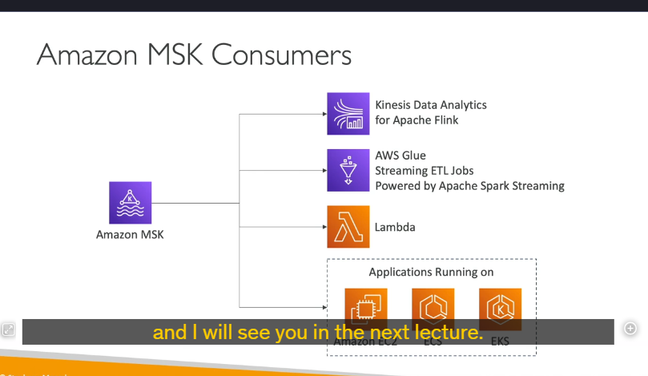

### **Amazon Managed Streaming for Apache Kafka (Amazon MSK)**
**Amazon MSK** là một dịch vụ được quản lý bởi AWS, giúp bạn dễ dàng triển khai và quản lý các cụm **Apache Kafka** trên nền tảng đám mây của AWS. **Apache Kafka** là một nền tảng mã nguồn mở dùng để xử lý luồng dữ liệu (data streaming) theo thời gian thực, tương tự như **Amazon Kinesis**, nhưng có một số khác biệt quan trọng.

### **Apache Kafka là gì?**

- **Apache Kafka** là một hệ thống messaging phân tán, được thiết kế để xử lý các luồng dữ liệu lớn theo thời gian thực.
- Một cụm Kafka bao gồm nhiều **broker nodes** (các máy chủ xử lý dữ liệu) và **Zookeeper nodes** (quản lý cấu hình và đồng bộ hóa).
- Kafka hoạt động dựa trên mô hình **publish-subscribe**:
  - **Producers** (nhà sản xuất dữ liệu) gửi dữ liệu vào các **topics** (chủ đề).
  - **Consumers** (người tiêu dùng dữ liệu) đọc dữ liệu từ các topics này.

---

### **Cách thức hoạt động của Amazon MSK**

1. **Triển khai cụm Kafka**:

   - Amazon MSK cho phép bạn tạo, cập nhật và xóa các cụm Kafka một cách dễ dàng.
   - AWS tự động quản lý các **broker nodes** và **Zookeeper nodes** trong cụm Kafka của bạn.
   - Cụm Kafka được triển khai trong **VPC** (Virtual Private Cloud) của bạn, trải rộng trên nhiều **Availability Zones (AZ)** để đảm bảo tính sẵn sàng cao (high availability).

2. **Tự động phục hồi**:

   - Amazon MSK cung cấp khả năng tự động phục hồi từ các lỗi phổ biến của Kafka.
   - Dữ liệu được lưu trữ trên các **EBS volumes** (Elastic Block Store) và có thể được lưu giữ trong thời gian dài tùy theo nhu cầu của bạn.

3. **MSK Serverless**:
   - Amazon MSK cung cấp tùy chọn **MSK Serverless**, cho phép bạn chạy Apache Kafka mà không cần phải quản lý cơ sở hạ tầng.
   - AWS tự động cung cấp tài nguyên tính toán và lưu trữ, đồng thời tự động mở rộng (scale) dựa trên nhu cầu của bạn.

---

### **Cách Kafka hoạt động**

1. **Producers**:

   - Các producers (ví dụ: ứng dụng IoT, cơ sở dữ liệu RDS, Kinesis, v.v.) gửi dữ liệu vào các **Kafka topics**.
   - Mỗi topic được phân chia thành nhiều **partitions** (phân vùng) để xử lý song song.

2. **Brokers**:

   - Các brokers lưu trữ và sao chép dữ liệu từ các topics trên nhiều nodes để đảm bảo tính sẵn sàng cao.

3. **Consumers**:
   - Các consumers (ví dụ: ứng dụng Flink, Glue, Lambda, v.v.) đọc dữ liệu từ các topics và xử lý chúng.
   - Dữ liệu sau khi xử lý có thể được gửi đến các dịch vụ như **EMR**, **S3**, **SageMaker**, **Kinesis**, hoặc **RDS**.

---

### **So sánh giữa Kinesis Data Streams và Amazon MSK**

| Đặc điểm                         | Kinesis Data Streams                                         | Amazon MSK                                                  |
| -------------------------------- | ------------------------------------------------------------ | ----------------------------------------------------------- |
| **Giới hạn kích thước tin nhắn** | Mặc định 1 MB, có thể tăng lên.                              | Mặc định 1 MB, có thể cấu hình lên đến 10 MB.               |
| **Đơn vị phân vùng**             | Shards                                                       | Partitions (trong Kafka Topics)                             |
| **Cách mở rộng**                 | Shard Splitting (chia shard) và Merging (gộp shard).         | Chỉ có thể thêm partitions, không thể xóa partitions.       |
| **Mã hóa dữ liệu**               | Hỗ trợ mã hóa trong quá trình truyền (in-flight encryption). | Hỗ trợ mã hóa trong quá trình truyền (TLS hoặc plain text). |
| **Lưu trữ dữ liệu**              | Thời gian lưu trữ giới hạn (mặc định 24 giờ, tối đa 7 ngày). | Lưu trữ không giới hạn, miễn là bạn trả phí cho EBS.        |

---

### **Cách sử dụng Amazon MSK**

1. **Tạo Kafka Producer**:

   - Bạn cần tạo một **Kafka Producer** để gửi dữ liệu vào các topics trong cụm MSK.

2. **Tiêu thụ dữ liệu từ MSK**:
   - **Kinesis Data Analytics for Apache Flink**: Sử dụng ứng dụng Flink để đọc dữ liệu trực tiếp từ cụm MSK.
   - **AWS Glue**: Thực hiện các công việc ETL (Extract, Transform, Load) trên dữ liệu streaming bằng **Apache Spark Streaming**.
   - **AWS Lambda**: Sử dụng Lambda với MSK làm nguồn sự kiện (event source).
   - **Tự viết Kafka Consumer**: Bạn có thể viết consumer của riêng mình và chạy nó trên **EC2**, **ECS**, hoặc **EKS**.

---

### **Tóm tắt**

- **Amazon MSK** là dịch vụ quản lý cụm Kafka trên AWS, giúp bạn dễ dàng triển khai và vận hành Kafka mà không cần quản lý cơ sở hạ tầng.
- Kafka hoạt động dựa trên mô hình publish-subscribe, với producers gửi dữ liệu vào topics và consumers đọc dữ liệu từ topics.
- MSK hỗ trợ **MSK Serverless**, tự động cung cấp tài nguyên và mở rộng theo nhu cầu.
- So với **Kinesis Data Streams**, MSK có một số khác biệt về giới hạn kích thước tin nhắn, cách mở rộng, và thời gian lưu trữ dữ liệu.

---
