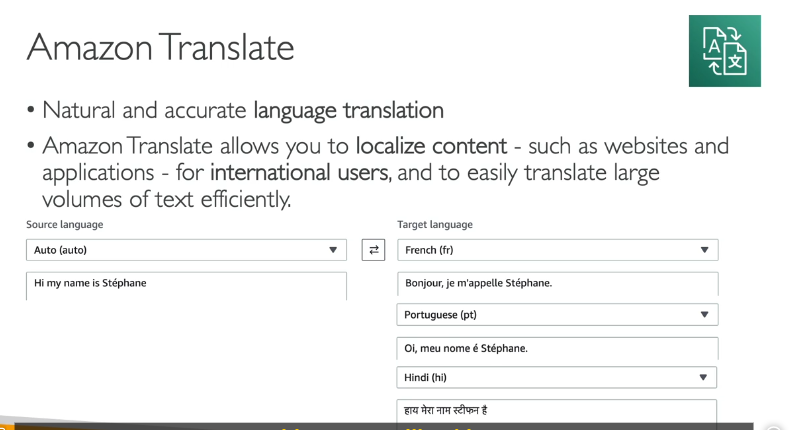

Amazon Polly là một dịch vụ chuyển đổi văn bản thành giọng nói (Text-to-Speech) sử dụng công nghệ học sâu (deep learning). Dịch vụ này cho phép bạn tạo ra các ứng dụng có khả năng "nói" một cách tự nhiên và giống con người. Dưới đây là các chi tiết quan trọng về Amazon Polly:

#### 1. **Chuyển Đổi Văn Bản Thành Giọng Nói**

- **Ví dụ**: Bạn có thể nhập văn bản như "Hello, my name is Stephane and this is a demo of Amazon Polly", và Polly sẽ tạo ra một đoạn âm thanh tương ứng.
- **Ứng dụng**: Điều này hữu ích trong việc phát triển các ứng dụng như trợ lý ảo, hệ thống đọc sách điện tử, hoặc các dịch vụ hỗ trợ khách hàng tự động.

#### 2. **Tùy Chỉnh Phát Âm với Lexicon**

- **Lexicon**: Là một công cụ cho phép bạn tùy chỉnh cách phát âm của các từ cụ thể. Ví dụ, nếu bạn có một từ được viết theo kiểu stylized như "St3ph4ne" (với "3" thay cho "e" và "4" thay cho "a"), bạn có thể tạo một lexicon để đảm bảo Polly phát âm đúng là "Stephane".
- **Ví dụ khác**: Bạn có thể thiết lập để khi Polly gặp từ "AWS", nó sẽ đọc là "Amazon Web Services" thay vì đọc từng chữ cái "A-W-S".

#### 3. **SSML (Speech Synthesis Markup Language)**

- **SSML**: Là một ngôn ngữ đánh dấu cho phép bạn tùy chỉnh sâu hơn cách giọng nói được tạo ra. Bạn có thể thêm các hiệu ứng như nhấn mạnh từ, phát âm theo ngữ âm, thêm tiếng thở, hoặc thậm chí là giọng nói thì thầm.
- **Ví dụ**: Bạn có thể sử dụng SSML để tạo một đoạn văn bản với giọng nói thì thầm, hoặc thêm một khoảng dừng (break) giữa các câu.
- **Cú pháp SSML**: Ví dụ, để thêm một khoảng dừng 3 giây, bạn có thể sử dụng cú pháp `<break time="3s"/>`.

#### 4. **Giọng Nói Tự Nhiên với Công Nghệ Neural**

- **Neural Text-to-Speech (NTTS)**: Amazon Polly sử dụng công nghệ neural để tạo ra giọng nói tự nhiên và giống con người nhất có thể. Bạn có thể chọn từ nhiều giọng nói khác nhau tùy theo nhu cầu của mình.
- **Ví dụ**: Bạn có thể chọn giọng nói "Joanna" và nhập văn bản "Hey, my name is Joanna and I love AWS", Polly sẽ tạo ra một đoạn âm thanh với giọng nói tự nhiên.

#### 5. **Tích Hợp Lexicon và SSML**

- **Kết hợp Lexicon và SSML**: Bạn có thể kết hợp cả hai công cụ này để tạo ra giọng nói tùy chỉnh cao. Ví dụ, bạn có thể sử dụng lexicon để đảm bảo phát âm đúng các từ đặc biệt, và SSML để thêm các hiệu ứng như nhấn mạnh hoặc khoảng dừng.

#### 6. **Demo trên AWS Console**

- **Thử nghiệm trực tiếp**: Bạn có thể truy cập vào dịch vụ Amazon Polly trên AWS Console để thử nghiệm trực tiếp. Bạn có thể nhập văn bản, chọn giọng nói, và nghe kết quả ngay lập tức.
- **Ví dụ**: Nhập văn bản "Hey, my name is Stephane and I love AWS", và Polly sẽ tạo ra một đoạn âm thanh tương ứng.

#### 7. **Ứng Dụng Thực Tế**

- **Hỗ trợ khách hàng**: Polly có thể được sử dụng để tạo ra các hệ thống hỗ trợ khách hàng tự động với giọng nói tự nhiên.
- **Giáo dục**: Polly có thể được sử dụng trong các ứng dụng giáo dục để đọc sách điện tử hoặc tạo ra các bài giảng bằng giọng nói.
- **Trợ lý ảo**: Polly có thể được tích hợp vào các trợ lý ảo để cung cấp phản hồi bằng giọng nói.

---

