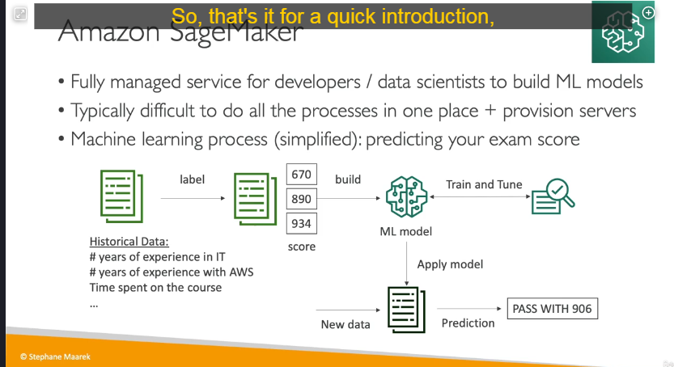

Amazon SageMaker là một dịch vụ hoàn toàn được quản lý bởi AWS, dành cho các nhà phát triển và nhà khoa học dữ liệu để xây dựng, đào tạo và triển khai các mô hình machine learning (ML) một cách dễ dàng và hiệu quả. SageMaker cung cấp một nền tảng tích hợp giúp đơn giản hóa quy trình phức tạp của việc phát triển ML, từ việc chuẩn bị dữ liệu đến triển khai mô hình vào sản xuất.

---

### **Tổng quan về Amazon SageMaker:**

1. **Mục đích:**

   - SageMaker được thiết kế để giúp các nhà phát triển và nhà khoa học dữ liệu xây dựng, đào tạo và triển khai các mô hình ML một cách nhanh chóng và hiệu quả.
   - Khác với các dịch vụ ML có sẵn của AWS (như Amazon Comprehend, Transcribe, Translate), SageMaker cho phép bạn tự tạo và tùy chỉnh các mô hình ML phù hợp với nhu cầu cụ thể của bạn.

2. **Quy trình làm việc của SageMaker:**
   - SageMaker hỗ trợ toàn bộ quy trình ML, bao gồm:
     - **Chuẩn bị dữ liệu:** Thu thập, làm sạch và gán nhãn dữ liệu.
     - **Xây dựng mô hình:** Lựa chọn thuật toán và thiết kế mô hình.
     - **Đào tạo mô hình:** Sử dụng dữ liệu để huấn luyện mô hình.
     - **Tinh chỉnh mô hình:** Tối ưu hóa mô hình để cải thiện độ chính xác.
     - **Triển khai mô hình:** Đưa mô hình vào sử dụng trong thực tế.
     - **Giám sát và cập nhật:** Theo dõi hiệu suất và cập nhật mô hình khi cần.

---

### **Các bước xây dựng mô hình ML với SageMaker:**

1. **Thu thập và gán nhãn dữ liệu:**

   - **Thu thập dữ liệu:** Bạn cần thu thập dữ liệu từ các nguồn khác nhau. Ví dụ: Nếu bạn muốn dự đoán điểm số của học viên trong kỳ thi AWS Certified Cloud Practitioner, bạn có thể thu thập dữ liệu về số năm kinh nghiệm IT, số năm kinh nghiệm AWS, thời gian học khóa học, số bài kiểm tra thực hành đã làm, v.v.
   - **Gán nhãn dữ liệu:** Dữ liệu cần được gán nhãn để xác định các cột tương ứng với các đặc điểm (features) và kết quả (labels). Ví dụ: Điểm số của học viên trong kỳ thi là nhãn (label), trong khi các thông tin khác như kinh nghiệm, thời gian học là các đặc điểm (features).

2. **Xây dựng mô hình:**

   - Bạn cần chọn một thuật toán ML phù hợp để xây dựng mô hình. SageMaker cung cấp nhiều thuật toán được tích hợp sẵn, bao gồm:
     - Hỗ trợ phân loại (Classification).
     - Hồi quy (Regression).
     - Phân cụm (Clustering).
     - Xử lý ngôn ngữ tự nhiên (NLP).
     - Xử lý hình ảnh (Computer Vision).
   - Bạn cũng có thể sử dụng các framework ML phổ biến như TensorFlow, PyTorch, hoặc MXNet.

3. **Đào tạo mô hình:**

   - SageMaker cung cấp khả năng đào tạo mô hình trên các tài nguyên điện toán đám mây mạnh mẽ. Bạn có thể sử dụng các instance EC2 được tối ưu hóa cho ML để đào tạo mô hình nhanh chóng.
   - Quá trình đào tạo bao gồm việc sử dụng dữ liệu đã gán nhãn để mô hình học cách dự đoán kết quả.

4. **Tinh chỉnh mô hình:**

   - Sau khi đào tạo, bạn cần tinh chỉnh mô hình để cải thiện độ chính xác. Điều này bao gồm việc điều chỉnh các siêu tham số (hyperparameters) và kiểm tra mô hình trên các tập dữ liệu validation.

5. **Triển khai mô hình:**

   - Khi mô hình đã sẵn sàng, bạn có thể triển khai nó dưới dạng một endpoint API. Điều này cho phép bạn sử dụng mô hình để dự đoán kết quả trên dữ liệu mới.
   - Ví dụ: Khi một học viên mới cung cấp thông tin về kinh nghiệm và thời gian học, mô hình sẽ dự đoán điểm số của họ trong kỳ thi.

6. **Giám sát và cập nhật:**
   - SageMaker cung cấp các công cụ để giám sát hiệu suất của mô hình trong thời gian thực. Nếu mô hình không còn hiệu quả, bạn có thể cập nhật hoặc đào tạo lại mô hình.

---

### **Lợi ích của Amazon SageMaker:**

1. **Tích hợp toàn bộ quy trình ML:**

   - SageMaker cung cấp một nền tảng duy nhất để thực hiện tất cả các bước trong quy trình ML, từ chuẩn bị dữ liệu đến triển khai.

2. **Tự động hóa và tối ưu hóa:**

   - SageMaker tự động hóa nhiều tác vụ phức tạp như điều chỉnh siêu tham số (Hyperparameter Tuning) và scaling tài nguyên.

3. **Khả năng mở rộng:**

   - Bạn có thể sử dụng các tài nguyên điện toán linh hoạt của AWS để đào tạo mô hình trên quy mô lớn.

4. **Tích hợp với các dịch vụ AWS khác:**

   - SageMaker có thể tích hợp với các dịch vụ như S3 (lưu trữ dữ liệu), IAM (quản lý quyền truy cập), và CloudWatch (giám sát hiệu suất).

5. **Hỗ trợ nhiều framework và thuật toán:**
   - Bạn có thể sử dụng các framework ML phổ biến như TensorFlow, PyTorch, hoặc các thuật toán được tích hợp sẵn của SageMaker.

---

### **Ví dụ minh họa:**

Giả sử bạn muốn xây dựng một mô hình ML để dự đoán điểm số của học viên trong kỳ thi AWS Certified Cloud Practitioner. Quy trình sẽ như sau:

1. **Thu thập dữ liệu:**

   - Bạn thu thập dữ liệu từ 10,000 học viên, bao gồm:
     - Số năm kinh nghiệm IT.
     - Số năm kinh nghiệm AWS.
     - Thời gian học khóa học.
     - Số bài kiểm tra thực hành đã làm.
     - Điểm số thực tế trong kỳ thi.

2. **Gán nhãn dữ liệu:**

   - Bạn gán nhãn các cột dữ liệu và xác định điểm số là nhãn (label).

3. **Xây dựng mô hình:**

   - Bạn chọn thuật toán hồi quy (Regression) để dự đoán điểm số.

4. **Đào tạo mô hình:**

   - Bạn sử dụng SageMaker để đào tạo mô hình trên dữ liệu đã thu thập.

5. **Tinh chỉnh mô hình:**

   - Bạn điều chỉnh các siêu tham số để cải thiện độ chính xác.

6. **Triển khai mô hình:**

   - Bạn triển khai mô hình dưới dạng API endpoint để dự đoán điểm số cho các học viên mới.

7. **Giám sát và cập nhật:**
   - Bạn theo dõi hiệu suất của mô hình và cập nhật khi cần.

---

### **Kết luận:**

Amazon SageMaker là một công cụ mạnh mẽ giúp đơn giản hóa quy trình phát triển và triển khai các mô hình ML. Với khả năng tích hợp toàn bộ quy trình ML trên một nền tảng duy nhất, SageMaker giúp các nhà phát triển và nhà khoa học dữ liệu tiết kiệm thời gian và công sức, đồng thời tối ưu hóa hiệu suất của các mô hình ML.
