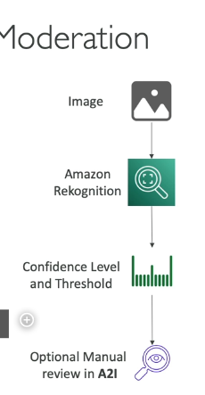

Amazon Rekognition là một dịch vụ mạnh mẽ dựa trên machine learning được cung cấp bởi AWS (Amazon Web Services), cho phép các nhà phát triển phân tích hình ảnh và video để phát hiện đối tượng, cảnh quan, văn bản và khuôn mặt. Dịch vụ này cung cấp nhiều tính năng đa dạng, phù hợp cho các ứng dụng như an ninh, phân tích media và xác thực người dùng. Dưới đây là chi tiết về các tính năng chính và trường hợp sử dụng của Amazon Rekognition:

---

### **Các Tính Năng Chính của Amazon Rekognition**

1. **Phân Tích Hình Ảnh và Video**:

   - Rekognition sử dụng machine learning để phân tích hình ảnh và video, nhận diện các đối tượng, con người, văn bản và cảnh quan.
   - Nó có thể tự động gắn nhãn nội dung trong hình ảnh và video, chẳng hạn như nhận diện động vật, phương tiện hoặc phong cảnh.

2. **Phân Tích Khuôn Mặt**:

   - Phát hiện khuôn mặt trong hình ảnh và video.
   - Cung cấp phân tích chi tiết về các thuộc tính khuôn mặt, bao gồm:
     - Giới tính
     - Khoảng tuổi
     - Cảm xúc (ví dụ: vui, buồn, tức giận)
     - Đặc điểm khuôn mặt (ví dụ: mắt mở, đeo kính, có râu)
   - Có thể phát hiện nếu một khuôn mặt đang cười hoặc mắt có mở hay không.

3. **Tìm Kiếm và Xác Thực Khuôn Mặt**:

   - Cho phép tạo một cơ sở dữ liệu về các khuôn mặt quen thuộc (ví dụ: nhân viên, người dùng) và so sánh hình ảnh mới với cơ sở dữ liệu này.
   - Hữu ích cho xác thực người dùng, kiểm soát truy cập và các ứng dụng an ninh.
   - Cũng có thể so sánh khuôn mặt với cơ sở dữ liệu người nổi tiếng để nhận diện.

4. **Nhận Diện Người Nổi Tiếng**:

   - Nhận diện người nổi tiếng trong hình ảnh và video bằng cách so sánh với cơ sở dữ liệu có sẵn.
   - Hữu ích cho ngành công nghiệp media và giải trí.

5. **Phát Hiện Văn Bản**:

   - Trích xuất văn bản từ hình ảnh và video (ví dụ: biển số xe, biển hiệu đường phố hoặc số áo của vận động viên).
   - Hỗ trợ nhiều ngôn ngữ và phông chữ.

6. **Kiểm Duyệt Nội Dung**:

   - Phát hiện nội dung không phù hợp, xúc phạm hoặc không mong muốn trong hình ảnh và video.
   - Giúp đảm bảo tuân thủ quy định và tạo trải nghiệm người dùng an toàn cho các ứng dụng như mạng xã hội, thương mại điện tử hoặc nền tảng media.
   - Sử dụng **Ngưỡng Tin Cậy Tối Thiểu** (Minimum Confidence Threshold) để đánh dấu nội dung, có thể điều chỉnh dựa trên độ nhạy mong muốn.

7. **Theo Dõi Đường Đi (Pathing)**:

   - Theo dõi chuyển động của đối tượng hoặc người trong video.
   - Hữu ích cho phân tích thể thao, giám sát hoặc theo dõi thời gian thực.

8. **Nhãn Tùy Chỉnh (Custom Labels)**:
   - Cho phép bạn huấn luyện Rekognition với tập dữ liệu riêng để phát hiện các đối tượng hoặc cảnh quan cụ thể.
   - Ví dụ: bạn có thể huấn luyện nó để nhận diện logo sản phẩm hoặc các bộ phận máy móc.

---

### **Cách Amazon Rekognition Hoạt Động**

1. **Tải Lên Media**:

   - Người dùng tải lên hình ảnh hoặc video lên dịch vụ Rekognition thông qua AWS Management Console, SDK hoặc API.

2. **Phân Tích**:

   - Rekognition xử lý media bằng các mô hình machine learning được huấn luyện sẵn hoặc mô hình tùy chỉnh (nếu sử dụng Custom Labels).

3. **Kết Quả**:

   - Trả về metadata chi tiết về nội dung được phân tích, chẳng hạn như:
     - Nhãn (ví dụ: "chó", "núi", "xe hơi")
     - Thuộc tính khuôn mặt (ví dụ: khoảng tuổi, cảm xúc)
     - Văn bản trích xuất từ hình ảnh
     - Thông tin đường đi trong video

4. **Điểm Tin Cậy**:
   - Mỗi phát hiện đi kèm với một điểm tin cậy (phần trăm) cho biết mức độ tự tin của Rekognition trong phân tích.
   - Người dùng có thể đặt **Ngưỡng Tin Cậy Tối Thiểu** để lọc kết quả theo yêu cầu.

---

### **Các Trường Hợp Sử Dụng Amazon Rekognition**

1. **An Ninh và Giám Sát**:

   - Nhận diện khuôn mặt để kiểm soát truy cập hoặc xác thực người dùng.
   - Giám sát không gian công cộng để phát hiện hoạt động đáng ngờ.

2. **Media và Giải Trí**:

   - Nhận diện người nổi tiếng để gắn thẻ trong ảnh hoặc video.
   - Kiểm duyệt nội dung để lọc tài liệu không phù hợp.

3. **Thương Mại Điện Tử**:

   - Tự động gắn thẻ sản phẩm trong hình ảnh.
   - Phát hiện nội dung xúc phạm trong hình ảnh do người dùng tải lên.

4. **Phân Tích Thể Thao**:

   - Theo dõi chuyển động của cầu thủ và phân tích video trận đấu.
   - Tạo ra các thông tin chi tiết cho huấn luyện viên và nhà phân tích.

5. **Mạng Xã Hội**:

   - Tự động gắn thẻ bạn bè trong ảnh.
   - Kiểm duyệt nội dung do người dùng tạo để đảm bảo tuân thủ quy định cộng đồng.

6. **Quảng Cáo**:
   - Phân tích hình ảnh và video để đảm bảo quảng cáo phù hợp với đối tượng mục tiêu.
   - Phát hiện văn bản trong hình ảnh để nhắm mục tiêu quảng cáo.

---

### **Kiểm Duyệt Nội Dung với Amazon Rekognition**

- **Mục Đích**:

  - Phát hiện và lọc nội dung không phù hợp hoặc xúc phạm trong hình ảnh và video.
  - Đảm bảo tuân thủ quy định và duy trì trải nghiệm người dùng an toàn.

- **Quy Trình**:

  1. **Đánh Dấu Tự Động**:
     - Rekognition phân tích hình ảnh/video và đánh dấu nội dung dựa trên Ngưỡng Tin Cậy Tối Thiểu.
  2. **Xem Xét Thủ Công**:
     - Nội dung được đánh dấu có thể được xem xét thủ công bằng **Amazon Augmented AI (A2I)**.
     - A2I cho phép người xem xét kiểm tra nội dung được đánh dấu và quyết định giữ lại hoặc xóa.

- **Ứng Dụng**:
  - Mạng xã hội, nền tảng thương mại điện tử, phát sóng media và quảng cáo.

---

### **Mẹo Thi AWS về Amazon Rekognition**

1. **Kiểm Duyệt Nội Dung**:

   - Hiểu cách Ngưỡng Tin Cậy Tối Thiểu hoạt động và cách nó ảnh hưởng đến số lượng nội dung được đánh dấu.
   - Biết rằng Amazon A2I có thể được sử dụng để xem xét thủ công nội dung được đánh dấu.

2. **Phân Tích Khuôn Mặt**:

   - Nắm rõ các thuộc tính Rekognition có thể phát hiện (ví dụ: khoảng tuổi, cảm xúc, giới tính).

3. **Trường Hợp Sử Dụng**:

   - Nhận biết các tình huống mà Rekognition sẽ hữu ích (ví dụ: an ninh, phân tích thể thao, kiểm duyệt nội dung).

4. **Nhãn Tùy Chỉnh**:

   - Hiểu rằng Nhãn Tùy Chỉnh cho phép bạn huấn luyện Rekognition với tập dữ liệu riêng cho các trường hợp sử dụng cụ thể.

5. **Phát Hiện Văn Bản**:
   - Biết rằng Rekognition có thể trích xuất văn bản từ hình ảnh và video, hữu ích cho các ứng dụng như nhận diện biển số xe hoặc phân tích số áo vận động viên.

---

### **Ví Dụ Quy Trình Làm Việc**

1. **Tải Lên Hình Ảnh**:

   - Người dùng tải lên hình ảnh một nhóm người tại sự kiện thể thao.

2. **Phân Tích Hình Ảnh**:

   - Rekognition phát hiện:
     - Khuôn mặt (với các thuộc tính như tuổi, giới tính và cảm xúc)
     - Đối tượng (ví dụ: bóng đá, cột gôn)
     - Văn bản (ví dụ: số áo cầu thủ)

3. **Kết Quả**:

   - Trả về metadata như:
     - "Người: Nam, Tuổi 25-30, Vui vẻ"
     - "Bóng đá: 95% Tin Cậy"
     - "Văn bản: 'Cầu thủ số 10'"

4. **Hành Động**:
   - Sử dụng kết quả để gắn thẻ, kiểm duyệt hoặc phân tích.

---

### **Kết Luận**

Amazon Rekognition là một công cụ mạnh mẽ và linh hoạt để phân tích hình ảnh và video bằng machine learning. Các tính năng như phân tích khuôn mặt, phát hiện văn bản và kiểm duyệt nội dung làm cho nó phù hợp với nhiều ứng dụng, từ an ninh đến phân tích media. Hiểu rõ các khả năng và trường hợp sử dụng của nó là điều cần thiết để tận dụng tối đa tiềm năng của dịch vụ, đặc biệt trong các tình huống yêu cầu phân tích hình ảnh và video tự động.
