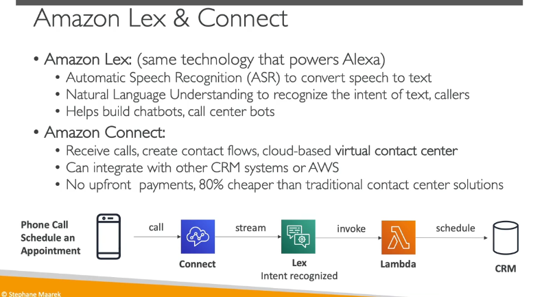

### Chi Tiết Kiến Thức về Amazon Lex và Amazon Connect

Amazon Lex và Amazon Connect là hai dịch vụ quan trọng của AWS, giúp xây dựng các hệ thống tương tác giọng nói và trung tâm liên hệ thông minh. Dưới đây là chi tiết về từng dịch vụ:

---

#### **1. Amazon Lex**

Amazon Lex là công nghệ đứng sau các thiết bị Alexa của Amazon. Nó cung cấp khả năng nhận dạng giọng nói tự động (ASR - Automatic Speech Recognition) và hiểu ngôn ngữ tự nhiên (NLU - Natural Language Understanding), giúp xây dựng các chatbot hoặc bot trung tâm cuộc gọi.

##### **Tính năng chính của Amazon Lex:**

- **Nhận dạng giọng nói (ASR)**: Chuyển đổi giọng nói thành văn bản.
  - Ví dụ: Khi bạn nói "Alexa, thời tiết ngày mai thế nào?", Lex sẽ chuyển đổi câu nói này thành văn bản.
- **Hiểu ngôn ngữ tự nhiên (NLU)**: Lex không chỉ nhận dạng giọng nói mà còn hiểu được ý định (intent) của người dùng.
  - Ví dụ: Khi bạn nói "Tôi muốn đặt một phòng khách sạn vào ngày mai", Lex sẽ hiểu rằng bạn muốn đặt phòng và trích xuất thông tin như ngày tháng.
- **Xây dựng chatbot và bot trung tâm cuộc gọi**: Lex giúp tạo ra các chatbot thông minh có thể tương tác với người dùng qua văn bản hoặc giọng nói.

##### **Ứng dụng của Amazon Lex:**

- **Chatbot**: Tạo các chatbot cho website, ứng dụng di động, hoặc nền tảng nhắn tin.
- **Bot trung tâm cuộc gọi**: Tích hợp với Amazon Connect để xử lý cuộc gọi tự động.
- **Hệ thống hỗ trợ khách hàng**: Tự động trả lời các câu hỏi thường gặp của khách hàng.

---

#### **2. Amazon Connect**

Amazon Connect là một dịch vụ trung tâm liên hệ (contact center) dựa trên đám mây, cho phép bạn xây dựng và quản lý các hệ thống hỗ trợ khách hàng một cách linh hoạt và tiết kiệm chi phí.

##### **Tính năng chính của Amazon Connect:**

- **Tiếp nhận cuộc gọi**: Bạn có thể thiết lập các số điện thoại ảo để tiếp nhận cuộc gọi từ khách hàng.
- **Tạo luồng liên hệ (Contact Flow)**: Bạn có thể thiết kế các luồng tương tác tự động để xử lý cuộc gọi, chẳng hạn như chào mừng, chuyển hướng cuộc gọi, hoặc thu thập thông tin.
- **Tích hợp với CRM và các dịch vụ AWS**: Amazon Connect có thể kết nối với các hệ thống quản lý quan hệ khách hàng (CRM) như Salesforce hoặc các dịch vụ AWS khác như Lambda, DynamoDB, v.v.
- **Không cần chi phí trả trước**: Amazon Connect hoạt động theo mô hình pay-as-you-go, giúp tiết kiệm chi phí so với các giải pháp trung tâm liên hệ truyền thống (khoảng 80% rẻ hơn).

##### **Ứng dụng của Amazon Connect:**

- **Trung tâm hỗ trợ khách hàng**: Xử lý cuộc gọi tự động, chuyển hướng cuộc gọi đến nhân viên phù hợp.
- **Hệ thống đặt lịch hẹn**: Tích hợp với Lex để tự động đặt lịch hẹn qua điện thoại.
- **Hệ thống khảo sát khách hàng**: Thu thập phản hồi từ khách hàng sau khi kết thúc cuộc gọi.

---

#### **3. Kết hợp Amazon Lex và Amazon Connect**

Khi kết hợp Lex và Connect, bạn có thể xây dựng một hệ thống trung tâm liên hệ thông minh với khả năng xử lý cuộc gọi tự động và hiểu ý định của khách hàng.

##### **Ví dụ về luồng hoạt động:**

1. **Khách hàng gọi đến**: Một khách hàng gọi đến số điện thoại được thiết lập bởi Amazon Connect.
2. **Lex xử lý cuộc gọi**: Lex sẽ chuyển đổi giọng nói của khách hàng thành văn bản và hiểu ý định của họ.
   - Ví dụ: Khách hàng nói "Tôi muốn đặt lịch hẹn với Tom vào 3 giờ chiều ngày mai."
3. **Kích hoạt Lambda function**: Lex sẽ gọi một Lambda function để xử lý yêu cầu.
   - Ví dụ: Lambda function sẽ ghi lại lịch hẹn vào hệ thống CRM.
4. **Phản hồi khách hàng**: Lex sẽ thông báo cho khách hàng rằng lịch hẹn đã được đặt thành công.

---

#### **4. Lợi ích của Amazon Lex và Connect**

- **Tiết kiệm chi phí**: Không cần đầu tư phần cứng, chi phí dựa trên mức độ sử dụng.
- **Dễ dàng tích hợp**: Có thể kết nối với các dịch vụ AWS khác như Lambda, DynamoDB, S3, v.v.
- **Khả năng mở rộng**: Hệ thống có thể mở rộng tự động để xử lý số lượng cuộc gọi lớn.
- **Tùy chỉnh linh hoạt**: Bạn có thể thiết kế các luồng tương tác phù hợp với nhu cầu kinh doanh.

---
