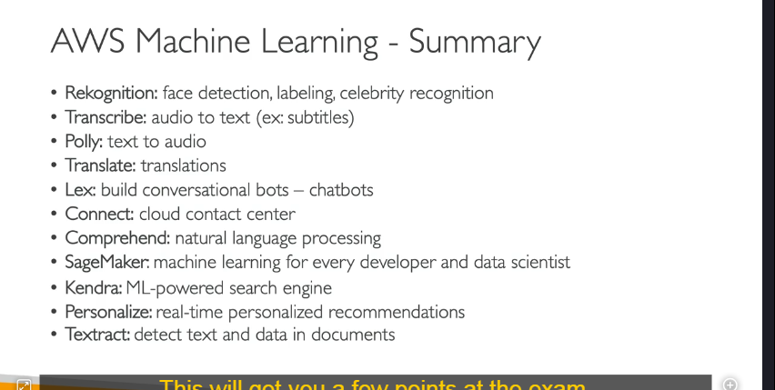

---

### **1. Amazon Rekognition:**

- **Chức năng:** Phân tích hình ảnh và video.
- **Các tính năng chính:**
  - Nhận diện khuôn mặt (Face Detection).
  - Gắn nhãn đối tượng (Labeling).
  - Nhận diện người nổi tiếng (Celebrity Recognition).
- **Ứng dụng:** Bảo mật, phân tích phương tiện truyền thông, quản lý nội dung.

---

### **2. Amazon Transcribe:**

- **Chức năng:** Chuyển đổi giọng nói thành văn bản.
- **Các tính năng chính:**
  - Tạo phụ đề (Subtitles) từ audio.
  - Hỗ trợ đa ngôn ngữ.
- **Ứng dụng:** Tạo phụ đề cho video, phân tích cuộc gọi, ghi chú tự động.

---

### **3. Amazon Polly:**

- **Chức năng:** Chuyển đổi văn bản thành giọng nói.
- **Các tính năng chính:**
  - Hỗ trợ nhiều giọng đọc và ngôn ngữ.
  - Tạo audio từ văn bản.
- **Ứng dụng:** Hỗ trợ đọc văn bản, tạo nội dung audio cho ứng dụng.

---

### **4. Amazon Translate:**

- **Chức năng:** Dịch văn bản giữa các ngôn ngữ.
- **Các tính năng chính:**
  - Hỗ trợ dịch tự động.
  - Tích hợp dễ dàng với các ứng dụng.
- **Ứng dụng:** Dịch thuật tài liệu, hỗ trợ đa ngôn ngữ trong ứng dụng.

---

### **5. Amazon Lex:**

- **Chức năng:** Xây dựng chatbot và trợ lý ảo.
- **Các tính năng chính:**
  - Hỗ trợ xử lý ngôn ngữ tự nhiên (NLP).
  - Tích hợp với các dịch vụ khác như Connect để tạo trung tâm liên hệ (Contact Center).
- **Ứng dụng:** Chatbot hỗ trợ khách hàng, trợ lý ảo.

---

### **6. Amazon Comprehend:**

- **Chức năng:** Xử lý ngôn ngữ tự nhiên (NLP).
- **Các tính năng chính:**
  - Phân tích cảm xúc (Sentiment Analysis).
  - Nhận diện thực thể (Entity Recognition).
  - Phân loại văn bản (Text Classification).
- **Ứng dụng:** Phân tích phản hồi khách hàng, phân loại tài liệu.

---

### **7. Amazon SageMaker:**

- **Chức năng:** Dịch vụ ML toàn diện dành cho nhà phát triển và nhà khoa học dữ liệu.
- **Các tính năng chính:**
  - Xây dựng, đào tạo và triển khai mô hình ML.
  - Hỗ trợ nhiều framework ML (TensorFlow, PyTorch, v.v.).
- **Ứng dụng:** Xây dựng mô hình ML tùy chỉnh cho các bài toán cụ thể.

---

### **8. Amazon Kendra:**

- **Chức năng:** Công cụ tìm kiếm tài liệu thông minh.
- **Các tính năng chính:**
  - Tìm kiếm ngôn ngữ tự nhiên (Natural Language Search).
  - Hỗ trợ đa dạng định dạng tài liệu (PDF, Word, HTML, v.v.).
- **Ứng dụng:** Tìm kiếm thông tin trong tài liệu nội bộ, hỗ trợ khách hàng.

---

### **9. Amazon Personalize:**

- **Chức năng:** Cung cấp khuyến nghị cá nhân hóa trong thời gian thực.
- **Các tính năng chính:**
  - Gợi ý sản phẩm, nội dung dựa trên hành vi người dùng.
  - Tích hợp dễ dàng với ứng dụng và website.
- **Ứng dụng:** Thương mại điện tử, truyền thông, marketing cá nhân hóa.

---

### **10. Amazon Textract:**

- **Chức năng:** Trích xuất văn bản và dữ liệu từ tài liệu.
- **Các tính năng chính:**
  - Nhận diện văn bản, biểu mẫu, bảng biểu.
  - Hỗ trợ chữ viết tay.
- **Ứng dụng:** Xử lý hóa đơn, hợp đồng, biểu mẫu.

---

### **Tóm tắt nhanh:**

- **Rekognition:** Phân tích hình ảnh và video.
- **Transcribe:** Chuyển đổi giọng nói thành văn bản.
- **Polly:** Chuyển đổi văn bản thành giọng nói.
- **Translate:** Dịch văn bản giữa các ngôn ngữ.
- **Lex:** Xây dựng chatbot.
- **Comprehend:** Xử lý ngôn ngữ tự nhiên (NLP).
- **SageMaker:** Dịch vụ ML toàn diện.
- **Kendra:** Tìm kiếm tài liệu thông minh.
- **Personalize:** Khuyến nghị cá nhân hóa.
- **Textract:** Trích xuất văn bản và dữ liệu từ tài liệu.

---
