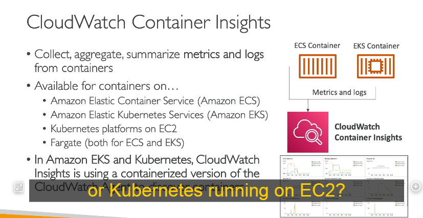
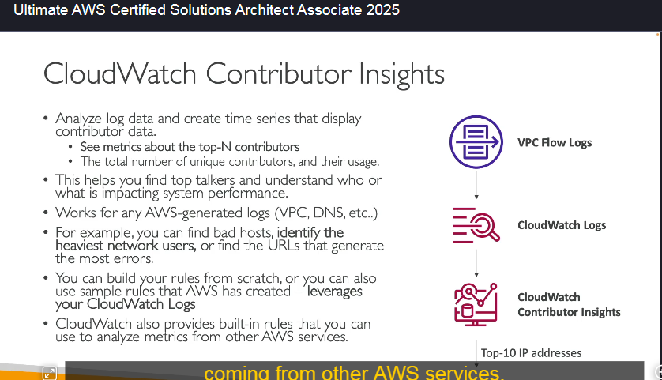

Dưới đây là chi tiết kiến thức về **CloudWatch Insights**, bao gồm **Container Insights, Lambda Insights, Contributor Insights,** và **Application Insights**.

---

# **📌 AWS CloudWatch Insights**

CloudWatch Insights là tập hợp các công cụ giám sát và phân tích hiệu suất của hệ thống AWS. Các loại chính bao gồm:

1. **CloudWatch Container Insights**
2. **CloudWatch Lambda Insights**
3. **CloudWatch Contributor Insights**
4. **CloudWatch Application Insights**

---

## **1. CloudWatch Container Insights 🐳**

### **Chức năng**

- Thu thập, tổng hợp và tóm tắt **metrics & logs** từ các container.
- Hỗ trợ các nền tảng container:
  - **Amazon ECS** (Elastic Container Service)
  - **Amazon EKS** (Elastic Kubernetes Service)
  - **Kubernetes chạy trên EC2**
  - **AWS Fargate** (cả ECS & EKS)

### **Cách hoạt động**

- **Tự động thu thập dữ liệu hiệu suất** như CPU, bộ nhớ, disk I/O, network.
- Nếu chạy trên **Kubernetes (EKS hoặc Kubernetes trên EC2)**, nó sử dụng **CloudWatch Agent** dưới dạng một container để thu thập dữ liệu.

### **Lợi ích**

✅ Tạo **dashboard chi tiết** để giám sát container.  
✅ Phát hiện lỗi nhanh chóng thông qua **log và metrics**.  
✅ Tích hợp sẵn với **CloudWatch Logs & Metrics**.

---

## **2. CloudWatch Lambda Insights ⚡**

### **Chức năng**

- Cung cấp **công cụ giám sát và khắc phục sự cố** cho ứng dụng serverless chạy trên **AWS Lambda**.
- Thu thập **metrics chi tiết** về:
  - **CPU time**
  - **Bộ nhớ**
  - **Disk & network usage**
  - **Cold starts**
  - **Lambda worker shutdowns**

### **Cách hoạt động**

- **Chạy dưới dạng một Lambda Layer**, thu thập dữ liệu song song với Lambda function.
- Dữ liệu được hiển thị trong **dashboard chuyên biệt** gọi là **Lambda Insights**.

### **Lợi ích**

✅ Phát hiện **bottleneck (điểm nghẽn)** của Lambda function.  
✅ Giám sát thời gian **cold start** để tối ưu hiệu suất.  
✅ Phát hiện các lỗi **worker shutdown** trong quá trình thực thi.

---

## **3. CloudWatch Contributor Insights 🔍**

### **Chức năng**

- **Phân tích log và tạo biểu đồ theo thời gian thực** để xác định nguồn tác động đến hiệu suất hệ thống.
- Xác định **top N contributor** gây ảnh hưởng đến hệ thống.

### **Trường hợp sử dụng**

- **Phát hiện "top talkers" trong mạng** → Phân tích **VPC Flow Logs** để tìm ra địa chỉ IP sử dụng băng thông nhiều nhất.
- **Tìm lỗi DNS** → Xác định **tên miền nào gây ra nhiều lỗi nhất** từ DNS logs.
- **Phát hiện host xấu** → Tìm các IP đang gửi quá nhiều request đến hệ thống.

### **Cách hoạt động**

- **VPC Flow Logs** ghi lại mọi yêu cầu mạng.
- Logs được gửi đến **CloudWatch Logs**.
- **CloudWatch Contributor Insights** phân tích dữ liệu để tìm **top contributors**.

### **Lợi ích**

✅ Giúp **xác định nguyên nhân chính** gây quá tải hệ thống.  
✅ **Phát hiện tấn công DDoS** bằng cách xem **IP nào tạo nhiều kết nối bất thường**.  
✅ Có thể **tạo rules tùy chỉnh hoặc sử dụng rules có sẵn từ AWS**.

---

## **4. CloudWatch Application Insights 🏛️**

### **Chức năng**

- **Tự động tạo dashboard** hiển thị các vấn đề tiềm ẩn của ứng dụng.
- Hỗ trợ các nền tảng **chạy trên EC2 hoặc AWS dịch vụ khác**, ví dụ:
  - **Java, .NET, IIS Web Server**
  - **Database (RDS, DynamoDB)**
  - **EBS, ELB, ASG, Lambda, API Gateway, S3, ECS, EKS...**

### **Cách hoạt động**

1. **Giám sát ứng dụng** và tài nguyên liên quan.
2. Khi xảy ra sự cố, **Application Insights tự động tạo dashboard** hiển thị nguyên nhân.
3. Sử dụng **Amazon SageMaker (AI/ML)** để phát hiện lỗi tự động.
4. Gửi cảnh báo đến **Amazon EventBridge & AWS SSM OpsCenter**.

### **Lợi ích**

✅ **Rút ngắn thời gian khắc phục sự cố** bằng cách hiển thị vấn đề trực quan.  
✅ **Tích hợp AI/ML (SageMaker)** giúp dự đoán lỗi.  
✅ **Cảnh báo tự động** khi phát hiện lỗi.

---

# **📌 Tóm tắt kiến thức quan trọng**

| Dịch vụ                             | Chức năng chính                                                  | Ứng dụng                                             |
| ----------------------------------- | ---------------------------------------------------------------- | ---------------------------------------------------- |
| **CloudWatch Container Insights**   | Giám sát **metrics & logs** từ **ECS, EKS, Kubernetes, Fargate** | Xem hiệu suất container, debug lỗi                   |
| **CloudWatch Lambda Insights**      | Giám sát chi tiết **AWS Lambda** (CPU, memory, cold start...)    | Tối ưu Lambda function                               |
| **CloudWatch Contributor Insights** | Xác định **top contributors** từ logs                            | Phát hiện botnet, DDoS, lỗi DNS, băng thông mạng     |
| **CloudWatch Application Insights** | **Tự động tạo dashboard** khi có lỗi ứng dụng                    | Phát hiện lỗi **EC2, RDS, API Gateway, DynamoDB...** |

---
