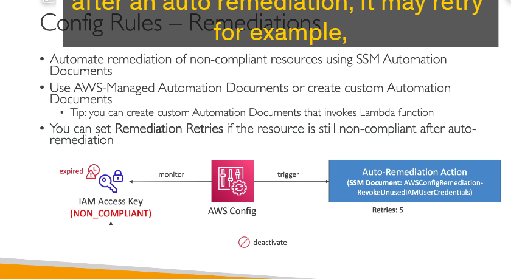
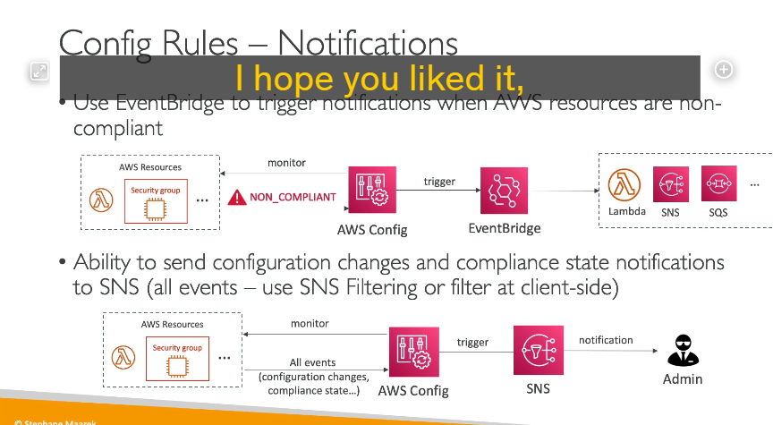

## 1. Tổng Quan về AWS Config

- **Định nghĩa:**  
  AWS Config là dịch vụ cho phép bạn thực hiện việc kiểm toán, đánh giá sự tuân thủ (compliance) và ghi nhận (record) cấu hình của các tài nguyên AWS. Nó giúp bạn theo dõi các thay đổi về cấu hình của tài nguyên theo thời gian, từ đó hỗ trợ việc khôi phục lại trạng thái trước đó hoặc xác định nguyên nhân khi có sự cố xảy ra.

- **Các câu hỏi mà AWS Config giải quyết:**

  - Có tồn tại trường hợp mở cổng SSH không giới hạn trong Security Groups không?
  - Các bucket S3 có được thiết lập với public access không?
  - Cấu hình của Application Load Balancer (ALB) có bị thay đổi theo thời gian không?

- **Cảnh báo và thông báo:**  
  Dựa trên việc đánh giá các quy tắc (rules) về sự tuân thủ, AWS Config có thể gửi thông báo qua SNS hoặc thông qua tích hợp với Amazon EventBridge khi có thay đổi hoặc khi tài nguyên không tuân thủ quy định đã định.

---

## 2. Ghi Nhận Cấu Hình và Lưu Trữ

- **Ghi nhận cấu hình:**AWS Config ghi nhận cấu hình của các tài nguyên và theo dõi các thay đổi theo thời gian. Điều này giúp bạn dễ dàng xác định khi nào và ai đã thay đổi cấu hình của tài nguyên.
- **Lưu trữ dữ liệu:**

  - Mỗi tài nguyên được ghi nhận dưới dạng một "configuration item" (một mục ghi nhận cấu hình).
  - Dữ liệu có thể được lưu trữ để phân tích sau này, ví dụ bằng cách sử dụng các công cụ như Amazon Athena.

- **Phạm vi hoạt động:**
  AWS Config là dịch vụ theo từng region. Bạn cần kích hoạt và cấu hình cho từng region nếu muốn theo dõi toàn bộ tài nguyên trên nhiều vùng. Tuy nhiên, bạn cũng có thể tập hợp dữ liệu từ nhiều region và nhiều tài khoản để tổng hợp tại một nơi tập trung.

---

## 3. Các Quy Tắc (Rules) trong AWS Config

- **Loại quy tắc:**

  - **AWS Managed Config Rules:** Có sẵn hơn 75 quy tắc do AWS quản lý, giúp bạn nhanh chóng đánh giá sự tuân thủ của các tài nguyên theo các tiêu chí phổ biến.
  - **Custom Config Rules:** Bạn có thể tự định nghĩa quy tắc bằng cách sử dụng AWS Lambda. Ví dụ, đánh giá xem các EBS disk có phải là loại gp2 hay không, hoặc kiểm tra các instance trong tài khoản phát triển có phải thuộc loại t2.micro hay không.

- **Cách thức kích hoạt quy tắc:**

  - **Khi có sự thay đổi cấu hình (Configuration Changes):** Quy tắc có thể được kích hoạt ngay khi có thay đổi, chẳng hạn như khi một EBS disk mới được tạo ra hay cấu hình của nó thay đổi.
  - **Định kỳ:** Bạn có thể thiết lập quy tắc chạy theo chu kỳ (ví dụ: mỗi 2 giờ) để kiểm tra trạng thái cấu hình của tài nguyên.

- **Lưu ý:**
  Các quy tắc của AWS Config chỉ đánh giá sự tuân thủ mà không ngăn chặn hành động xảy ra. Chúng không thay thế các cơ chế bảo mật như IAM mà chỉ cung cấp thông tin kiểm tra và giám sát.

---

## 4. Chi Phí và Quản Lý Dữ Liệu

- **Chi phí:**

  - Phí tính theo số lượng "configuration items" được ghi nhận: khoảng 0.003 cent cho mỗi item trên mỗi region.
  - Phí tính cho mỗi lần đánh giá quy tắc: khoảng 0.001 cent mỗi lần trên mỗi region.
    → Do đó, chi phí có thể tăng nhanh nếu số lượng cấu hình hoặc quy tắc lớn.

- **Lưu trữ và phân tích lịch sử:**
  Bạn có thể xem lịch sử của một tài nguyên (ví dụ: Security Group không tuân thủ) qua thời gian để biết được khi nào và ai đã thực hiện thay đổi.
  Dữ liệu này có thể được liên kết với CloudTrail để xem chi tiết các API call đã được thực hiện trên tài nguyên đó.

---

## 5. Tính Năng Remediation (Khắc Phục)

- **Khắc phục tự động:**AWS Config không ngăn chặn hành động xảy ra, nhưng bạn có thể thực hiện khắc phục (remediation) cho các tài nguyên không tuân thủ.

  - **SSM Automation Documents:** Bạn có thể sử dụng các tài liệu tự động của AWS Systems Manager (SSM) để thực hiện các hành động khắc phục.
  - **Ví dụ:** Nếu phát hiện rằng các IAM access keys đã quá 90 ngày và được đánh dấu là không tuân thủ, bạn có thể kích hoạt một tài liệu SSM (ví dụ: RevokeUnusedIAMUserCredentials) để vô hiệu hóa các key đó.

- **Tùy chọn tự động hóa nâng cao:**
  Bạn cũng có thể tạo các tài liệu tự động tùy chỉnh, có thể kết hợp với AWS Lambda để thực hiện các hành động phức tạp hơn, đồng thời có cơ chế retry (thử lại) nếu tài nguyên vẫn không tuân thủ sau khi đã được xử lý.

---

## 6. Thông Báo và Tích Hợp Với Các Dịch Vụ Khác

- **Thông báo:**AWS Config có thể gửi thông báo về trạng thái không tuân thủ thông qua SNS hoặc tích hợp với Amazon EventBridge.

  - **SNS Filtering:** Cho phép bạn lọc ra các sự kiện cần thiết và chuyển thông báo đến email của quản trị viên hoặc các kênh khác như Slack.

- **Tích hợp với các dịch vụ khác:**

  - **Amazon EventBridge:** Cho phép kích hoạt các hành động tự động ngay khi có sự thay đổi về cấu hình hoặc khi một tài nguyên không tuân thủ.
  - **Amazon Athena:** Dùng để truy vấn và phân tích các dữ liệu cấu hình được lưu trữ, giúp bạn dễ dàng tìm ra nguyên nhân hoặc xem lại lịch sử thay đổi.

---

## 7. Tổng Kết

- **AWS Config** là công cụ mạnh mẽ để giám sát, ghi nhận và đánh giá cấu hình của các tài nguyên AWS, hỗ trợ việc kiểm toán và đảm bảo tuân thủ.
- Nó cung cấp khả năng ghi lại lịch sử thay đổi cấu hình, đánh giá sự tuân thủ qua các quy tắc được định nghĩa sẵn hoặc tùy chỉnh, và cho phép thực hiện các hành động khắc phục tự động khi cần.
- Dù không ngăn chặn hành động xảy ra, nhưng việc theo dõi và cảnh báo sớm giúp bạn có cái nhìn toàn diện và có thể phản ứng kịp thời khi có sự thay đổi bất thường trong hạ tầng AWS của mình.
