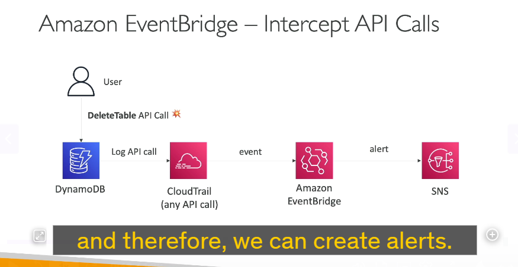
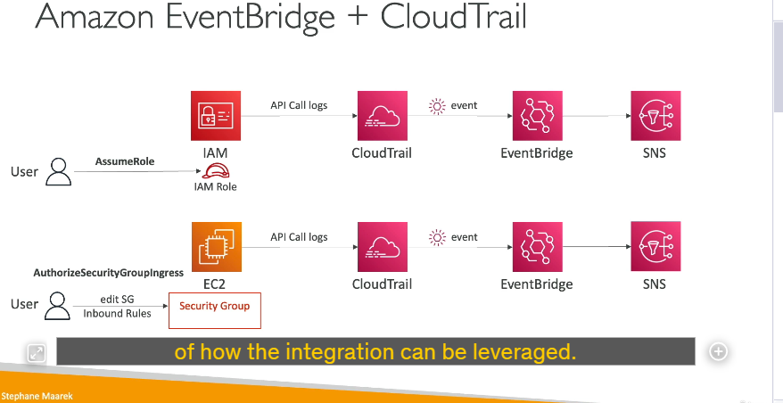

---

## 1. Tổng Quan Về Tích Hợp CloudTrail và Amazon EventBridge

- **CloudTrail ghi nhận API Call:**  
  Mỗi khi bạn thực hiện một API call (ví dụ: xoá một bảng DynamoDB, gọi API AssumeRole, thay đổi rule của Security Group, v.v…), CloudTrail sẽ ghi lại các sự kiện này. Đây là bước đầu tiên trong việc theo dõi các hoạt động trên tài khoản AWS của bạn.

- **Amazon EventBridge nhận các sự kiện:**  
  Sau khi CloudTrail ghi nhận các API call, những sự kiện đó cũng sẽ được chuyển tới Amazon EventBridge dưới dạng event. EventBridge có khả năng xử lý, lọc và định tuyến các sự kiện này dựa theo các quy tắc (rules) mà bạn thiết lập.

---

## 2. Cách Tạo Cảnh Báo và Tự Động Hóa Với Amazon EventBridge

### a. Ví Dụ 1: Nhận Thông Báo Khi Xoá Bảng DynamoDB

- **API Call:**  
  Giả sử bạn muốn nhận thông báo mỗi khi có API call DeleteTable được thực hiện trên DynamoDB.
- **Quy trình hoạt động:**
  1. **Ghi nhận trong CloudTrail:** Mỗi khi có hành động xoá bảng (DeleteTable) xảy ra, CloudTrail sẽ lưu lại sự kiện đó.
  2. **Chuyển event tới EventBridge:** Sự kiện DeleteTable được gửi đến EventBridge.
  3. **Tạo Rule trong EventBridge:** Bạn có thể tạo một rule trên EventBridge để lọc ra những sự kiện có liên quan đến DeleteTable.
  4. **Thiết lập đích đến (Destination):** Đích đến của rule có thể là một SNS topic. Khi rule kích hoạt, nó sẽ gửi thông báo đến SNS, từ đó bạn có thể nhận được cảnh báo qua email, tin nhắn hoặc các hình thức thông báo khác.

### b. Ví Dụ 2: Thông Báo Khi Có Người Assume Role

- **API Call:**  
  Khi một người dùng thực hiện AssumeRole (gọi API trong dịch vụ IAM) để chuyển đổi vai trò.
- **Quy trình:**
  - CloudTrail ghi nhận API call AssumeRole.
  - EventBridge nhận sự kiện này và rule đã được tạo sẵn sẽ lọc ra sự kiện AssumeRole.
  - Rule sẽ kích hoạt đích đến là SNS để gửi thông báo, giúp bạn biết ai đang thực hiện hành động này.

### c. Ví Dụ 3: Thông Báo Khi Thay Đổi Inbound Rules Của Security Group

- **API Call:**  
  Khi có một thay đổi trong Security Group (ví dụ: gọi API AuthorizeSecurityGroupIngress của EC2 để thay đổi inbound rules).
- **Quy trình:**
  - CloudTrail ghi nhận sự kiện thay đổi rule của Security Group.
  - Sự kiện này được chuyển tới EventBridge.
  - Rule của EventBridge sẽ lọc ra các sự kiện liên quan đến AuthorizeSecurityGroupIngress.
  - Khi rule kích hoạt, nó sẽ gửi thông báo qua SNS để cảnh báo bạn về sự thay đổi này.

---

## 3. Lợi Ích Và Ứng Dụng Của Việc Tích Hợp

- **Giám sát theo thời gian thực:**  
  Nhờ sự tích hợp này, bạn có thể theo dõi các hoạt động quan trọng ngay khi chúng xảy ra, từ đó phản ứng kịp thời với các thay đổi không mong muốn hoặc các hành động đáng ngờ.

- **Tự động hóa quy trình cảnh báo:**  
  Bằng cách kết hợp với SNS, bạn có thể tự động gửi cảnh báo đến các nhóm quản trị hoặc quản lý an ninh, giúp giảm thời gian phản ứng khi có sự cố.

- **Tùy chỉnh linh hoạt:**  
  EventBridge cho phép bạn tạo các quy tắc theo nhu cầu cụ thể của mình, ví dụ như lọc các sự kiện dựa trên API call cụ thể, các thông tin chi tiết từ sự kiện (như tên tài nguyên, người dùng, địa chỉ IP, v.v…), từ đó nâng cao khả năng giám sát và kiểm soát.

- **Tích hợp với các dịch vụ khác:**  
  Ngoài SNS, EventBridge có thể định tuyến sự kiện tới nhiều dịch vụ AWS khác như AWS Lambda hoặc Amazon SQS, mở rộng khả năng xử lý tự động theo yêu cầu của bạn.

---

## 4. Kết Luận

Tích hợp Amazon EventBridge với CloudTrail là một giải pháp mạnh mẽ để:

- Ghi nhận và theo dõi chi tiết tất cả các API call trên tài khoản AWS.
- Lọc ra những sự kiện quan trọng hoặc bất thường.
- Tự động kích hoạt các hành động cảnh báo hoặc xử lý tự động thông qua SNS, Lambda, hoặc các dịch vụ khác.

Việc này không chỉ giúp bạn duy trì an ninh và tuân thủ (compliance) mà còn tăng cường khả năng giám sát và quản lý các hoạt động trên AWS theo thời gian thực.
