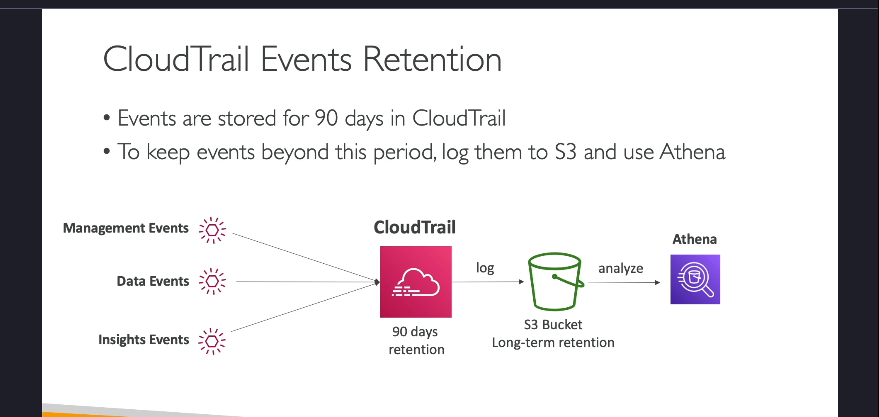

---

## 1. Tổng Quan Về AWS CloudTrail

- **CloudTrail là gì?**  
  AWS CloudTrail là một dịch vụ của AWS cho phép bạn thu thập, giám sát và lưu trữ lịch sử các sự kiện và các API Call được thực hiện trên tài khoản AWS của bạn. Nó cung cấp một công cụ kiểm toán (audit) mạnh mẽ để bạn có thể theo dõi các thay đổi, hoạt động truy cập và cấu hình trên các dịch vụ AWS.

- **Mục đích chính:**  
  - **Quản trị (Governance):** Giúp bạn theo dõi và kiểm soát việc sử dụng các dịch vụ AWS.  
  - **Tuân thủ (Compliance):** Đáp ứng các yêu cầu về kiểm toán và quy định của tổ chức.  
  - **Kiểm toán (Audit):** Xác định ai đã thực hiện các thay đổi trên tài khoản AWS, khi nào và từ đâu.

- **CloudTrail được bật mặc định:**  
  Mỗi tài khoản AWS khi được tạo ra đều có CloudTrail bật theo mặc định, giúp ghi lại các sự kiện xảy ra mà không cần cấu hình thêm ban đầu.

---

## 2. Nguồn Ghi Log và Phương Thức Ghi Nhận Sự Kiện

- **Các nguồn tạo ra sự kiện:**

  - **Console của AWS:** Khi bạn thực hiện thao tác qua giao diện web của AWS.
  - **SDK và CLI:** Các công cụ lập trình hoặc dòng lệnh gọi các API của AWS.
  - **Các dịch vụ AWS khác:** Một số dịch vụ có thể tự động ghi lại hoạt động của chúng.

- **Lưu trữ log:**
  - **CloudWatch Logs:** Bạn có thể chuyển log từ CloudTrail vào CloudWatch Logs để phân tích, giám sát và nhận thông báo (alerts) theo thời gian thực.
  - **Amazon S3:** Cho phép lưu trữ log lâu dài, hữu ích khi bạn cần duy trì lịch sử sự kiện vượt quá 90 ngày mặc định.
  - **Trail:** Bạn có thể cấu hình một trail cho toàn bộ các vùng (regions) hoặc chỉ một vùng cụ thể để gom chung các sự kiện từ nhiều vùng vào cùng một nơi (ví dụ: một bucket S3).

---

## 3. Các Loại Sự Kiện Trong CloudTrail

CloudTrail ghi nhận các sự kiện từ AWS theo 3 nhóm chính:

### a. Management Events

- **Định nghĩa:**  
  Các sự kiện liên quan đến việc quản lý và cấu hình tài nguyên trên tài khoản AWS.
- **Phân chia:**
  - **Read Events:** Các hành động không thay đổi cấu hình, chẳng hạn như việc liệt kê (list) người dùng hoặc liệt kê các EC2 instances.
  - **Write Events:** Các hành động thay đổi cấu hình, như tạo, chỉnh sửa hoặc xóa tài nguyên (ví dụ: tạo subnet, xóa DynamoDB table).
- **Ví dụ thực tiễn:**  
  Nếu một EC2 instance bị terminate, bạn có thể kiểm tra trong CloudTrail để xác định ai đã thực hiện lệnh đó.

### b. Data Events

- **Đặc điểm:**  
  Ghi lại các hoạt động cấp độ đối tượng, thường có khối lượng rất lớn và do đó không được ghi lại mặc định.
- **Ví dụ:**
  - Hoạt động trên Amazon S3: GetObject, DeleteObject, PutObject.
  - Các hoạt động liên quan đến AWS Lambda: Ghi nhận các lần gọi hàm (Invoke API).

### c. CloudTrail Insights Events

- **Mục đích:**  
  Được thiết kế để phát hiện các hoạt động bất thường hoặc các sự kiện không theo khuôn mẫu thông thường trong tài khoản AWS của bạn.
- **Cách hoạt động:**
  - CloudTrail Insights tạo ra một "baseline" (đường chuẩn) dựa trên các hành vi quản lý thông thường.
  - Sau đó, nó liên tục so sánh các sự kiện mới với baseline này để phát hiện các bất thường, ví dụ như một đợt tăng đột biến trong số lượng hành động IAM, hoặc việc provision tài nguyên vượt mức dự kiến.
- **Kết quả:**  
  Khi phát hiện bất thường, CloudTrail Insights tạo ra các sự kiện Insights, có thể hiển thị trực tiếp trong console hoặc được chuyển tiếp tới các dịch vụ như EventBridge, giúp bạn tự động hóa việc gửi thông báo (alert) hoặc kích hoạt các hành động khắc phục.

---

## 4. Thời Gian Lưu Trữ Và Phân Tích Log

- **Lưu trữ mặc định:**  
  Các sự kiện được lưu giữ trong CloudTrail cho đến 90 ngày. Sau thời gian này, các sự kiện sẽ bị xóa khỏi CloudTrail.
- **Lưu trữ dài hạn:**  
  Để lưu giữ log lâu hơn (ví dụ: lưu trữ lịch sử lên đến 1 năm hoặc hơn cho mục đích kiểm toán), bạn nên chuyển các log này vào một bucket Amazon S3.
- **Phân tích log:**  
  Sau khi log được lưu trong S3, bạn có thể sử dụng **Amazon Athena** – một dịch vụ truy vấn dữ liệu không cần máy chủ – để thực hiện các truy vấn phân tích và tìm kiếm thông tin cần thiết trong các sự kiện.

---

## 5. Ví Dụ Thực Tế Khi Sử Dụng CloudTrail

- **Tình huống:**  
  Nếu có một hành động xóa hoặc thay đổi tài nguyên (ví dụ: xóa một EC2 instance), CloudTrail sẽ ghi nhận API Call đó.
- **Lợi ích:**  
  Bạn có thể truy vấn CloudTrail để xác định chính xác ai đã thực hiện hành động đó, từ đâu (source IP) và vào thời điểm nào.
- **Ứng dụng:**  
  Điều này rất hữu ích trong trường hợp cần xác định nguyên nhân của một sự cố, phân tích vi phạm bảo mật, hoặc đơn giản là kiểm tra tuân thủ chính sách nội bộ.

---

## 6. Tích Hợp CloudTrail Với Các Dịch Vụ Khác

- **CloudWatch Logs:**  
  Khi tích hợp với CloudWatch Logs, bạn có thể thiết lập:

  - **Giám sát và cảnh báo:** Nhận thông báo ngay khi có các sự kiện bất thường hoặc các hoạt động quan trọng được ghi nhận trong CloudTrail.
  - **Phân tích log:** Sử dụng CloudWatch Insights để trực quan hóa và phân tích dữ liệu log theo thời gian thực.

- **EventBridge:**  
  CloudTrail Insights có thể gửi sự kiện tới EventBridge, cho phép bạn tự động hóa các phản ứng, chẳng hạn như kích hoạt một Lambda function để xử lý hoặc gửi email cảnh báo.

---

## 7. Kết Luận

AWS CloudTrail đóng vai trò trung tâm trong việc:

- **Ghi nhận và lưu trữ lịch sử các hành động trên tài khoản AWS.**
- **Giúp phát hiện các hành vi bất thường thông qua CloudTrail Insights.**
- **Hỗ trợ việc kiểm toán, tuân thủ và khắc phục sự cố an ninh.**

Việc tích hợp CloudTrail với các dịch vụ như CloudWatch Logs, Amazon S3 và EventBridge không chỉ giúp bạn lưu trữ và phân tích log một cách hiệu quả mà còn tăng cường khả năng giám sát và tự động hóa phản ứng khi có các sự kiện quan trọng xảy ra.
