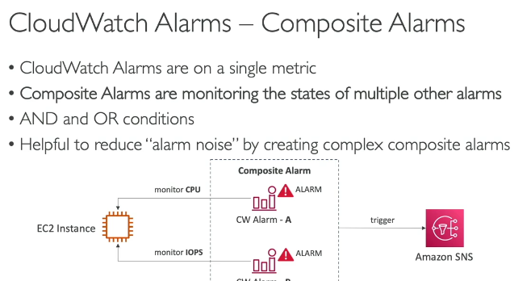
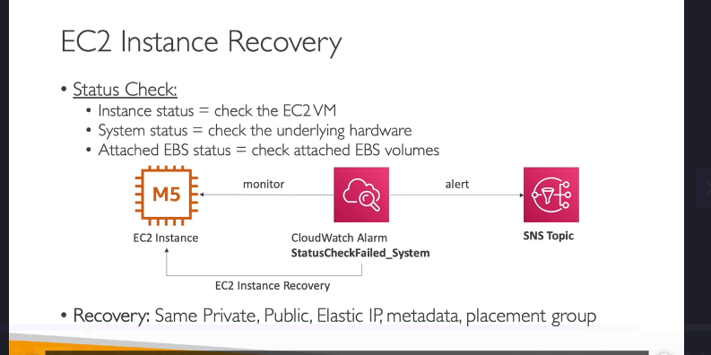
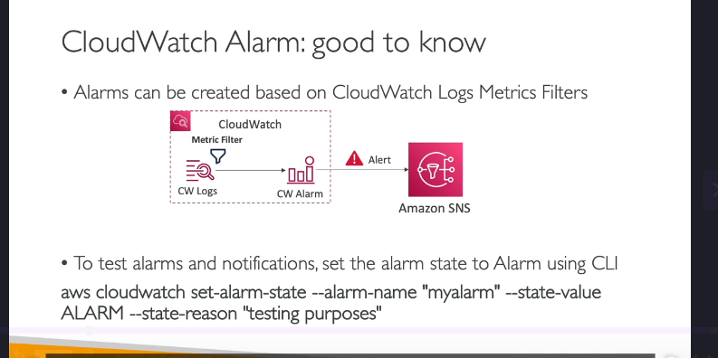

### **CloudWatch Alarms: Tổng Quan Chi Tiết**

CloudWatch Alarms là một tính năng mạnh mẽ của Amazon CloudWatch, cho phép bạn thiết lập cảnh báo dựa trên các metric trong hệ thống của mình. Khi một metric vượt qua ngưỡng được định nghĩa, CloudWatch Alarms sẽ kích hoạt các hành động như gửi thông báo, thực hiện tự động hóa (auto-scaling), hoặc khôi phục EC2 instances.

---

### **1. CloudWatch Alarms Là Gì?**

- **CloudWatch Alarms** giúp bạn theo dõi các metric và kích hoạt hành động khi các metric này vượt qua ngưỡng được định nghĩa.
- Ví dụ: Bạn có thể tạo một alarm để theo dõi CPU utilization của một EC2 instance. Nếu CPU vượt quá 80%, alarm sẽ chuyển sang trạng thái **ALARM** và gửi thông báo.

---

### **2. Các Trạng Thái Của CloudWatch Alarms**

Một CloudWatch Alarm có ba trạng thái chính:

#### **a. OK**

- Trạng thái này có nghĩa là metric đang nằm trong ngưỡng cho phép, và không có vấn đề gì xảy ra.

#### **b. INSUFFICIENT_DATA**

- Trạng thái này xảy ra khi không có đủ dữ liệu để đánh giá trạng thái của alarm. Ví dụ: Khi bạn vừa tạo alarm và hệ thống chưa thu thập đủ dữ liệu.

#### **c. ALARM**

- Trạng thái này xảy ra khi metric vượt qua ngưỡng được định nghĩa. Khi đó, alarm sẽ kích hoạt các hành động được cấu hình (ví dụ: gửi thông báo).

---

### **3. Các Thành Phần Chính Của CloudWatch Alarms**

#### **a. Period (Chu Kỳ Đánh Giá)**

- **Period** là khoảng thời gian mà alarm sẽ đánh giá metric. Ví dụ: 1 phút, 5 phút, hoặc 1 giờ.
- Bạn có thể thiết lập period ngắn (ví dụ: 10 giây) để theo dõi các metric có độ phân giải cao.

#### **b. Threshold (Ngưỡng)**

- **Threshold** là giá trị ngưỡng mà metric cần vượt qua để kích hoạt alarm. Ví dụ: CPU utilization > 80%.

#### **c. Actions (Hành Động)**

- Khi alarm chuyển sang trạng thái **ALARM**, bạn có thể kích hoạt các hành động như:
  - **Thông báo qua SNS**: Gửi email, SMS hoặc thông báo đến các dịch vụ khác.
  - **Tự động hóa EC2**: Dừng, khởi động lại, hoặc khôi phục EC2 instance.
  - **Auto Scaling**: Tự động thêm hoặc xóa EC2 instances trong Auto Scaling Group.

---

### **4. Composite Alarms (Alarms Tổng Hợp)**



- **Composite Alarms** cho phép bạn kết hợp nhiều alarms thành một alarm tổng hợp.
- Bạn có thể sử dụng các điều kiện **AND** hoặc **OR** để tạo các alarm phức tạp hơn.
- Ví dụ: Bạn có thể tạo một Composite Alarm để kích hoạt khi cả CPU utilization cao **VÀ** network traffic thấp.

#### **Ví Dụ Về Composite Alarms**

1. Tạo **Alarm A** để theo dõi CPU utilization của EC2 instance.
2. Tạo **Alarm B** để theo dõi IOPS của EC2 instance.
3. Tạo **Composite Alarm** với điều kiện: **Alarm A AND Alarm B**.
   - Nếu cả hai alarms đều ở trạng thái **ALARM**, Composite Alarm sẽ kích hoạt.

---

### **5. EC2 Instance Recovery (Khôi Phục EC2 Instance)**



- CloudWatch Alarms có thể được sử dụng để khôi phục EC2 instances khi có sự cố.
- Các loại **status checks** mà bạn có thể theo dõi:
  - **Instance Status Check**: Kiểm tra trạng thái của EC2 instance (phần mềm).
  - **System Status Check**: Kiểm tra trạng thái phần cứng bên dưới EC2 instance.
  - **EBS Status Check**: Kiểm tra trạng thái của các EBS volumes được gắn với EC2 instance.

#### **Cách Hoạt Động**

- Khi một status check fail, CloudWatch Alarm sẽ kích hoạt và thực hiện khôi phục EC2 instance.
- Trong quá trình khôi phục:
  - EC2 instance sẽ được di chuyển sang một host khác.
  - Giữ nguyên private IP, public IP, elastic IP, metadata, và placement group.

---

### **6. CloudWatch Alarms Với CloudWatch Logs**



- Bạn có thể tạo alarms dựa trên các **metric filters** trong CloudWatch Logs.
- Ví dụ: Nếu có quá nhiều log chứa từ khóa "error", bạn có thể tạo một alarm để gửi thông báo qua SNS.

#### **Cách Thiết Lập**

1. Tạo một **metric filter** trong CloudWatch Logs để đếm số lần xuất hiện của từ khóa "error".
2. Tạo một **CloudWatch Alarm** dựa trên metric filter này.
3. Khi số lần xuất hiện từ khóa "error" vượt ngưỡng, alarm sẽ kích hoạt và gửi thông báo.

---

### **7. Kiểm Thử Alarms**

- Bạn có thể sử dụng CLI command `set-alarm-state` để kiểm thử alarms mà không cần chờ metric vượt ngưỡng.
- Ví dụ:
  ```bash
  aws cloudwatch set-alarm-state --alarm-name "MyAlarm" --state-value ALARM --state-reason "Testing alarm"
  ```
- Điều này giúp bạn đảm bảo rằng các hành động được kích hoạt đúng cách khi alarm chuyển sang trạng thái **ALARM**.

---

### **8. Các Trường Hợp Sử Dụng CloudWatch Alarms**

- **Giám sát hiệu suất**: Theo dõi CPU, memory, disk, và network utilization của EC2 instances.
- **Tự động hóa**: Tự động thêm/xóa EC2 instances trong Auto Scaling Group.
- **Khôi phục sự cố**: Tự động khôi phục EC2 instances khi có sự cố phần cứng hoặc phần mềm.
- **Cảnh báo**: Gửi thông báo qua SNS khi có sự cố hoặc metric vượt ngưỡng.

---

### **9. Kết Luận**

CloudWatch Alarms là một công cụ mạnh mẽ để giám sát và tự động hóa các tài nguyên AWS. Với khả năng tạo alarms đơn giản hoặc phức tạp (Composite Alarms), bạn có thể dễ dàng theo dõi và phản ứng kịp thời với các sự cố trong hệ thống. Ngoài ra, tích hợp với các dịch vụ như SNS, Auto Scaling, và EC2 Recovery giúp bạn xây dựng một hệ thống tự động và đáng tin cậy.
