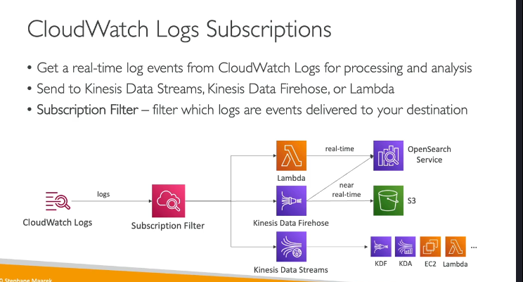
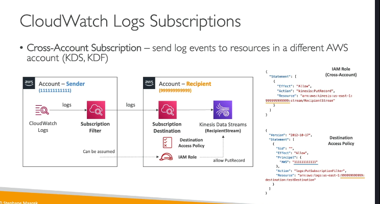

### **Amazon CloudWatch Logs: Tổng Quan Chi Tiết**

Amazon CloudWatch Logs là một dịch vụ cho phép bạn thu thập, lưu trữ và phân tích nhật ký (logs) từ các ứng dụng và tài nguyên AWS. Nó cung cấp khả năng giám sát, truy vấn và xuất nhật ký một cách linh hoạt, giúp bạn dễ dàng quản lý và phân tích dữ liệu nhật ký.

---

### **1. Các Khái Niệm Chính trong CloudWatch Logs**

#### **a. Log Groups (Nhóm nhật ký)**

- **Log Groups** là các nhóm chứa các luồng nhật ký (log streams) liên quan đến một ứng dụng hoặc dịch vụ cụ thể.
- Ví dụ: Bạn có thể tạo một log group cho ứng dụng web của mình và một log group khác cho cơ sở dữ liệu.
- Log groups giúp tổ chức và quản lý nhật ký một cách có cấu trúc.

#### **b. Log Streams (Luồng nhật ký)**

- **Log Streams** là các luồng nhật ký riêng lẻ trong một log group.
- Mỗi log stream có thể đại diện cho một phiên bản ứng dụng, một container, hoặc một tệp nhật ký cụ thể.
- Ví dụ: Nếu bạn có nhiều container chạy cùng một ứng dụng, mỗi container có thể có một log stream riêng.

#### **c. Chính Sách Hết Hạn (Retention Policy)**

- Bạn có thể thiết lập thời gian lưu trữ nhật ký trong CloudWatch Logs.
- Các tùy chọn bao gồm:
  - Lưu trữ vô thời hạn (never expire).
  - Từ 1 ngày đến 10 năm.
- Việc thiết lập chính sách hết hạn giúp bạn quản lý chi phí lưu trữ và tuân thủ các yêu cầu pháp lý.

---

### **2. Cách Gửi Nhật Ký Đến CloudWatch Logs**

- Bạn có thể gửi nhật ký đến CloudWatch Logs bằng nhiều cách:
  - **SDK**: Sử dụng AWS SDK để gửi nhật ký từ ứng dụng của bạn.
  - **CloudWatch Logs Agent**: Một agent cũ để thu thập và gửi nhật ký (hiện đã được thay thế bằng CloudWatch Unified Agent).
  - **CloudWatch Unified Agent**: Một agent mới hỗ trợ thu thập nhật ký(logs) và metric từ các ứng dụng và hệ thống.
  - **Các dịch vụ AWS tích hợp sẵn**:
    - **Elastic Beanstalk**: Tự động thu thập nhật ký từ ứng dụng.
    - **ECS**: Gửi nhật ký từ các container.
    - **Lambda**: Gửi nhật ký từ các hàm Lambda.
    - **VPC Flow Logs**: Gửi nhật ký về lưu lượng mạng trong VPC.
    - **API Gateway**: Gửi nhật ký về các yêu cầu API.
    - **CloudTrail**: Gửi nhật ký về các hoạt động trong tài khoản AWS.
    - **Route53**: Gửi nhật ký về các truy vấn DNS.

---

### **3. Truy Vấn Nhật Ký với CloudWatch Logs Insights**

- **CloudWatch Logs Insights** là một công cụ mạnh mẽ để truy vấn và phân tích nhật ký trong CloudWatch Logs.
- Tính năng chính:
  - **Ngôn ngữ truy vấn**: Sử dụng ngôn ngữ truy vấn đơn giản để tìm kiếm và phân tích nhật ký.
  - **Tự động phát hiện trường**: CloudWatch tự động phát hiện các trường trong nhật ký để bạn dễ dàng truy vấn.
  - **Tính toán thống kê**: Tính toán các giá trị thống kê như tổng, trung bình, số lượng sự kiện.
  - **Lưu và chia sẻ truy vấn**: Bạn có thể lưu truy vấn và thêm kết quả vào CloudWatch Dashboards.
- Ví dụ về các truy vấn phổ biến:
  - Tìm 25 sự kiện gần nhất.
  - Đếm số lượng sự kiện có lỗi hoặc ngoại lệ.
  - Tìm kiếm nhật ký từ một địa chỉ IP cụ thể.

---

### **4. Xuất Nhật Ký Từ CloudWatch Logs**

- Bạn có thể xuất nhật ký từ CloudWatch Logs đến các dịch vụ khác để lưu trữ hoặc phân tích thêm.

#### **a. Xuất Hàng Loạt (Batch Export) đến Amazon S3**

- Bạn có thể xuất toàn bộ nhật ký từ CloudWatch Logs đến Amazon S3.
- Quá trình xuất có thể mất đến **12 giờ** để hoàn thành.
- Sử dụng API `CreateExportTask` để bắt đầu quá trình xuất.

#### **b. Stream Nhật Ký Thời Gian Thực (Real-Time Streaming)**

- Bạn có thể stream nhật ký thời gian thực đến các dịch vụ khác thông qua **CloudWatch Logs Subscription**.
- Các điểm đến phổ biến:
  - **Kinesis Data Streams**: Để xử lý và phân tích dữ liệu thời gian thực.
  - **Kinesis Data Firehose**: Để gửi dữ liệu đến S3, OpenSearch, hoặc các dịch vụ khác.
  - **Lambda**: Để thực thi mã tùy chỉnh dựa trên nhật ký.
- Bạn có thể sử dụng **Subscription Filters** để chỉ định loại nhật ký nào sẽ được gửi đến điểm đến.

---

### **5. Tích Hợp Đa Tài Khoản và Đa Vùng**

- CloudWatch Logs hỗ trợ tích hợp nhật ký từ nhiều tài khoản và nhiều vùng (regions) vào một điểm đến chung.
  
  
- Cách thức hoạt động:
  1. Tạo một **CloudWatch Logs Subscription Filter** trong tài khoản gửi.
  2. Tạo một **Destination** (điểm đến) trong tài khoản nhận (ví dụ: Kinesis Data Stream).
  3. Thiết lập **Destination Access Policy** để cho phép tài khoản gửi gửi dữ liệu đến điểm đến.
  4. Tạo một **IAM Role** trong tài khoản nhận để cho phép tài khoản gửi ghi dữ liệu vào Kinesis Data Stream.
- Ví dụ: Bạn có thể tập hợp nhật ký từ nhiều tài khoản AWS vào một S3 bucket hoặc OpenSearch cluster trong một tài khoản trung tâm.

---

### **6. Mã Hóa Nhật Ký**

- Tất cả nhật ký trong CloudWatch Logs được mã hóa **mặc định** bằng AES-256.
- Bạn có thể sử dụng **AWS Key Management Service (KMS)** để mã hóa nhật ký bằng khóa của riêng mình.

---

### **7. Các Trường Hợp Sử Dụng CloudWatch Logs**

- **Giám sát ứng dụng**: Thu thập và phân tích nhật ký từ ứng dụng của bạn.
- **Khắc phục sự cố**: Tìm kiếm và phân tích nhật ký để xác định nguyên nhân sự cố.
- **Tuân thủ và kiểm toán**: Lưu trữ nhật ký để đáp ứng các yêu cầu pháp lý và kiểm toán.
- **Phân tích dữ liệu**: Sử dụng CloudWatch Logs Insights để phân tích dữ liệu nhật ký và tạo báo cáo.

---

### **8. Ví Dụ: Sử Dụng CloudWatch Logs Insights**

1. Truy cập **CloudWatch Console**.
2. Chọn **Logs Insights** từ menu bên trái.
3. Chọn một hoặc nhiều **log groups**.
4. Nhập truy vấn (ví dụ: `fields @timestamp, @message | filter @message like /error/ | sort @timestamp desc | limit 25`).
5. Chọn khoảng thời gian (ví dụ: 1 giờ qua, 7 ngày qua).
6. Xem kết quả dưới dạng biểu đồ hoặc danh sách nhật ký.
7. Lưu truy vấn hoặc thêm kết quả vào dashboard.

---

### **9. Kết Luận**

CloudWatch Logs là một công cụ mạnh mẽ để thu thập, lưu trữ và phân tích nhật ký trên AWS. Với các tính năng như CloudWatch Logs Insights, bạn có thể dễ dàng truy vấn và phân tích nhật ký để giám sát ứng dụng, khắc phục sự cố và đáp ứng các yêu cầu tuân thủ. Ngoài ra, khả năng tích hợp với các dịch vụ khác như S3, Kinesis, và Lambda giúp bạn xử lý và lưu trữ nhật ký một cách linh hoạt.
