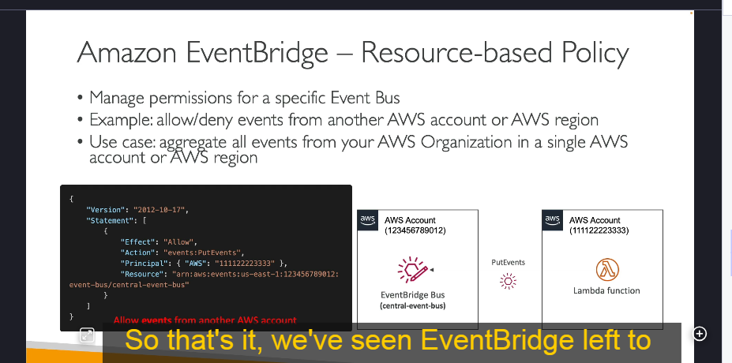

---
## **Amazon EventBridge là gì?**
Amazon EventBridge (trước đây được gọi là **CloudWatch Events**) là một dịch vụ quản lý sự kiện của AWS, cho phép các dịch vụ AWS, ứng dụng của bên thứ ba và các ứng dụng tùy chỉnh có thể giao tiếp với nhau thông qua các sự kiện.
---

## **Chức năng của Amazon EventBridge**

### 1. **Lập lịch và kích hoạt sự kiện**

- Có thể lên lịch thực thi các tác vụ theo thời gian cố định (cron jobs) trên đám mây.
- Ví dụ: Cứ mỗi giờ, EventBridge có thể kích hoạt một **AWS Lambda** function để chạy một tập lệnh.

### 2. **Phản ứng với các mẫu sự kiện**

- EventBridge có thể thiết lập **quy tắc (rules)** để phản ứng với sự kiện do các dịch vụ AWS tạo ra.
- Ví dụ: Khi **IAM root user** đăng nhập vào AWS Console, EventBridge có thể gửi thông báo qua **Amazon SNS** để cảnh báo quản trị viên.

### 3. **Tích hợp với nhiều dịch vụ AWS**

EventBridge có thể nhận sự kiện từ nhiều dịch vụ AWS như:

- **EC2**: Khi instance khởi động, dừng hoặc bị hủy.
- **S3**: Khi một tệp mới được tải lên.
- **CodeBuild**: Khi quá trình build thất bại.
- **Trusted Advisor**: Khi có cảnh báo bảo mật mới.

Bên cạnh đó, EventBridge có thể kết hợp với **AWS CloudTrail** để theo dõi tất cả các API call trong tài khoản AWS.

---

## **Luồng hoạt động của Amazon EventBridge**

1. **Nguồn sự kiện (Event Sources)**  
   Các dịch vụ AWS hoặc ứng dụng bên ngoài gửi sự kiện vào **EventBridge**.

2. **Lọc sự kiện (Filtering Events)**  
   EventBridge có thể lọc sự kiện dựa trên tiêu chí cụ thể. Ví dụ: Chỉ nhận sự kiện từ một bucket S3 nhất định.

3. **Xử lý sự kiện (Event Processing)**  
   Sự kiện được chuyển đổi thành định dạng JSON chứa thông tin như ID instance, thời gian, IP,…

4. **Điểm đến của sự kiện (Event Targets)**  
   EventBridge có thể gửi sự kiện đến nhiều dịch vụ khác nhau như:
   - **Lambda**: Kích hoạt function để xử lý dữ liệu.
   - **SQS/SNS**: Gửi tin nhắn hoặc thông báo.
   - **Kinesis Data Stream**: Xử lý dữ liệu theo luồng.
   - **ECS**: Khởi chạy một task ECS.
   - **Step Functions**: Kích hoạt quy trình làm việc.
   - **EC2 Actions**: Khởi động/dừng instance EC2.
   - **CodePipeline/CodeBuild**: Tích hợp CI/CD.

---

## **Các loại Event Bus trong EventBridge**

Amazon EventBridge có 3 loại **Event Bus** chính:

1. **Default Event Bus**

   - Event Bus mặc định, nhận sự kiện từ các dịch vụ AWS.

2. **Partner Event Bus**

   - Nhận sự kiện từ các đối tác SaaS như **Zendesk, Datadog, Auth0**,…

3. **Custom Event Bus**
   - Cho phép ứng dụng tùy chỉnh gửi sự kiện riêng.

Ngoài ra, có thể sử dụng **Resource-based Policies** để chia sẻ Event Bus giữa các tài khoản AWS.

---

## **Tính năng bổ sung**

- **Lưu trữ sự kiện (Event Archiving)**
  - EventBridge có thể lưu trữ sự kiện vô thời hạn hoặc trong một khoảng thời gian nhất định.
- **Phát lại sự kiện (Event Replay)**
  - Hữu ích trong debugging/troubleshooting. Ví dụ: Nếu có lỗi trong Lambda function, bạn có thể sửa lỗi và phát lại sự kiện để kiểm tra.

---

## **1. EventBridge và Định Dạng Sự Kiện**

- **EventBridge nhận sự kiện từ nhiều nguồn** khác nhau, bao gồm các dịch vụ AWS, ứng dụng bên ngoài và các sự kiện tùy chỉnh.
- **Các sự kiện được lưu trữ ở định dạng JSON** để chứa thông tin chi tiết về sự kiện, giúp dễ dàng phân tích và xử lý dữ liệu.

---

## **2. Schema Registry – Quản lý lược đồ sự kiện**

### **Schema Registry là gì?**

- EventBridge có tính năng **Schema Registry** giúp phân tích và suy luận cấu trúc dữ liệu (schema) từ các sự kiện trong Event Bus.
- Điều này giúp các ứng dụng biết trước cách dữ liệu được tổ chức mà không cần xử lý thủ công.

### **Lợi ích của Schema Registry**

- **Tự động suy luận lược đồ (Schema Inference)**:  
  EventBridge có thể phân tích dữ liệu và tạo lược đồ tương ứng.
- **Tạo mã nguồn từ Schema**:  
  Bạn có thể **tải xuống mã nguồn** trực tiếp để tích hợp với ứng dụng, giúp xử lý dữ liệu nhanh chóng hơn.
- **Hỗ trợ phiên bản (Schema Versioning)**:  
  Nếu cấu trúc sự kiện thay đổi theo thời gian, Schema Registry hỗ trợ quản lý nhiều phiên bản.

### **Ví dụ**

- Một sự kiện từ **AWS CodePipeline** có thể có một Schema cụ thể.
- Bạn có thể **tải Schema về ứng dụng** để biết trước dữ liệu sẽ có cấu trúc như thế nào.

---

## **3. Resource-Based Policies – Chính sách quản lý quyền hạn**

### **Resource-Based Policies là gì?**

- Cho phép **quản lý quyền truy cập** cho một Event Bus cụ thể.
- Có thể **cho phép hoặc từ chối** các sự kiện từ tài khoản AWS khác hoặc từ các vùng khác nhau.

### **Trường hợp sử dụng**

- **Tạo một Event Bus trung tâm** trong **tổ chức AWS** để **tập hợp sự kiện từ nhiều tài khoản** khác nhau.
- Một tài khoản có thể **gửi sự kiện (PutEvents)** đến **Event Bus trung tâm** thông qua **Resource-Based Policy**.

### **Cách hoạt động**

1. Một **Event Bus trung tâm** được tạo trên tài khoản AWS chính.
2. **Resource-based policy** được cấu hình để cho phép các tài khoản khác gửi sự kiện.
3. Các tài khoản khác có thể **gửi sự kiện trực tiếp** đến Event Bus trung tâm.

---

## **4. Tóm tắt những điểm quan trọng về EventBridge**

- **EventBridge có thể phản ứng với sự kiện từ AWS, đối tác bên thứ ba hoặc các sự kiện tùy chỉnh.**
- **Schema Registry giúp suy luận, quản lý và tải xuống lược đồ dữ liệu từ sự kiện.**
- **Resource-Based Policies giúp quản lý quyền truy cập sự kiện giữa các tài khoản AWS.**
- **EventBridge có thể đóng vai trò như một Event Bus trung tâm, tập hợp sự kiện từ nhiều tài khoản khác nhau.**

## **Kết luận**

Amazon EventBridge là một dịch vụ mạnh mẽ giúp quản lý và tự động hóa quy trình sự kiện trong AWS, cho phép phản ứng với các sự kiện từ nhiều nguồn khác nhau và tích hợp chặt chẽ với các dịch vụ AWS cũng như đối tác bên ngoài.
