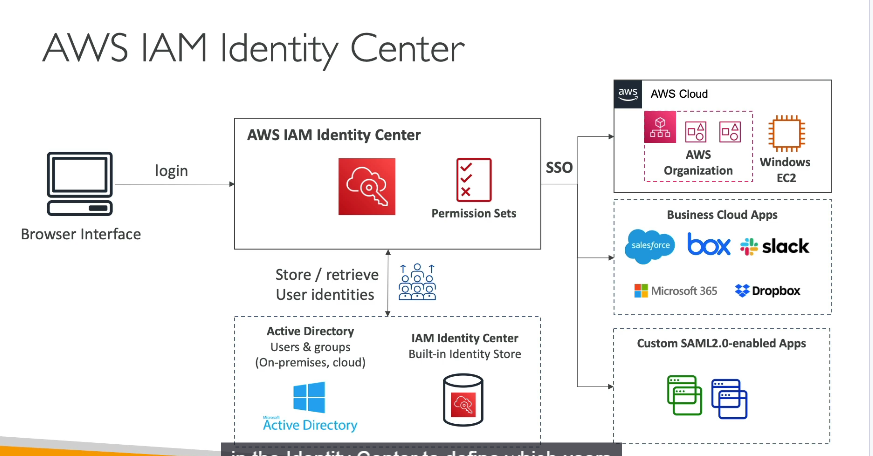

### **1. Giới thiệu AWS IAM Identity Center**

- **Là gì?**

  - Dịch vụ kế thừa **AWS Single Sign-On (SSO)**, cung cấp **đăng nhập một lần (Single Sign-On)** cho:
    - **Tất cả tài khoản AWS** trong AWS Organizations.
    - **Ứng dụng doanh nghiệp** (Salesforce, Microsoft 365, Box...) qua tích hợp SAML 2.0.
    - **EC2 Windows Instances** (qua Active Directory).
  - **Mục đích**: Giảm số lần đăng nhập, quản lý tập trung quyền truy cập.
- **Tính năng nổi bật**:

  - **Một cổng đăng nhập duy nhất** cho nhiều AWS accounts và ứng dụng.
  - Hỗ trợ **quản lý người dùng** qua **Built-in Identity Store** hoặc **kết nối với IdP bên thứ 3** (AD, Okta, OneLogin).

---

### **2. Kiến trúc và Luồng đăng nhập**

- **Bước 1**: Người dùng truy cập **trang đăng nhập IAM Identity Center**.
- **Bước 2**: Xác thực qua:
  - **Built-in Identity Store** (tích hợp sẵn trong AWS).
  - **IdP bên ngoài** (Active Directory, Okta...).
- **Bước 3**: Sau đăng nhập, người dùng thấy **dashboard** liệt kê:
  - **Tài khoản AWS** họ có quyền truy cập.
  - **Ứng dụng doanh nghiệp** được tích hợp.
  - **EC2 Windows Instances** (nếu cấu hình).
- **Bước 4**: Chọn tài nguyên → Truy cập **trực tiếp** mà không cần đăng nhập lại.

---

### **3. Quản lý quyền với Permission Sets**

- **Permission Set** là tập hợp các **IAM policies** định nghĩa quyền truy cập cho người dùng/nhóm.
- **Ví dụ**:

  - **AdminAccess**: Full quyền trên tất cả dịch vụ.
  - **ReadOnlyAccess**: Chỉ xem, không chỉnh sửa.
  - **DatabaseAdmin**: Quyền trên RDS/Aurora.
- **Cách gán quyền**:

  

  1. Tạo **Permission Set** (vd: `DevAdmin`).
  2. Liên kết Permission Set với **OU/Account** trong AWS Organizations (vd: Development OU).
  3. Gán Permission Set cho **nhóm/user** (vd: Nhóm Developers).
     → Người dùng trong nhóm sẽ có quyền tương ứng trên tất cả accounts thuộc OU/Account được gán.
- **Cơ chế hoạt động**:

  - Khi người dùng truy cập account qua IAM Identity Center, họ **assume một IAM role** được tạo tự động trong account đó.
  - Role này có quyền theo **Permission Set** đã định nghĩa.

---

### **4. Tích hợp với AWS Organizations**

- **Cấu trúc ví dụ**:

  - **Organization Root** → **Management Account** (nơi kích hoạt IAM Identity Center).
  - **OUs**: Development và Production.
  - **Accounts**: Dev-Account1, Dev-Account2, Prod-Account1.
- **Phân quyền đa tầng**:

  - **Nhóm Developers** (Bob và Alice):
    - Gán Permission Set **AdminAccess** cho **Development OU**.
    - Gán Permission Set **ReadOnlyAccess** cho **Production OU**.
      → Bob/Alice có full quyền trên Dev accounts, chỉ đọc trên Prod accounts.

---

### **5. Attribute-Based Access Control (ABAC)**

- **Khái niệm**: Phân quyền chi tiết dựa trên **thuộc tính** của người dùng (vd: department, job title, region).
- **Ví dụ**:

  - User có thuộc tính `CostCenter=Finance` → Chỉ truy cập S3 buckets được tag `CostCenter=Finance`.
  - User có `Title=Junior` → Giới hạn quyền chỉnh sửa.
- **Lợi ích**:

  - **Giảm số lượng policies**: Dùng chung policy, điều chỉnh quyền qua thay đổi thuộc tính.
  - **Linh hoạt**: Dễ mở rộng khi có user/team mới.

---

### **6. Kết nối với Ứng dụng doanh nghiệp**

- **Hỗ trợ SAML 2.0**: Tích hợp với bất kỳ ứng dụng nào hỗ trợ SAML (Salesforce, Microsoft 365...).
- **Cấu hình**:
  1. Thêm ứng dụng trong IAM Identity Center.
  2. Cấu hình **Metadata/URL** từ ứng dụng vào AWS.
  3. Gán ứng dụng cho user/nhóm.
     → User thấy ứng dụng trong dashboard sau đăng nhập.

---

### **7. Lưu ý cho kỳ thi AWS**

- **Câu hỏi phổ biến**:

  - **Single Sign-On cho nhiều accounts** → Đáp án: **IAM Identity Center**.
  - Phân biệt **Permission Sets** vs **IAM Roles**: Permission Sets quản lý tập trung, IAM Roles gắn với từng account.
  - **ABAC** áp dụng khi cần phân quyền dựa trên tags/thuộc tính.
- **Dịch vụ liên quan**:

  - **AWS Organizations**: Quản lý multi-account.
  - **AWS Directory Service**: Tích hợp với Active Directory.

---

### **8. Best Practices**

- **Centralized Management**: Dùng IAM Identity Center thay vì tạo IAM user/role riêng lẻ.
- **Least Privilege**: Gán quyền tối thiểu qua Permission Sets.
- **Audit**: Sử dụng AWS CloudTrail để giám sát hoạt động đăng nhập.

**Kết luận**: AWS IAM Identity Center là công cụ mạnh để quản lý truy cập tập trung, đặc biệt hiệu quả trong môi trường đa tài khoản và ứng dụng.
