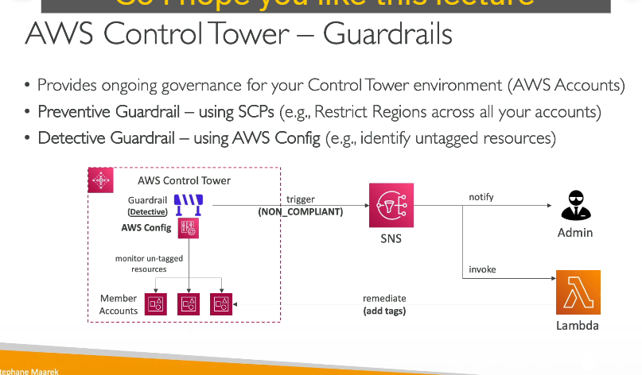

### 1. Giới thiệu về AWS Control Tower

**AWS Control Tower** là dịch vụ của AWS giúp bạn thiết lập, quản trị và quản lý môi trường AWS đa tài khoản một cách bảo mật và tuân thủ theo các best practices. Với Control Tower, bạn có thể:

- **Thiết lập môi trường đa tài khoản** chỉ với vài cú nhấp chuột.
- **Tự động hóa cấu hình** và quản lý chính sách bảo mật cho các tài khoản AWS.
- **Giám sát và kiểm tra** mức độ tuân thủ của toàn bộ môi trường thông qua một dashboard tương tác.

Control Tower hoạt động dựa trên nền tảng của dịch vụ **AWS Organizations** để tạo và quản lý các tài khoản AWS, sau đó tự động áp dụng các cấu hình an toàn và chính sách (guardrails) cho các tài khoản đó.

---

### 2. Tạo và Quản lý các Tài Khoản AWS

- **Tạo tài khoản tự động:**  
  Khi thiết lập AWS Control Tower, dịch vụ này sẽ sử dụng AWS Organizations để tạo ra các tài khoản mới theo cấu hình đã được định sẵn.  
- **Cấu hình bảo mật và tuân thủ:**  
  Sau khi các tài khoản được tạo, Control Tower tự động áp dụng các cấu hình bảo mật và chính sách tuân thủ để đảm bảo rằng các tài khoản này hoạt động theo các best practices đã được định nghĩa trước.

---

### 3. Guardrails – Các chính sách kiểm soát (policies) của Control Tower

Control Tower sử dụng khái niệm **guardrails** để quản trị và giám sát các tài khoản, giúp bạn duy trì môi trường an toàn và tuân thủ. Có hai loại guardrails:

#### A. Preventive Guardrails (Chính sách phòng ngừa)

- **Mục tiêu:**  
  Ngăn chặn (prevent) các hành động không mong muốn hoặc vi phạm chính sách của tài khoản.
- **Cách hoạt động:**  
  - Sử dụng **Service Control Policies (SCPs)** từ AWS Organizations.
  - SCPs áp dụng các hạn chế cho các tài khoản thành viên trong tổ chức, chẳng hạn như hạn chế hoạt động chỉ được phép ở một số vùng nhất định (ví dụ, chỉ cho phép hoạt động ở us-east-1 và eu-west-2).
- **Ưu điểm:**  
  - Ngăn chặn các hành động vi phạm ngay từ đầu, giúp bảo mật môi trường một cách chủ động.

#### B. Detective Guardrails (Chính sách phát hiện)

- **Mục tiêu:**  
  Phát hiện (detect) các hành động hoặc cấu hình không tuân thủ sau khi chúng đã xảy ra.
- **Cách hoạt động:**  
  - Dựa trên **AWS Config** để triển khai các quy tắc giám sát cấu hình trên toàn bộ các tài khoản thành viên.
  - Ví dụ, bạn có thể thiết lập quy tắc để phát hiện các resource chưa được gán tag.
- **Hành động tiếp theo:**  
  - Khi phát hiện resource không tuân thủ, hệ thống có thể kích hoạt **SNS topic** để thông báo cho quản trị viên.
  - Ngoài ra, một hàm **Lambda** có thể được gọi tự động để khắc phục (remediate) các vấn đề, chẳng hạn như tự động gán tag cho resource thiếu tag.
- **Ưu điểm:**  
  - Giúp quản trị viên phát hiện kịp thời các vi phạm cấu hình và tuân thủ, từ đó có các biện pháp điều chỉnh phù hợp.

---

### 4. Lợi ích Khi Sử Dụng AWS Control Tower

- **Tự động hóa và nhanh chóng:**  
  Thiết lập môi trường đa tài khoản một cách tự động chỉ với vài bước và cấu hình sẵn.
- **Quản lý chính sách tập trung:**  
  Áp dụng và giám sát các quy tắc bảo mật và tuân thủ thông qua guardrails, giúp quản trị toàn bộ môi trường một cách dễ dàng.
- **Giảm thiểu sai sót:**  
  Tự động hóa giúp giảm thiểu lỗi do thao tác thủ công và đảm bảo các tài khoản luôn tuân thủ các best practices bảo mật.
- **Dashboard giám sát:**  
  Control Tower cung cấp giao diện dashboard tương tác để quản trị viên có thể nhanh chóng nắm bắt tình trạng tuân thủ của tất cả tài khoản trong tổ chức.

---

### 5. Tóm tắt Quy Trình Hoạt Động của Control Tower

1. **Khai báo và tạo tài khoản:**  
   - Sử dụng AWS Organizations để tự động tạo các tài khoản mới theo yêu cầu.
2. **Áp dụng cấu hình bảo mật:**  
   - Control Tower tự động cấu hình các tài khoản mới theo các tiêu chí bảo mật và best practices.
3. **Triển khai các guardrails:**  
   - Preventive guardrails: Sử dụng SCP để ngăn chặn hành động vi phạm.
   - Detective guardrails: Sử dụng AWS Config để phát hiện và thông báo các hành động không tuân thủ.
4. **Giám sát và khắc phục:**  
   - Dashboard giám sát toàn bộ các tài khoản.
   - Kích hoạt các quy trình tự động (qua SNS và Lambda) để khắc phục sự cố khi phát hiện vi phạm.

---

### 6. Kết Luận

AWS Control Tower là một công cụ mạnh mẽ giúp bạn:
- Thiết lập nhanh chóng một môi trường AWS đa tài khoản an toàn.
- Tự động áp dụng các cấu hình bảo mật và tuân thủ.
- Giám sát và duy trì mức độ tuân thủ thông qua các guardrails (phòng ngừa và phát hiện).
  
Đây là giải pháp lý tưởng cho các tổ chức mong muốn xây dựng một hạ tầng AWS chuyên nghiệp, có khả năng kiểm soát và bảo mật tốt theo các best practices của AWS.

