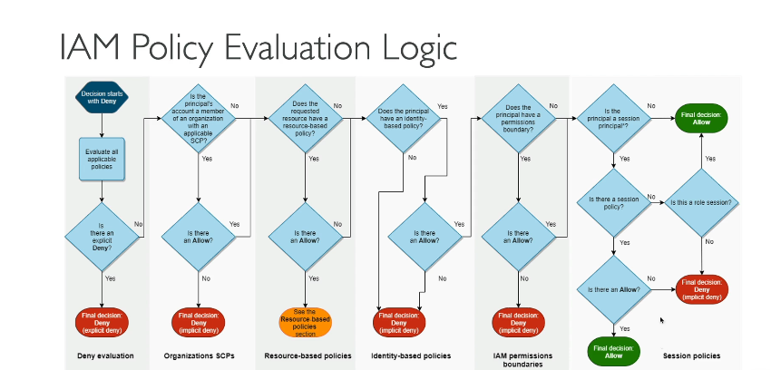

**Tổng hợp về IAM Permission Boundaries trong AWS**

**1. Khái niệm và Mục đích**

- **Permission Boundaries** (Ranh giới quyền) là một tính năng nâng cao của AWS IAM, áp dụng cho **users và roles** (không áp dụng cho groups).
- Chúng định nghĩa **giới hạn tối đa** của quyền mà một IAM entity (user/role) có thể có, bất kể các policy được gán thêm.
- Đóng vai trò như "hàng rào" ngăn việc cấp quyền vượt quá phạm vi cho phép.

---

**2. Cơ chế hoạt động**

- **Permission Boundary** là một **managed policy** (dạng JSON), được gán trực tiếp vào user/role.
- Quyền thực tế của user/role là **phần giao nhau** giữa:
  - **Policy được gán** (identity-based policies).
  - **Permission Boundary**.
- **Ví dụ**:
  - Nếu Boundary cho phép `S3:*`, nhưng policy gán chỉ cho `S3:GetObject` → Quyền thực tế là `S3:GetObject`.
  - Nếu Boundary chỉ cho phép `EC2` và policy cho phép `EC2 + IAM` → Quyền thực tế chỉ là `EC2`.

---

**3. Tại sao sử dụng?**

- **Ngăn leo thang đặc quyền**: Dù user có policy cho phép tạo IAM user/policy mới, nếu Boundary không bao gồm `IAM`, hành động này sẽ bị từ chối.
- **Áp dụng nguyên tắc least privilege**: Đảm bảo user/role chỉ có quyền trong phạm vi được phê duyệt.
- **Quản lý tập trung**: Tái sử dụng Boundary cho nhiều user/role, đảm bảo tính nhất quán.

---

**4. So sánh với các loại Policy khác**  

| **Loại Policy**                 | **Phạm vi**           | **Mục đích**                         |
| -------------------------------------- | ---------------------------- | --------------------------------------------- |
| **Permission Boundary**          | User/Role                    | Giới hạn tối đa quyền có thể cấp      |
| **SCP (Service Control Policy)** | AWS Organization/OU/Account  | Giới hạn quyền cho toàn bộ account/OU    |
| **Resource-Based Policy**        | Tài nguyên (S3, Lambda...) | Kiểm soát ai được truy cập tài nguyên |

---

**5. Ví dụ thực tế**

- **Scenario**: Developer cần quyền truy cập EC2 và S3, nhưng không được phép thao tác IAM.
  - **Permission Boundary**: Cho phép `EC2:*` và `S3:*`.
  - **Policy gán**: Cho phép `EC2:StartInstances` và `IAM:CreateUser`.
  - **Kết quả**: User chỉ có quyền `EC2:StartInstances` (vì `IAM:CreateUser` nằm ngoài Boundary).

---

**6. Lưu ý quan trọng**

- **Không tự cấp quyền**: Boundary chỉ giới hạn quyền, không trực tiếp cấp quyền. Quyền thực tế phải được cấp qua identity-based policies.
- **Thứ tự đánh giá**: AWS kiểm tra theo thứ tự
- 
- **Không dùng được với Groups**: Chỉ áp dụng cho user/role.

---

**7. Ứng dụng ng bài thi AWS**

- Nhận biết khi nào cần dùng Boundary: Khi đề cập đến việc **giới hạn quyền tối đa** hoặc **ngăn leo thang đặc quyền**.
- Phân biệt rõ giữa Boundary và SCP: SCP áp dụng ở cấp Organization/Account, Boundary áp dụng cho user/role.

**Kết luận**: Permission Boundaries là công cụ mạnh để kiểm soát quyền trong AWS, đặc biệt hữu ích trong môi trường đa team hoặc cần tuân thủ nghiêm ngặt về bảo mật.
