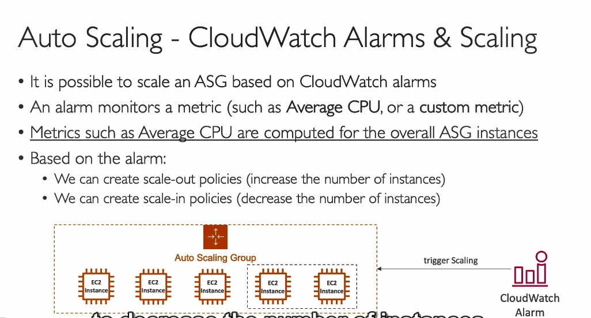

###  Auto Scaling Group (ASG) trong AWS :

1. **Giới thiệu về Auto Scaling Group (ASG):**
   - **Auto Scaling Group (ASG)** là một dịch vụ trong AWS cho phép tự động **mở rộng** (scale out) và **thu hẹp** (scale in) số lượng EC2 instances dựa trên nhu cầu sử dụng ứng dụng hoặc website.
   - **Scale out** có nghĩa là **thêm instance mới** để đáp ứng lượng tải tăng lên.
   - **Scale in** có nghĩa là **xóa instance** khi lượng tải giảm xuống.

2. **Lợi ích của Auto Scaling:**
   - **Tự động mở rộng và thu hẹp**: Nhờ vào ASG, bạn có thể thêm hoặc bớt EC2 instances tự động mà không cần phải làm thủ công.
   - **Tối ưu hóa tài nguyên**: Bạn có thể cấu hình giới hạn tối thiểu và tối đa cho số lượng EC2 instances chạy tại bất kỳ thời điểm nào.
   - **Tiết kiệm chi phí**: Bạn chỉ trả tiền cho các tài nguyên sử dụng, chẳng hạn như EC2 instances, thay vì phải duy trì các máy chủ dư thừa.

3. **Các thành phần trong ASG:**
   - **Minimum capacity**: Số lượng instance tối thiểu bạn muốn duy trì trong ASG (ví dụ: 2 instances).
   - **Desired capacity**: Số lượng instance bạn mong muốn chạy tại một thời điểm (ví dụ: 4 instances).
   - **Maximum capacity**: Giới hạn số lượng instance tối đa bạn muốn có trong ASG (ví dụ: 7 instances).
   - **Scaling Policies**: Các chính sách để điều chỉnh số lượng instance dựa trên các yếu tố như tài nguyên (CPU, bộ nhớ, v.v.).

4. **Liên kết với Load Balancer:**
   - **Load balancer** sẽ phân phối lưu lượng đến tất cả các EC2 instances trong ASG. Điều này giúp website hoặc ứng dụng luôn hoạt động ổn định dù có sự thay đổi về số lượng server.
   - **Health Check**: Load balancer kiểm tra tình trạng sức khỏe của các instance và gửi thông tin về tình trạng này cho ASG. Nếu một instance bị đánh giá là không khỏe mạnh, ASG sẽ loại bỏ nó và thay thế bằng một instance mới.

5. **Launch Template**:
   - Để tạo ASG, bạn cần một **Launch Template** thay vì Launch Configuration (đã bị hủy). Launch Template chứa thông tin như:
     - AMI (Amazon Machine Image)
     - Loại instance
     - EC2 User Data
     - Security Groups
     - IAM Roles
     - Các cài đặt mạng, subnet, và thông tin về load balancer.

6. **CloudWatch Alarms và Scaling Policies:**
   - **CloudWatch** có thể theo dõi các chỉ số như **CPU** hoặc **Memory** để xác định khi nào cần **scale out** hoặc **scale in**.
   - **Scaling Policies** giúp tự động mở rộng hoặc thu hẹp ASG dựa trên cảnh báo từ CloudWatch (ví dụ: khi CPU sử dụng quá cao, ASG sẽ thêm instances mới).

7. **Tổng kết**:
   - **Auto Scaling Group** là một công cụ mạnh mẽ giúp quản lý tài nguyên EC2 linh hoạt và tiết kiệm chi phí cho ứng dụng.
   - Kết hợp ASG với **Load Balancer** và **CloudWatch Alarms** giúp hệ thống tự động thích nghi với thay đổi về lưu lượng và tài nguyên một cách hiệu quả.

---

vô asg mục history active để xem điều gì xảy ra và nó đang scale lên 
