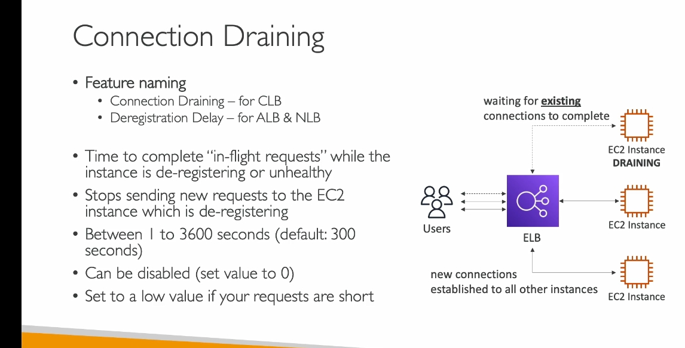

# nói chung là thời gian chờ để kết thúc 1 con máy1  để truyền dần nhiệm vụ cho con máy khác , thời gian này để không dừng máy1 đột ngột làm mất dữ liệu của user đang thao tác trên máy1 
---

---

**1. **Deregistration-Delay là gì?**
- Connection Draining/Deregistration-Delay là **tính năng của Load Balancer** (CLB, ALB, hoặc NLB) giúp:
  - Ngừng gửi yêu cầu mới đến một **EC2 instance** đang chuẩn bị **loại bỏ** hoặc bị đánh dấu là **không khỏe mạnh**.
  - Đảm bảo **các kết nối hoặc yêu cầu đang xử lý** được hoàn thành trước khi instance đó thực sự bị ngắt.

---

**2. Vì sao cần Deregistration-Delay?**
- Nếu không có Deregistration-Delay, khi bạn loại bỏ một EC2 instance:
  - Các kết nối chưa hoàn thành sẽ bị ngắt ngay lập tức.
  - Người dùng có thể gặp lỗi (ví dụ: tải file bị gián đoạn, ứng dụng dừng đột ngột).
- Deregistration-Delay giúp người dùng hoàn thành công việc của họ, đồng thời hệ thống vẫn hoạt động ổn định.

---

**3. Cách hoạt động của Deregistration-Delay?**

- Giả sử hệ thống của bạn có **3 EC2 instances (A, B, C)** đang xử lý yêu cầu qua Load Balancer.

1. **Khi loại bỏ Instance A:**
   - Instance A được đặt vào trạng thái **draining**.
   - ELB ngừng **phân phối yêu cầu mới** đến Instance A.
   - **Các yêu cầu hiện tại đang xử lý trên Instance A** (người dùng đang sử dụng) vẫn tiếp tục được thực hiện.

2. **Trong thời gian Deregistration-Delay Period:**
   - Người dùng đang kết nối với Instance A có thời gian hoàn thành công việc của họ.
   - Các yêu cầu mới sẽ được chuyển sang các instance khác (**B và C**).

3. **Kết thúc thời gian Deregistration-Delay:**
   - Tất cả các kết nối trên Instance A được đóng.
   - Instance A được gỡ hoàn toàn khỏi Load Balancer.

---

**4. Deregistration-Delay Period là gì?**
- **Thời gian chờ (Deregistration-Delay Period):**
  - Khoảng thời gian mà một EC2 instance ở trạng thái draining để xử lý các kết nối hiện tại , hết thời gian thì kết thúc
  - Thời gian này có thể được cấu hình:
    - **1 giây đến 3600 giây** (tối đa 60 phút).
    - Mặc định là **300 giây (5 phút)**.
  - Nếu đặt thời gian là **0**, ELB sẽ **ngắt kết nối ngay lập tức**, không có thời gian chờ.

---

**5. Ví dụ thực tế:**
- **Ngắn:** Nếu ứng dụng của bạn xử lý **yêu cầu nhanh (dưới 1 giây)**, hãy đặt thời gian draining thấp, ví dụ: **30 giây**.
  - Trường hợp: Website gửi các yêu cầu API nhỏ và xử lý nhanh chóng.
- **Dài:** Nếu ứng dụng của bạn có các tác vụ dài, ví dụ: **tải file**, đặt thời gian cao hơn, ví dụ: **600 giây**.
  - Trường hợp: Một người dùng đang tải file lớn, bạn cần cho họ đủ thời gian để hoàn thành việc này trước khi ngắt instance.

---

**6. Hình ảnh minh họa (mô phỏng):**

- Ban đầu:
  - Instance A: Đang phục vụ 5 người dùng.
  - Instance B và C: Đang phục vụ các người dùng khác.

- Khi **Instance A** vào trạng thái **draining**:
  - ELB không gửi thêm kết nối mới đến Instance A.
  - 5 người dùng trên Instance A tiếp tục làm việc.
  - Yêu cầu mới từ người dùng khác được gửi đến Instance B và C.

- Khi thời gian **draining kết thúc** hoặc 5 người dùng hoàn thành công việc:
  - Instance A bị ngắt hoàn toàn.

---

**7. Lợi ích của Deregistration-Delay:**
- Giảm thiểu rủi ro **lỗi kết nối** cho người dùng cuối.
- Giúp hệ thống vận hành mượt mà khi bảo trì hoặc thay thế EC2 instance.
- Tăng trải nghiệm người dùng.

