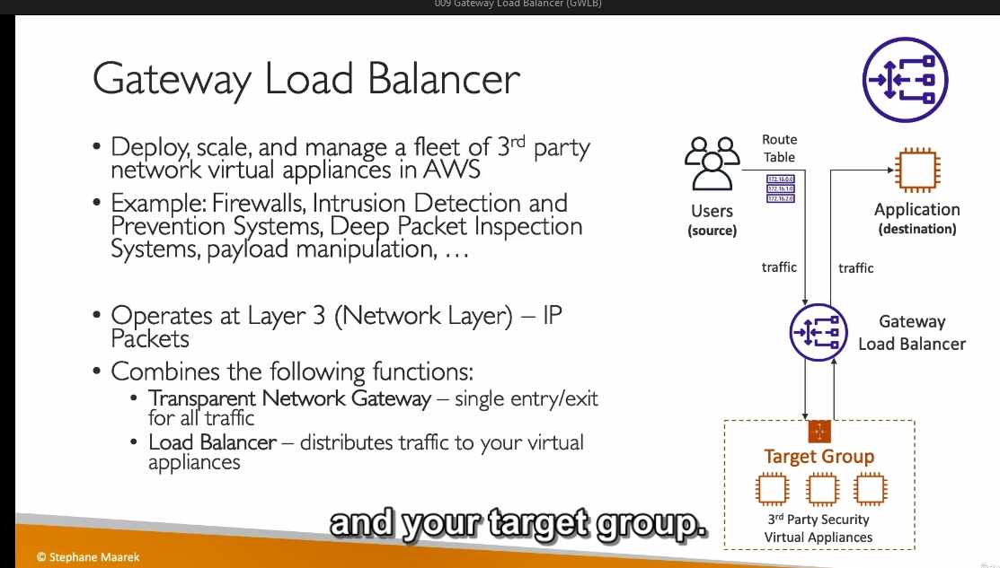
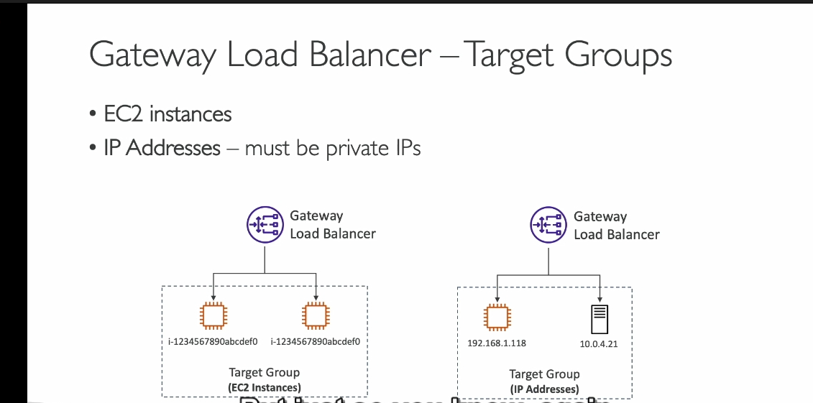

### **Chi Tiết Kiến Thức: Gateway Load Balancer (GLB)**

#### **1. Khái Niệm**
- **Gateway Load Balancer** (GLB) là một loại load balancer mới, được thiết kế để:
  - **Triển khai, mở rộng và quản lý** các thiết bị mạng bên thứ ba (third-party network appliances).
  - Hỗ trợ các dịch vụ như **firewall**, **hệ thống phát hiện và ngăn chặn xâm nhập (IDPS)**, hoặc **kiểm tra gói tin sâu (Deep Packet Inspection)**.

---

#### **2. Lợi Ích và Trường Hợp Sử Dụng**
- Dùng GLB khi bạn muốn:
  - Tất cả lưu lượng mạng đi qua một hệ thống **firewall** hoặc **IDPS**.
  - Kiểm tra, chỉnh sửa payload ở mức **mạng** (network level).
  - Quản lý lưu lượng một cách **tập trung** thông qua thiết bị ảo (virtual appliances).

---

#### **3. Cách Hoạt Động**
- **Truyền thống:** 
  - Người dùng truy cập ứng dụng thông qua **Application Load Balancer (ALB)**.
  - Lưu lượng từ ALB đi trực tiếp đến ứng dụng.
- **Với GLB:** 
  - **Lưu lượng mạng** trước tiên được chuyển đến **Gateway Load Balancer**.
  - GLB phân phối lưu lượng đến một **nhóm mục tiêu** (target group) gồm các **virtual appliances** (thiết bị ảo như EC2 instances).
  - Các thiết bị ảo thực hiện phân tích, lọc hoặc xử lý dữ liệu:
    - **Chấp nhận:** Gửi lưu lượng trở lại GLB để chuyển đến ứng dụng.
    - **Từ chối:** Loại bỏ lưu lượng (drop traffic).

---

#### **4. Kỹ Thuật Hoạt Động**
- **Cấp độ hoạt động:** 
  - Hoạt động ở **Layer 3 (Mạng IP)**, thấp hơn các load balancer khác như ALB hay NLB.
- **Hai chức năng chính:**
  1. **Transparent Network Gateway:** 
     - Tất cả lưu lượng đi qua một điểm vào/ra duy nhất (entry/exit).
  2. **Load Balancer:**
     - Phân phối lưu lượng đến các **virtual appliances** trong target group.

---

#### **5. Target Groups (Nhóm Mục Tiêu)**
- **Loại thiết bị:** 
  - **EC2 Instances** (đăng ký bằng Instance ID).
  - **Private IP Addresses** (cho các thiết bị trong mạng riêng hoặc trung tâm dữ liệu của bạn).

---

#### **6. Protocol và Cổng**
- GLB sử dụng giao thức **GENEVE** (port **6081**).

---

#### **7. Điểm Nhấn Quan Trọng**
- Học GLB qua **sơ đồ minh họa**:
  - Người dùng → GLB → Thiết bị ảo → Ứng dụng.
- Không cần đi sâu vào chi tiết thực hành, chỉ cần hiểu **cách thức hoạt động cơ bản**.

---

#### **8. Tóm Tắt**
- **Gateway Load Balancer**:
  - **Phân phối và bảo mật** lưu lượng mạng.
  - Đơn giản hóa quản lý các thiết bị ảo bên thứ ba.
  - Hoạt động ở cấp độ **Layer 3** với giao thức **GENEVE**.

---
### **Use Case Gateway Load Balancer (GLB)**

---

#### **1. Triển Khai Firewall**  
- **Mục đích:** Lọc và kiểm tra lưu lượng trước khi vào ứng dụng.  
- **Giải pháp:** GLB chuyển lưu lượng qua firewall, chặn lưu lượng độc hại, chuyển lưu lượng hợp lệ đến ứng dụng.  
- **Lợi ích:** Dễ mở rộng, đảm bảo an toàn mạng tập trung.

---
[IPDS và DPI là gì ](../lý-thuyết-bên-lề/IDPS-DPI.md)
#### **2. Phát Hiện và Ngăn Chặn Xâm Nhập (IDPS)**  
- **Mục đích:** Giám sát và ngăn chặn các mối đe dọa như DDoS.  
- **Giải pháp:** GLB chuyển lưu lượng qua IDPS để phân tích, lọc lưu lượng độc hại.  
- **Lợi ích:** Bảo mật chủ động, tích hợp dễ dàng.

---

#### **3. Kiểm Tra Gói Tin Sâu (DPI)**  
- **Mục đích:** Phân tích nội dung gói tin để phát hiện mã độc hoặc vi phạm chính sách.  
- **Giải pháp:** GLB phân phối lưu lượng đến thiết bị DPI để xử lý.  
- **Lợi ích:** Phân tích sâu mà không làm gián đoạn kết nối.

---

#### **4. Kiểm Soát Truy Cập Ứng Dụng**  
- **Mục đích:** Chỉ cho phép lưu lượng từ nguồn đáng tin cậy.  
- **Giải pháp:** GLB kết hợp với ACL kiểm tra nguồn IP và header.  
- **Lợi ích:** Tăng cường bảo mật, ngăn truy cập trái phép.

---

#### **5. Chỉnh Sửa Payload**  
- **Mục đích:** Thay đổi nội dung gói tin, như mã hóa hoặc thêm thông tin.  
- **Giải pháp:** GLB chuyển lưu lượng qua thiết bị xử lý payload để chỉnh sửa.  
- **Lợi ích:** Tùy chỉnh lưu lượng mạng mà không thay đổi ứng dụng.

---

#### **6. Bảo Mật Đa Khu Vực (Multi-Region)**  
- **Mục đích:** Bảo mật lưu lượng giữa các khu vực AWS.  
- **Giải pháp:** GLB phân phối lưu lượng qua thiết bị bảo mật trước khi đến khu vực đích.  
- **Lợi ích:** Bảo mật mạng xuyên khu vực.

---

#### **7. Kiểm Tra Tuân Thủ Quy Định**  
- **Mục đích:** Đảm bảo lưu lượng tuân thủ quy định như [GDPR, HIPAA - nói chung là quy định mọi nơi không nhất thiếu phải 2 cái này ](../lý-thuyết-bên-lề/GDPR-HIPAA.md)  
- **Giải pháp:** GLB chuyển lưu lượng qua thiết bị giám sát tuân thủ.  
- **Lợi ích:** Dễ dàng phát hiện vi phạm, đảm bảo tuân thủ.

---

### **Lợi Ích Chung**  
- **Đơn giản hóa:** Tích hợp và quản lý thiết bị mạng hiệu quả.  
- **Tăng cường bảo mật:** Giám sát và xử lý toàn bộ lưu lượng.  
- **Linh hoạt:** Phù hợp với nhiều trường hợp sử dụng, dễ mở rộng.  