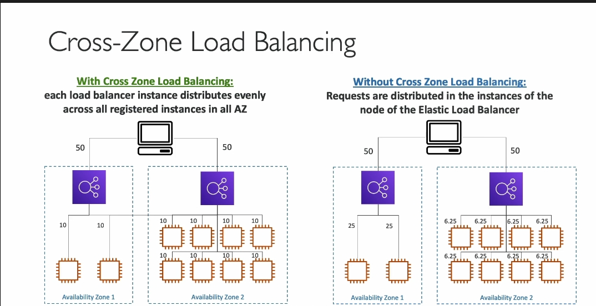

---
### **Kiến thức chi tiết về Cross-Zone Load Balancing (Cân bằng tải liên vùng)**

---

#### **1. Định nghĩa Cross-Zone Load Balancing**
- Cross-Zone Load Balancing là một cơ chế giúp **phân phối lưu lượng yêu cầu** từ người dùng một cách đồng đều giữa các **instance (máy chủ)** trên nhiều **Availability Zone (AZ)**.
- Nó giúp tận dụng hiệu quả tài nguyên, đặc biệt khi số lượng instance giữa các AZ không cân bằng.

---

#### **2. Cách hoạt động của Cross-Zone Load Balancing**

##### **Ví dụ minh họa:**
1. Có hai AZ:
   - **AZ1:** Chứa 1 Load Balancer (ALB/NLB/GLB) và 2 EC2 instances.
   - **AZ2:** Chứa 1 Load Balancer và 8 EC2 instances.
2. **Không sử dụng Cross-Zone Load Balancing:**
   - Lưu lượng từ người dùng được chia **50%-50%** giữa hai AZ.
   - Load Balancer trong mỗi AZ **chỉ phân phối lưu lượng đến các instance trong AZ đó**.
   - Kết quả:
     - Mỗi instance trong AZ1 nhận nhiều lưu lượng hơn (do ít instance hơn).
     - Mỗi instance trong AZ2 nhận ít lưu lượng hơn (do có nhiều instance hơn).
   - **Hạn chế:** Không đồng đều nếu các AZ không có cùng số lượng instance.
3. **Sử dụng Cross-Zone Load Balancing:**
   - Load Balancer **phân phối đều lưu lượng đến tất cả các instance trong mọi AZ**.
   - Kết quả:
     - Mỗi instance (dù ở AZ1 hay AZ2) nhận một lượng lưu lượng **bằng nhau**.
   - **Lợi ích:** Phân phối cân bằng ngay cả khi số lượng instance giữa các AZ không đồng đều.

---

#### **3. Cấu hình mặc định cho các loại Load Balancer**
- **Application Load Balancer (ALB):**
  - Cross-Zone Load Balancing **bật mặc định**.
  - **Không bị tính phí** cho lưu lượng giữa các AZ.
- **Network Load Balancer (NLB) & Gateway Load Balancer (GLB):**
  - Cross-Zone Load Balancing **tắt mặc định**.
  - **Có tính phí** nếu bật, vì lưu lượng đi qua các AZ sẽ phát sinh chi phí.
---

#### **4. Khi nào nên bật hoặc tắt Cross-Zone Load Balancing?**
- **Nên bật khi:**
  - Số lượng instance giữa các AZ không đều.
  - Muốn cân bằng lưu lượng trên tất cả các instance để cải thiện hiệu suất.
- **Nên tắt khi:**
  - Muốn tối ưu hóa lưu lượng **trong từng AZ** để giảm độ trễ.
  - Muốn tránh chi phí phát sinh (với NLB/GLB).

---

#### **5. Chi phí liên quan**
- ALB: **Miễn phí** cho lưu lượng giữa các AZ khi bật Cross-Zone Load Balancing.
- NLB/GLB: **Tính phí** cho lưu lượng giữa các AZ khi bật Cross-Zone Load Balancing.

---

#### **6. Tóm lại**
- Cross-Zone Load Balancing **giúp cân bằng tải hiệu quả** khi hạ tầng có sự phân bổ không đồng đều giữa các AZ.
- **Cân nhắc cấu hình** dựa trên nhu cầu cân bằng tải và tối ưu chi phí cho từng ứng dụng.