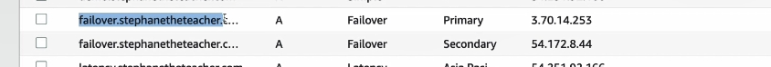

Dưới đây là chi tiết kiến thức về chính sách định tuyến failover trong Route 53 của AWS:

### **1. Chính sách định tuyến Failover**
Chính sách định tuyến failover trong AWS Route 53 được thiết kế để tự động chuyển hướng lưu lượng tới một máy chủ phụ (secondary) khi máy chủ chính (primary) không còn hoạt động hoặc không thể truy cập được. Điều này giúp duy trì tính khả dụng của ứng dụng trong trường hợp sự cố.

### **2. Các thành phần trong failover routing**
- **Route 53:** Dịch vụ DNS của AWS, có khả năng phân giải tên miền và áp dụng các chính sách định tuyến, bao gồm cả failover.
- **EC2 Instances:** Các máy chủ chạy ứng dụng của bạn. Một trong số chúng sẽ là máy chủ chính (primary), còn lại sẽ là máy chủ phụ (secondary).
- **Health Checks:** Được sử dụng để giám sát trạng thái của các máy chủ. Khi trạng thái của máy chủ chính không còn healthy (không khỏe mạnh), Route 53 sẽ tự động chuyển lưu lượng đến máy chủ phụ.

### **3. Các bước cấu hình failover routing**
1. **Tạo bản ghi DNS trong Route 53:**
   - Bản ghi DNS đầu tiên (primary) sẽ trỏ đến máy chủ chính và phải được liên kết với một health check.
   - Bản ghi DNS thứ hai (secondary) trỏ đến máy chủ phụ và có thể không cần health check (tùy chọn).
   
2. **Thiết lập TTL (Time to Live):**
   - TTL là khoảng thời gian mà bản ghi DNS sẽ được lưu trữ trong bộ nhớ đệm của các máy khách DNS. Thời gian TTL thấp, ví dụ 60 giây, giúp giảm độ trễ trong việc chuyển đổi giữa các bản ghi khi xảy ra failover.

3. **Health Check:**
   - Health check là điều kiện quyết định xem máy chủ có khỏe mạnh hay không. Nếu health check của máy chủ chính không thành công (ví dụ do mất kết nối), Route 53 sẽ chuyển lưu lượng đến máy chủ phụ.

4. **Cấu hình các bản ghi DNS với loại failover:**
   - **Primary:** Được liên kết với health check và sẽ là bản ghi chính khi máy chủ đang hoạt động bình thường.
   - **Secondary:** Sẽ là bản ghi dự phòng và sẽ được sử dụng khi bản ghi primary không hoạt động.

### **4. Quá trình failover hoạt động**
- Khi một máy khách gửi yêu cầu DNS, Route 53 sẽ trả về địa chỉ IP của máy chủ chính nếu máy chủ này khỏe mạnh.
- Nếu máy chủ chính không còn khỏe mạnh (do health check thất bại), Route 53 sẽ tự động chuyển hướng lưu lượng đến máy chủ phụ.

### **5. Cách kiểm tra và thử nghiệm failover**
- **Giả lập sự cố:** Bạn có thể kiểm tra failover bằng cách làm cho máy chủ chính không thể truy cập được, ví dụ bằng cách ngừng dịch vụ hoặc thay đổi cấu hình bảo mật để làm cho máy chủ không thể truy cập.
- **Kiểm tra kết quả:** Sau khi máy chủ chính không còn khả dụng, Route 53 sẽ chuyển hướng đến máy chủ phụ và bạn sẽ thấy rằng lưu lượng đã được chuyển hướng đúng cách.

---

 **Health check nên được đặt ở khu vực khác với khu vực primary**. Lý do là để đảm bảo rằng khi khu vực **primary** (ví dụ, EU-Central-1) gặp sự cố, Route 53 có thể nhận diện được tình trạng của máy chủ đó và chuyển lưu lượng sang máy chủ **secondary** (ví dụ, US-East-1) mà không có gián đoạn.

### Tại sao nên để Health Check ở khu vực khác?
1. **Đảm bảo tính khả dụng cao** (High Availability - HA):
   - Khi bạn đặt health check ở khu vực khác với khu vực primary, bạn đang kiểm tra tình trạng của máy chủ **dưới góc độ độc lập** với khu vực đó. Nếu khu vực **primary** gặp sự cố, health check sẽ phát hiện ngay và chuyển lưu lượng sang khu vực phụ mà không gây gián đoạn.
   
2. **Giảm thiểu sự phụ thuộc vào một khu vực duy nhất**:
   - Nếu health check chỉ đặt ở khu vực **primary**, trong trường hợp khu vực đó gặp sự cố (ví dụ, mất kết nối mạng trong khu vực đó), Route 53 có thể không nhận ra rằng máy chủ của bạn đang gặp sự cố. Điều này có thể dẫn đến downtime cho người dùng.
   
3. **Phục hồi thảm họa (Disaster Recovery - DR)**:
   - Nếu khu vực **primary** gặp sự cố, và health check được đặt ở khu vực khác (ví dụ, **secondary** ở US-East-1), Route 53 sẽ tự động chuyển lưu lượng đến **secondary** mà không có thời gian gián đoạn. Điều này giúp bạn duy trì hoạt động liên tục của hệ thống.

### Cách hoạt động trong cấu hình failover:
- **Primary EC2**: Đặt health check ở khu vực khác, ví dụ **US-East-1** (nếu primary là EU-Central-1).
- **Secondary EC2**: Có thể hoặc không có health check (tùy vào cách bạn cấu hình).
  
Nếu **EU-Central-1** (primary) không khả dụng, health check sẽ báo lỗi và Route 53 sẽ chuyển lưu lượng sang **US-East-1** (secondary). 

### Tóm lại:
- **Health check không nên ở cùng khu vực với primary instance** để đảm bảo phát hiện được sự cố ngay cả khi khu vực chính gặp sự cố. Điều này giúp hệ thống của bạn luôn hoạt động ổn định và duy trì tính khả dụng cao.