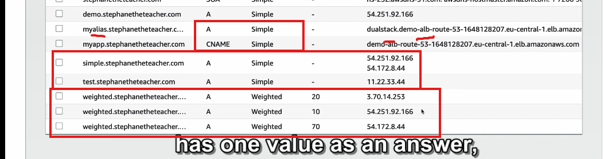

## 
### **1. Tổng quan về chính sách định tuyến (Routing Policy)**

- **Chức năng chính:** Giúp **Route 53** phản hồi các truy vấn DNS (Domain Name System).
- **Không nhầm lẫn với "routing" của Load Balancer:**
  - Load Balancer **định tuyến lưu lượng thực tế** tới các instance backend.
  - Route 53 chỉ trả lời các truy vấn DNS và **không tham gia trực tiếp vào việc định tuyến lưu lượng.**

### **2. Vai trò của DNS trong Route 53**

- DNS có nhiệm vụ:
  - Chuyển đổi tên miền (hostname) thành địa chỉ IP hoặc endpoint.
  - Đáp ứng truy vấn để client biết cách thực hiện truy vấn HTTP tiếp theo.
- DNS **không truyền tải** lưu lượng; client tự xử lý việc gửi yêu cầu HTTP đến các địa chỉ IP được cung cấp.

---

### **3. Các loại chính sách định tuyến hỗ trợ bởi Route 53**

Route 53 hỗ trợ các chính sách định tuyến sau:

- **Simple** (Đơn giản)
- **Weighted** (Theo trọng số)
- **Failover** (Dự phòng)
- **Latency-based** (Theo độ trễ)
- **Geolocation** (Theo vị trí địa lý)
- **Multi-value Answer** (Trả lời nhiều giá trị)
- **Geoproximity** (Theo khoảng cách địa lý)

---

### **4. Simple Routing Policy (Chính sách định tuyến đơn giản)**

- **Đặc điểm:**
  - Phổ biến và dễ sử dụng.
  - Dùng để định tuyến lưu lượng tới **một tài nguyên duy nhất** hoặc trả về một danh sách IP.
- **Cách hoạt động:**
  - Khi client truy vấn DNS (ví dụ: `foo.example.com`), Route 53 sẽ trả về:
    - Một địa chỉ IP (nếu chỉ có 1 giá trị).
    - Nhiều địa chỉ IP (nếu có nhiều giá trị trong bản ghi).
  - Client chọn một địa chỉ IP ngẫu nhiên từ danh sách và gửi yêu cầu tới đó.

#### **4.1. Alias Record và Simple Policy**

- Khi sử dụng Alias Record:
  - Chỉ có thể chỉ định **một tài nguyên AWS** làm đích (ví dụ: S3 bucket, Load Balancer).
- Không thể kết hợp Simple Policy với **health checks** (kiểm tra trạng thái).

#### **4.2. Ví dụ về Simple Policy**

1. Tạo một bản ghi A (A record):

   - Tên: `simple.example.com`
   - Giá trị: Địa chỉ IP của một instance trong **ap-southeast-1**.
   - TTL: 20 giây.
   - Kết quả: Khi truy vấn DNS, Route 53 trả về địa chỉ IP.

2. Cập nhật bản ghi A với nhiều giá trị:
   - Giá trị: Thêm một IP khác từ **us-east-1**.
   - Kết quả: Khi client truy vấn, Route 53 trả về **cả hai IP**, và client sẽ chọn ngẫu nhiên một IP để sử dụng.

---

### **5. Cách kiểm tra hoạt động của Simple Policy**

1. Sử dụng lệnh `dig` để kiểm tra bản ghi DNS:
   - Kết quả: Route 53 trả về danh sách IP với TTL tương ứng.
2. Sau khi TTL hết hạn:
   - Truy vấn lại DNS sẽ trả về danh sách IP mới (nếu có thay đổi).
3. Truy cập địa chỉ web:
   - Khi tải lại trang, client có thể ngẫu nhiên chọn một IP khác trong danh sách, dẫn đến việc truy cập vào tài nguyên ở vị trí khác.

---

### **6. Kết luận**

- **Ưu điểm của Simple Policy:**
  - Dễ thiết lập và phù hợp với các trường hợp đơn giản.
  - Có thể sử dụng cho các ứng dụng yêu cầu trả về nhiều endpoint nhưng không cần kiểm tra trạng thái tài nguyên.
- **Hạn chế:**
  - Không hỗ trợ Health Checks.
  - Client phải tự quyết định endpoint nào để gửi yêu cầu.