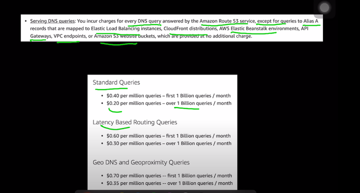
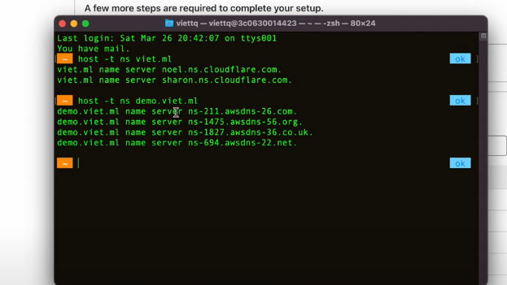

tóm gọn sự khác biệt giữa các loại *routing policy* trong AWS Route 53 trong một câu:

1. *Simple Routing Policy*: Điều hướng tất cả truy vấn đến một bản ghi duy nhất. bản ghi nhiều ip thì nó random trả về 1 trong tất cả ip dù cho 1 ip nào đó  nó healthy hay không , không có health check 
2. *Weighted Routing Policy*: Phân phối truy vấn giữa các bản ghi theo tỷ lệ phần trăm.
3. *Latency Routing Policy*: Điều hướng truy vấn đến bản ghi có độ trễ thấp nhất từ người dùng.
4. *Failover Routing Policy*: Điều hướng truy vấn đến bản ghi chính, chuyển sang bản ghi phụ khi chính không khả dụng.
5. *Geolocation Routing Policy*: Điều hướng truy vấn đến bản ghi dựa trên vị trí địa lý của người dùng. người dùng jp thì được trỏ vô ip của server dành cho người jp  
6. *Geoproximity Routing Policy*: Điều hướng truy vấn đến các bản ghi gần người dùng nhất, với trọng số tùy chỉnh theo khoảng cách. mở động vùng dùng thông số bias càng lớn thì khu vực càng to , người dùng trong khu vực nào thì bị trỏ đến các ip server trong khu vực đó hoặc bị trỏ dến các policy khác dựa trên khu vực đó 
7. *Multivalue Answer Routing Policy*: Trả về nhiều bản ghi DNS trừ các bản ghi không khỏe mạnh dựa trên health check. giống simple nhưng không trả ip unhealthy 

---
Dưới đây là sự khác biệt giữa *CNAME* và *Alias* trong AWS Route 53:

1. *CNAME (Canonical Name)*:
   - Chỉ có thể sử dụng cho *subdomain* (ví dụ: www.example.com), không thể dùng cho *domain gốc* (ví dụ: example.com).
   - Trỏ đến một tên miền khác (ví dụ: www.example.com có thể trỏ đến example.net).
   - Phải trả về một tên miền, không phải địa chỉ IP.

2. *Alias*:
   - Có thể sử dụng cho *cả domain gốc* và *subdomain*.
   - Trỏ đến *tên miền AWS* (ví dụ: ELB, CloudFront, S3 bucket, v.v.) mà không cần phải biết địa chỉ IP.
   - Không tốn phí cho truy vấn DNS, trong khi CNAME có thể tạo thêm chi phí truy vấn.

### Tóm lại:
- *CNAME* chỉ có thể dùng cho subdomains và yêu cầu trỏ đến một tên miền khác.
- *Alias* có thể dùng cho cả domain gốc và subdomain, và có thể trỏ đến các dịch vụ AWS mà không cần biết IP.
---
case:
- tạo hosted zone trên route 53 cho domain bên ngoài  .  muốn dùng route 53 quản lý domain mua ở x thì vô x chỉnh custom ns thành ns ở chỗ hosted zone vừa tạo cho cái domain đó 
- tương tự cloudflare cũng dùng ns của cloudflare để gắn vô custom ns trên x 

case2:
- muốn quản lý domain trên 2 nhà cung cấp . như kiểu muốn aws quản lý domain web này còn x quản lý domain  web khác thì . vô x thêm record ns trỏ vô hết ns của hosted zone trong route53
