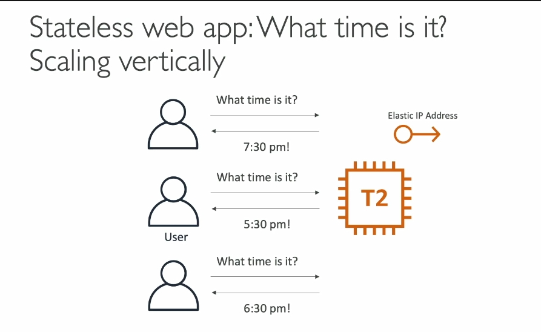
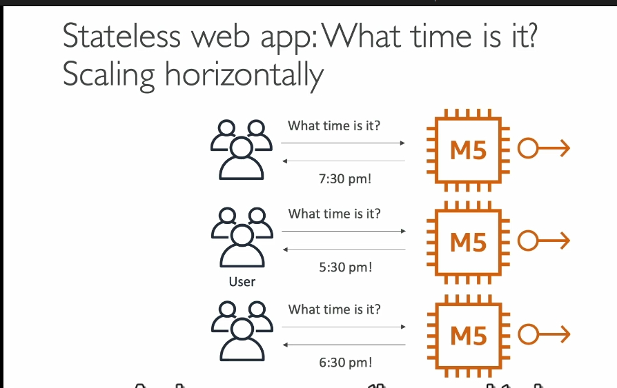
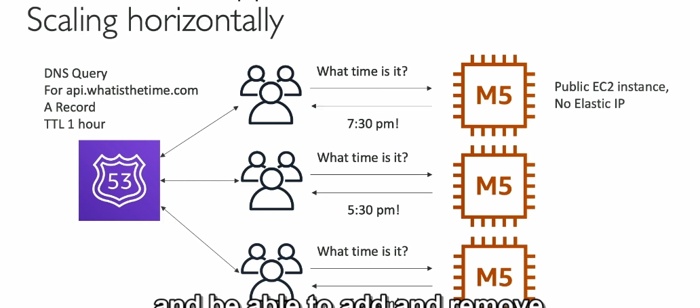
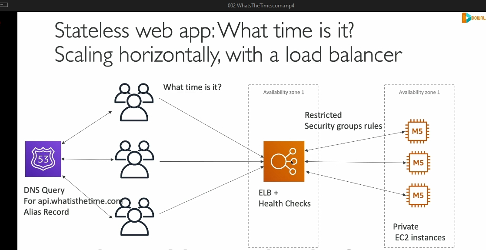
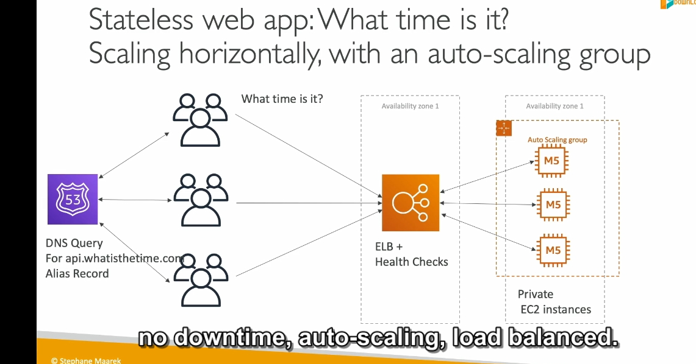

Dưới đây là phân tích chi tiết về nội dung trên, tập trung vào các khái niệm chính và kiến thức liên quan:

---

### **1. Giới thiệu vai trò Solutions Architect**
- Vai trò của một **Solutions Architect** là giải quyết các vấn đề kỹ thuật thông qua thiết kế kiến trúc hệ thống tối ưu.
- Tình huống thực tế: **WhatIsTheTime.com** - ứng dụng đơn giản cho phép người dùng kiểm tra giờ hiện tại. 
- Đây là một bài toán mẫu, giúp minh họa các thách thức và giải pháp trong việc thiết kế kiến trúc.

---

### **2. Giai đoạn 1: Khởi đầu nhỏ với một EC2 instance**
- **Cấu hình ban đầu:**
  - Sử dụng một **EC2 instance (T2 Micro)**.
  - Gán một **Elastic IP** để đảm bảo IP tĩnh trong trường hợp khởi động lại.
- **Ưu điểm:**
  - Đơn giản, tiết kiệm chi phí, dễ thiết lập.
  - Thích hợp cho ứng dụng với lưu lượng truy cập thấp.
- **Hạn chế:**
  - Khi tải tăng lên, tài nguyên hạn chế của T2 Micro không đủ để xử lý.

---

### **3. Giai đoạn 2: Vertical Scaling (Tăng quy mô dọc)**

- **Giải pháp:**
  - Thay thế T2 Micro bằng một instance mạnh hơn, ví dụ **M5 Large**.
  - Quá trình này yêu cầu **dừng hoạt động** để nâng cấp, gây gián đoạn.
- **Ưu điểm:**
  - Tăng hiệu năng một cách dễ dàng.
- **Hạn chế:**
  - **Downtime (gián đoạn dịch vụ)** khi thay đổi instance.
  - Tài nguyên của một instance lớn cũng sẽ đạt giới hạn khi lưu lượng tiếp tục tăng.

---

### **4. Giai đoạn 3: Horizontal Scaling (Tăng quy mô ngang)**

- **Giải pháp:**
  - Thêm nhiều **EC2 instances (M5 Large)** để phân tải.
  - Mỗi instance có một **Elastic IP** riêng.
- **Ưu điểm:**
  - Không cần dừng dịch vụ khi thêm instance.
  - Tăng khả năng xử lý lưu lượng truy cập.
- **Hạn chế:**
  - Quản lý nhiều Elastic IP trở nên phức tạp.
  - Người dùng phải biết chính xác từng Elastic IP để truy cập.

---

### **5. Giai đoạn 4: Sử dụng Route 53 (DNS)**

- **Giải pháp:**
  - Dùng **Route 53** với A Record (TTL: 1 giờ) để ánh xạ domain (e.g., `api.whatisthetime.com`) tới danh sách IP của các instance. policy simple 

- **Ưu điểm:**
  - Đơn giản hóa việc truy cập, chỉ cần nhớ domain name.
  - Route 53 tự động cập nhật danh sách IP khi cần thiết.
- **Hạn chế:**
  - **TTL cao (1 giờ)** có thể gây lỗi nếu một instance bị xóa, nhưng vẫn còn trong cache DNS của người dùng.

### 6. **Sử dụng Elastic Load Balancer (ELB)**

- **Ưu điểm:**
  - Tự động phân phối lưu lượng giữa các EC2 instances.
  - Hỗ trợ các tính năng như health checks để đảm bảo chỉ các instance hoạt động mới nhận traffic.
  - Giúp tăng tính khả dụng và ổn định cho ứng dụng.
  - Tích hợp với các dịch vụ AWS khác như Route 53 để quản lý DNS.

- **Hạn chế:**
  - ELB có thể gặp vấn đề khi phải xử lý một lượng rất lớn lưu lượng trong thời gian ngắn.
  - Chi phí có thể tăng khi lượng traffic tăng mạnh.

### 7. **Auto Scaling Group (ASG)**

- **Ưu điểm:**
  - Tự động mở rộng hoặc thu hẹp số lượng EC2 instances dựa trên nhu cầu thực tế.
  - Giúp tiết kiệm chi phí vì chỉ sử dụng tài nguyên khi cần thiết.
  - Đảm bảo ứng dụng có khả năng đáp ứng với lưu lượng biến động.
  - Kết hợp tốt với ELB để đảm bảo tính sẵn sàng và khả năng chịu tải.

- **Hạn chế:**
  - Cấu hình không chính xác có thể dẫn đến việc mở rộng quá mức hoặc không đủ, ảnh hưởng đến hiệu suất.
  - Quá trình mở rộng hoặc thu hẹp có thể mất thời gian, ảnh hưởng đến tốc độ phản hồi trong một số trường hợp.

### 8. **Multi-AZ Deployment**

- **Ưu điểm:**
  - Đảm bảo tính khả dụng cao, vì ứng dụng sẽ có các bản sao ở nhiều Availability Zones (AZ), giảm thiểu tác động khi có sự cố.
  - AWS sẽ tự động chuyển lưu lượng đến các AZ khác nếu một AZ gặp sự cố.
  - Tăng tính bền bỉ và phục hồi của ứng dụng.
  - 1 AZ TỐI THIỂU 1 EC2 CÓ TỐI THIỂU 2 AZ TRONG ELB ĐỂ ĐẢM BẢO AN TOÀN 

- **Hạn chế:**
  - Chi phí có thể cao hơn vì bạn phải duy trì tài nguyên trên nhiều AZ.
  - Phải có thiết kế và cấu hình chính xác để tránh sự cố trong quá trình phân phối lưu lượng.

### 9. **Reserved Instances (RI)**
- **Ưu điểm:**
  - Giảm chi phí đáng kể nếu bạn có thể dự đoán được mức độ sử dụng EC2 trong thời gian dài (1 hoặc 3 năm).
  - Dễ dàng tích hợp với Auto Scaling và giúp tiết kiệm chi phí trong những trường hợp có yêu cầu về tài nguyên ổn định.

- **Hạn chế:**
  - Được yêu cầu thanh toán trước, có thể gây khó khăn nếu không sử dụng hết công suất.
  - Không linh hoạt trong việc thay đổi cấu hình hoặc loại instance trong suốt thời gian thuê.

### 5. **Spot Instances**
- **Ưu điểm:**
  - Cung cấp tài nguyên EC2 với chi phí rất thấp, tiết kiệm chi phí vận hành.
  - Thích hợp cho các ứng dụng không yêu cầu hoạt động liên tục và có thể chịu sự gián đoạn.

- **Hạn chế:**
  - Các spot instances có thể bị hủy khi AWS cần tài nguyên, điều này có thể gây gián đoạn cho ứng dụng.
  - Không thể dự đoán trước khi nào instances sẽ bị hủy.

### 6. **Elastic IP và Route 53**
- **Ưu điểm:**
  - Elastic IP cho phép bạn duy trì một địa chỉ IP tĩnh và dễ dàng chuyển đến các instance khác trong trường hợp cần.
  - Route 53 giúp quản lý DNS và cung cấp khả năng phân phối lưu lượng một cách hiệu quả với các alias record.

- **Hạn chế:**
  - Elastic IP có chi phí nếu không sử dụng đúng cách (ví dụ: không gắn với instance).
  - Việc sử dụng Route 53 để phân phối lưu lượng đến các IP động có thể gặp khó khăn khi sử dụng với Load Balancer do IP thay đổi liên tục.

### Tổng kết:

### **6. Các vấn đề cần giải quyết trong kiến trúc**
- **Downtime** khi nâng cấp instance (Vertical Scaling).
- **Quản lý Elastic IP phức tạp** khi tăng số lượng instance (Horizontal Scaling).
- **Cache TTL của DNS** gây chậm trễ khi thay đổi IP.
- **Giải pháp tối ưu:** Tùy thuộc vào yêu cầu về hiệu suất, chi phí và độ khả dụng của ứng dụng, bạn có thể kết hợp các giải pháp trên. Việc triển khai Auto Scaling, Multi-AZ và ELB cùng nhau là một cách hiệu quả để đảm bảo ứng dụng của bạn luôn sẵn sàng và có khả năng chịu tải cao, với chi phí hợp lý.

---
